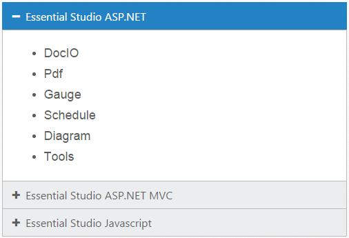

# Getting Started

This section explains briefly about how to create an **Accordion** in your application with **AngularJS**.

## Configure Accordion

This section encompasses the details on how you can configure the **Accordion** control in your application and customize it with various properties such as multiple open, rounded corner and icons for the **Accordion** header according to your requirement.

The following screenshot illustrates you the usage of **Accordion** control in listing the controls under the Essential Studio products. 

 

The usage of **Accordion** control is described in the following sections.

## Create a Simple Accordion in AngularJS

Create an HTML file and add the following references to the required libraries.



     <!DOCTYPE html>
    <html ng-app="AccordionApp">
    <head>
    <meta name="viewport" content="width=device-width, initial-scale=1.0" charset="utf-8" />
    <!-- Style sheet for default theme (flat azure) -->
    <link href="http://cdn.syncfusion.com/{{ site.releaseversion }}/js/web/flat-azure/ej.web.all.min.css" rel="stylesheet" />
    <!--Scripts-->
    
    
	
    
	
    <!--Add custom scripts here -->
    </head>
     <body ng-controller="AccordionCtrl">
    <!-- add necessary HTML elements here -->
    </body>
    </html>
    



The ng-app directive explains the root element (<html> or <body> tags) of the application. You will assign a name to the ng-app directive, then you must create a module with that name. In this module, you  have to define your directives, services, filters and configurations.

A controller is defined using ng-controller directive. Each controller accepts an object $scope which we pass as a parameter.  This object is used to bind the controller with view.   

Properties can be bind to ejAccordion control using the prefix e- and particular property name.

Add a &lt;div&gt; element. It is a container for Accordion control.



    

    <h3>
        <a href="#">Essential Studio ASP.NET</a>
    </h3>
    

        <!-- add accordion contents here to load contents under this header -->
        <ul>
            <li>
                <h4>DocIO</h4>
            </li>
            <li>
                <h4>Pdf  </h4>
            </li>
            <li>
                <h4>Gauge  </h4>
            </li>
            <li>
                <h4>Schedule  </h4>
            </li>
            <li>
                <h4>Diagram  </h4>
            </li>
            <li>
                <h4>Tools </h4>
            </li>
        </ul>
      

      <h3>
        <a href="#">Essential Studio ASP.NET MVC</a>
      </h3>
       

        <!-- add accordion contents here to load contents under this header -->
        <ul>
            <li>
                <h4>Chart </h4>
            </li>
            <li>
                <h4>Grid  </h4>
            </li>
            <li>
                <h4>Gantt  </h4>
            </li>
            <li>
                <h4>Schedule  </h4>
            </li>
            <li>
                <h4>Diagram  </h4>
            </li>
        </ul>
     

     <h3>
        <a href="#">Essential Studio Javascript</a>
     </h3>
     

        <!-- add accordion contents here to load contents under this header -->
        <ul>
            <li>
                <h4>Chart </h4>
            </li>
            <li>
                <h4>Grid  </h4>
            </li>
            <li>
                <h4>Gantt  </h4>
            </li>
            <li>
                <h4>Schedule  </h4>
            </li>
            <li>
                <h4>Diagram  </h4>
            </li>
        </ul>
    

    



Create the Accordion control as follows.


  
     



You can execute the above code example to display the Accordion control with simple control list.

 

You can customize the Accordion control using various properties. The Accordion control properties and its default values are described in the following section.

## Configure Multiple Open

You can have multiple **Accordion** tabs opened to view all products at a time. To achieve this set the **enableMultipleOpen** property of the **Accordion** control to true.

N> enableMultipleOpen property is false by default.

You can also open all the panels during initialization using the **selectedItems** property of the **Accordion** control. The following code sample illustrates the opening of multiple tabs by passing the tab index values of tab.



    





    



**Accordion** control with **enableMultipleOpen** property is illustrated in the following screen shot.

 

### Setting rounded corner

**Accordion** control, by default, is rendered in a regular rectangle. You can modify the regular rectangles with rounded corners by setting the **showRoundedCorner** property to **True**.

N> showRoundedCorner property is False by default.



     

	 


The following screenshot illustrates the **Accordion** control with rounded corners.

 

## Customize Icon

You can customize the **Header** icon using **customIcon** property. This property has two features such as **header** and **selectedHeader**. By default, the classes of **header** and **selectedHeader** are **e-collapse** and **e-expand** respectively**.**

You can change the + and - symbols in the **Accordion** header, that are the default icons with Up or Down arrow icons. 

Up or Down arrow icons are available in **e-arrowheadup** and **e-arrowheaddown** classes respectively in the ej.widgets.core.min.css stylesheets from the sample. 

You can set the Up or Down arrow icon to **Accordion** header, by adding **e-arrowheadup** and **e-arrowheaddown** class to **selectedHeader** and **header** properties respectively.



    

  


The following screenshot illustrates the customization of **selectedHeader** and **header** of the **Accordion** control.

 

