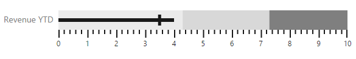
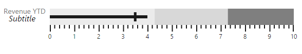
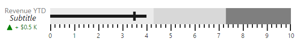
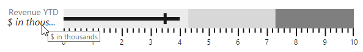
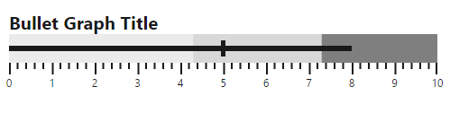
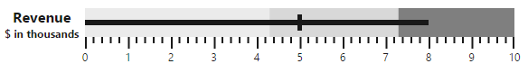
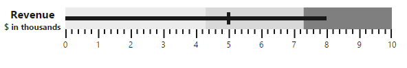
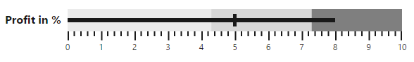

# Bullet Graph Caption

**Bullet Graph** supports title and **subtitle** to convey what is represented in **Bullet Graph**. They are customized using **captionSettings** property.

## Title

**Title** is set to **Bullet Graph** using **text** property in **captionSettings**. Caption settings also include properties like location, font, and textAngle for customizing the caption of **Bullet Graph**.

### Location

Using `location` option, you can set the `X` and `Y` position of caption text.

### Font

Using `font` property, you can customize font `color`, `fontFamily`, `fontStyle`, `fontWeight`, `opacity`, `size` options.



<html xmlns="http://www.w3.org/1999/xhtml" lang="en" ng-app="BulletGraphApp">
    <head>
        <title>Essential Studio for AngularJS: BulletGraph</title>
        <!--CSS and Script file References -->
    </head>
    <body ng-controller="BulletGraphCtrl">
        

                 <ej-bulletgraph e-quantitativescalesettings-location-x="100"
                 e-quantitativescalesettings-location-y="200" e-quantitativescalesettings-minimum="0" 
                 e-quantitativescalesettings-maximum="5" e-quantitativescalesettings-interval="0.5" 
                 e-quantitativescalesettings-featureMeasures="featureMeasure"
                 e-height="700" e-width="600" e-captionsettings-text="Revenue YTD"
                 e-captionsettings-textAngle="0" e-captionsettings-location-x="10"
                 e-captionsettings-location-y="220" e-captionsettings-font-fontFamily="segoe ui"
                 e-captionsettings-font-color="gray" e-captionsettings-font-fontStyle="bold" 
                 e-captionsettings-font-size="14px" e-captionsettings-font-fontWeight="regular"
                 e-captionsettings-font-opacity="1"></ej-bulletgraph>
        

     
     </body>
    </html>



The following screenshot displays a **Bullet Graph** with customized caption using the above code.

## Subtitle

**Subtitle** is added to **Bullet Graph** using **text** property of **subtitle** in **captionSettings**. **Subtitle** also provides properties like location, textAngle and font to customize subtitle similar to caption.

### Location

Using `location` option, you can set the `X` and `Y` position of caption text.

### Font

Using `font` property, you can customize font `color`, `fontFamily`, `fontStyle`, `fontWeight`, `opacity`, `size` options.



<html xmlns="http://www.w3.org/1999/xhtml" lang="en" ng-app="BulletGraphApp">
    <head>
        <title>Essential Studio for AngularJS: BulletGraph</title>
        <!--CSS and Script file References -->
    </head>
    <body ng-controller="BulletGraphCtrl">
        

                 <ej-bulletgraph   e-captionsettings-subtitle-text="Subtitle"
                e-captionsettings-subtitle-location-x="20" e-captionsettings-subtitle-location-y="225"
                e-captionsettings-subtitle-font-color="black"
                e-captionsettings-subtitle-font-fontFamily="segoe ui" 
                e-captionsettings-subtitle-font-fontStyle="italic"
                e-captionsettings-subtitle-font-size="16px"
                e-captionsettings-subtitle-font-fontWeight="regular"
                e-captionsettings-subtitle-font-opacity="1"></ej-bulletgraph>
        

     
     </body>
    </html>



The following screenshot displays **Bullet Graph** with a subtitle

## Indicator

You can add **Indicator** to bullet graph by enabling **visible** and setting **text** properties of **indicator** in **captionSettings**. Indicator is used to represent whether target is achieved or not with text and symbol by comparing current and target values in bullet graph. 

Indicator displays a symbol along with text which is different from caption and subtitle. Images like logos can be used in indicator instead of symbols. Indicator has properties such as **symbol**, **text**, **textSpacing**, **textAngle**, **location** and **font**.



<html xmlns="http://www.w3.org/1999/xhtml" lang="en" ng-app="BulletGraphApp">
    <head>
        <title>Essential Studio for AngularJS: BulletGraph</title>
        <!--CSS and Script file References -->
    </head>
    <body ng-controller="BulletGraphCtrl">
        

                 <ej-bulletgraph   e-captionsettings-indicator-visible="true"
                 e-captionsettings-indicator-textAngle="0" e-indicator-text="+ $0.5 K"
                 e-captionsettings-indicator-textSpacing ="5"
                 e-captionsettings-indicator-location-x="15" 
                 e-captionsettings-indicator-location-y="240"
                 e-captionsettings-indicator-font-color="green"
                 e-captionsettings-indicator-symbol-color="green" 
                 e-captionsettings-indicator-symbol-shape="triangle" 
                 e-captionsettings-indicator-imageUrl="column.png" 
                 e-captionsettings-indicator-symbol-size-width="10"
                 e-captionsettings-symbol-size-height="10" 
                 e-captionsettings-symbol-border-width="1"
                 e-captionsettings-symbol-border-color="green" 
                 e-captionsettings-indicator-font-fontFamily="segoe ui" 
                 e-captionsettings-indicator-font-fontStyle="normal"
                 e-captionsettings-indicator-font-size="12px" 
                 e-captionsettings-indicator-font-fontWeight="regular"
                 e-captionsettings-indicator-font-opacity="1"></ej-bulletgraph>
        

     
     </body>
    </html>



The following screenshot displays a bullet graph with indicator.

## Trim

The title, indicator and indicator text can be overlapped to the scale group. You can avoid the overlapped text by using the enableTrim property of the captionSettings. The default value of the enableTrim is true. 



<html xmlns="http://www.w3.org/1999/xhtml" lang="en" ng-app="BulletGraphApp">
    <head>
        <title>Essential Studio for AngularJS: BulletGraph</title>
        <!--CSS and Script file References -->
    </head>
    <body ng-controller="BulletGraphCtrl">
        

                 <ej-bulletgraph   e-captionsettings-text="Bullet Graph Title" 
                 e-captionsettings-enableTrim="true"></ej-bulletgraph>
        

     
     </body>
    </html>



The following screenshot displays the BulletGraph with Trim.

## Text Placement

All the caption group elements (caption, subtitle, and indicator) in the **Bullet Graph** support text positioning by using the property **textPosition** available in all caption group elements. The properties, **textAlignment** and **textAnchor** are used to customize text placement further.

**Text Position**

The property, textPosition, is used to position the text at the top, bottom, left, and right side of the quantitative scale. The default value of this property is float. By default, text can be placed at any desired location by using the location property.



<html xmlns="http://www.w3.org/1999/xhtml" lang="en" ng-app="BulletGraphApp">
    <head>
        <title>Essential Studio for AngularJS: BulletGraph</title>
        <!--CSS and Script file References -->
    </head>
    <body ng-controller="BulletGraphCtrl">
        

                 <ej-bulletgraph  e-value="5" e-comparativemeasurevalue="8" 
                 e-quantitativescalesettings-location-x="120" e-quantitativescalesettings-location-y="40"
                 e-height="150" e-width="650"   e-captionsettings-text="BulletGraph Title" 
                 e-captionsettings-textPosition="top" e-captionsettings-font-size="20px" 
                 e-captionsettings-font-fontWeight="bold"></ej-bulletgraph>
        

     
     </body>
    </html>



The following screenshot displays the Bullet Graph with the title positioned above.

### Text Alignment

Alignment of text at different positions with respect to scale can be customized by using the **textAlignment** property. Text can be aligned in the **near**, **center,** and **far** locations of the scale. Text alignment depends upon **textPosition** property and is not applicable when the value of the **textPosition** property is **float**. The default value of the **textAlignment** property is **near**.



<html xmlns="http://www.w3.org/1999/xhtml" lang="en" ng-app="BulletGraphApp">
    <head>
        <title>Essential Studio for AngularJS: BulletGraph</title>
        <!--CSS and Script file References -->
    </head>
    <body ng-controller="BulletGraphCtrl">
        

                 <ej-bulletgraph  e-value="5" e-comparativemeasurevalue="8" 
                 e-quantitativescalesettings-location-x="120" e-quantitativescalesettings-location-y="40"
                 e-height="150" e-width="650"   e-captionsettings-text="Revenue"
                 e-captionsettings-textPosition="left" e-captionsettings-textAnchor="middle"
                 e-captionsettings-font-size="16px" e-captionsettings-font-fontWeight="bold" 
                 e-captionsettings-subtitle-text="$ in thousands" e-captionsettings-subtitle-textPosition="left" 
                 e-captionsettings-subtitle-textAlignment="center" e-captionsettings-subtitle-font-size="12px"
                 e-captionsettings-subtitle-font-fontWeight="bold"></ej-bulletgraph>
        

     
     </body>
    </html>



The following screenshot displays the Bullet Graph with the title and subtitle at different alignments.

### Text Anchor

Text elements aligned at the same position are anchored by using the textAnchor property. These can be anchored at the start, middle, and end. The default value of this property is start and applicable only when two or more text elements are aligned at the same position. 



<html xmlns="http://www.w3.org/1999/xhtml" lang="en" ng-app="BulletGraphApp">
    <head>
        <title>Essential Studio for AngularJS: BulletGraph</title>
        <!--CSS and Script file References -->
    </head>
    <body ng-controller="BulletGraphCtrl">
        

                 <ej-bulletgraph  e-value="5" e-comparativemeasurevalue="8" 
                 e-quantitativescalesettings-location-x="120" e-quantitativescalesettings-location-y="40"
                 e-height="150" e-width="650"   e-captionsettings-text="Revenue" 
                 e-captionsettings-textPosition="left" e-captionsettings-textAnchor="middle" 
                 e-captionsettings-font-size="16px" e-captionsettings-font-fontWeight="bold"  
                 e-captionsettings-subtitle-text="$ in thousands" e-captionsettings-subtitle-textPosition="left" 
                 e-captionsettings-subtitle-textAlignment="center" e-captionsettings-subtitle-font-size="12px" 
                 e-captionsettings-subtitle-font-fontWeight="bold"></ej-bulletgraph>
        

     
     </body>
    </html>



### Padding

The space required between text and quantitative scale is customized by using the padding property. The default value of this property is 5 and not applicable when the value of the textPosition property is float.



<html xmlns="http://www.w3.org/1999/xhtml" lang="en" ng-app="BulletGraphApp">
    <head>
        <title>Essential Studio for AngularJS: BulletGraph</title>
        <!--CSS and Script file References -->
    </head>
    <body ng-controller="BulletGraphCtrl">
        

                 <ej-bulletgraph  e-value="5" e-comparativemeasurevalue="8" 
                 e-quantitativescalesettings-location-x="120" e-quantitativescalesettings-location-y="40"
                 e-height="150" e-width="650"   e-captionsettings-text="Profit in %" 
                 e-captionsettings-textPosition="left" e-captionsettings-textAlignment="center" 
                 e-captionsettings-padding="10" e-captionsettings-font-size="16px" 
                 e-captionsettings-font-fontWeight="bold"  ></ej-bulletgraph>
        

     
     </body>
    </html>



