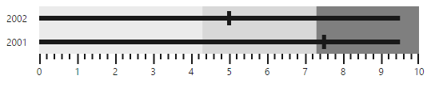

# Data Binding

**Bullet Graph** supports binding JSON data from a remote server or data created in client-side. You can use the **fields** property to customize the data bound with **Bullet Graph**.

## Local Data

Data available in client-side (local data) can be bound with **Bullet Graph** using **fields** property. This property provides option to specify data source, fields representing progress measure bar value, comparative measure value and category value.



<html xmlns="http://www.w3.org/1999/xhtml" lang="en" ng-app="BulletGraphApp">
    <head>
        <title>Essential Studio for AngularJS: BulletGraph</title>
        <!--CSS and Script file References -->
    </head>
    <body ng-controller="BulletGraphCtrl">
        

                 <ej-bulletgraph e-qualitativerangesize="60" e-quantitativescalesettings-location-x="50"
                 e-quantitativescalesettings-location-y="20" e-height="120"
                 e-fields-dataSource="dataSource" e-fields-category="category"
                 e-fields-featureMeasures="value" 
                 e-fields-comparativeMeasure="comparativeMeasureValue"></ej-bulletgraph>
        

     
     </body>
    </html>



The following screenshot displays **Bullet Graph** with local data generated using html

 

## Remote Data

**Bullet Graph** provides option to bind data from a remote server using **ejDataManager** as data source in **fields** property. A query object should also be passed to **query** property when using data manager as data source.



<html xmlns="http://www.w3.org/1999/xhtml" lang="en" ng-app="BulletGraphApp">
    <head>
        <title>Essential Studio for AngularJS: BulletGraph</title>
        <!--CSS and Script file References -->
    </head>
    <body ng-controller="BulletGraphCtrl">
        

                 <ej-bulletgraph e-qualitativerangesize="60" e-quantitativescalesettings-location-x="50" 
                 e-quantitativescalesettings-minimum="5" e-quantitativescalesettings-maximum="45"
                 e-quantitativescalesettings-interval="10"
                 e-quantitativescalesettings-location-y="20" e-height="120"
                 e-fields-dataSource="dataManger" e-fields-query="query" e-fields-category="ProductID"
                 e-fields-featureMeasures="UnitPrice" e-fields-comparativeMeasure="Quantity">
                 <e-qualitativeranges>
                 <e-qualitativerange e-rangeend="25"></e-qualitativerange>
                 <e-qualitativerange e-rangeend="37"></e-qualitativerange>
                 <e-qualitativerange e-rangeend="45"></e-qualitativerange>
                 </e-qualitativeranges>
                 </ej-bulletgraph>
        

             
     </body>
    </html>  

            



The following screenshot displays a Bullet Graph bounded with data from a remote server

 

