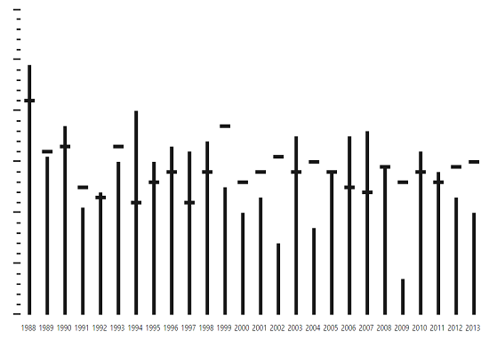

# Getting Started

Before we start with the bullet graph, please refer [this page](http://help.syncfusion.com/js/angularjs) page for general information regarding integrating Syncfusion widget’s.

## Adding JavaScript and CSS references

To render the bullet graph control, the following list of external dependencies are needed, 

* [jQuery](http://jquery.com) - 1.7.1 and later versions
* [Angular](https://angularjs.org/) - Angular latest versions

The required Angular script as `angular.min.js` and `ej.widget.angular.min.js` which can be available in below [CDN](/js/cdn) links:

* `angular.min.js` - [http://cdn.syncfusion.com/js/assets/external/angular.min.js](http://cdn.syncfusion.com/js/assets/external/angular.min.js)
* `ej.widget.angular.min.js` - [http://cdn.syncfusion.com/{{ site.releaseversion }}/js/common/ej.widget.angular.min.js](http://cdn.syncfusion.com/14.3.0.49/js/common/ej.widget.angular.min.js)

The other required internal dependencies are tabulated below,

<table>
   <tr>
      <th>
         <b>Files</b>
      </th>
      <th>
         <b>Description/Usage </b>
      </th>
   </tr>
   <tr>
      <td>
         ej.core.min.js
      </td>
      <td>
        It is referred always before using all the JS controls.
      </td>
   </tr>
   <tr>
      <td>
         ej.data.min.js
      </td>
      <td>
         Used to handle data operation and is used while binding data to the JS controls.
      </td>
   </tr>
   <tr>
      <td>
        ej.bulletgraph.min.js 
      </td>
      <td>
         Bullet graph core script file which includes bullet graph related scripts files.
      </td>
   </tr>
</table>

N> Refer the `ej.web.all.min.js` (which encapsulates all the `ej` controls and frameworks in a single file) in the application instead of referring all the above specified internal dependencies. 

To get the real appearance of the bullet graph, the dependent CSS file `ej.web.all.min.css` (which includes styles of all the widgets) should also needs to be referred.

So the complete boilerplate code is



    <!DOCTYPE html>
    <html xmlns="http://www.w3.org/1999/xhtml" lang="en" ng-app="BulletGraphApp">
    <head>
    <title>Essential Studio for AngularJS: BulletGraph</title>
    <!-- Essential Studio for JavaScript  theme reference -->
    <link href="http://cdn.syncfusion.com/{{ site.releaseversion }}/js/web/flat-azure/ej.web.all.min.css" rel="stylesheet" />
    <!-- Essential Studio for JavaScript  script references -->
    
    
        
    
    
    <!-- Add your custom scripts here -->
    </head>
    <body>
    </body>
    </html>



N> 1. In production, we highly recommend you to use our [`custom script generator`](http://help.syncfusion.com/js/custom-script-generator) to create custom script file with required controls and its dependencies only. Also to reduce the file size further please use [`GZip compression`](https://developers.google.com/web/fundamentals/performance/optimizing-content-efficiency/optimize-encoding-and-transfer?hl=en) in your server.
N> 2. For themes, you can use the `ej.web.all.min.css` CDN link from the code snippet given. To add the themes in your application, please refer to [`this link`](http://help.syncfusion.com/js/theming-in-essential-javascript-components).

## Create a bullet graph

All the Essential JavaScript directives have been encapsulated into a single module called `ejangular` so the first step would be to declare dependency for this module within your AngularJS application.

The bullet graph can be created using `ej-bulletgraph` AngularJS directive and its properties can be defined using `e-` prefix followed by the property name.(For example, e-height)

The code example for defining controls in AngularJS is as follows,



<html xmlns="http://www.w3.org/1999/xhtml" lang="en" ng-app="BulletGraphApp">
    <head>
        <title>Essential Studio for AngularJS: BulletGraph</title>
        <!--CSS and Script file References -->
    </head>
    <body ng-controller="BulletGraphCtrl">
        

                 <ej-bulletgraph></ej-bulletgraph>
        

    </body>
</html>



On executing the above code, sample renders a default **Bullet Graph** with default values as follows.

##Provide Required Data

You can customize the values of feature and comparative measure bars in a **BulletGraph**, either locally or remotely. The category data is optional, and is used to display label values in parallel to the measure bars. 

Assign the data in **localData** variable to the **dataSource** property of **BulletGraph** as shown in the following code example.



   

        <ej-bulletgraph e-fields-dataSource="data"></ej-bulletgraph>
    

    
    
    


Once the **dataSource** property is assigned with the required values, you can bind the variable names used in the **JSON** data to the corresponding fields of the **BulletGraph** as shown in the following code sample.



<ej-bulletgraph e-fields-datasource="data"  e-fields-category="category"  
                e-fields-featureMeasures="value" 
                e-fields-comparativeMeasure="comparativeMeasureValue">
</ej-bulletgraph>



**Set Default and Scale Values**

You can plot more number of measure bars within the **BulletGraph**, the height and width of the control should be increased to locate all the measure bars within the graph.The **qualitativeRangeSize** and **quantitativeScaleLength** property needs to be set accordingly as shown in the following code example.

By default, the **BulletGraph** is rendered in the Horizontal orientation with its flow direction set to **Forward.** 

**Minimum**, **maximum** and **interval** values for the **quantitativeScale** of the **bullet graph** should be set, as shown in the following code example.



<ej-bulletgraph e-height="540" e-width="850" e-qualitativerangesize="800"
                e-quantitativescalelength="420" e-orientation="vertical" 
                e-flowdirection="backward" e-quantitativescalesettings-interval="10"
                e-quantitativescalesettings-minimum="70" e-quantitativescalesettings-maximum="130"
                e-quantitativescalesettings-tickPosition="near" e-labelsettings-position="above"
                e-fields-datasource="data" e-fields-category="category" e-fields-featureMeasures="value"
                e-fields-comparativeMeasure="comparativeMeasureValue">
</ej-bulletgraph>



As you can see in the image above, the bullet graph without any ranges is displayed in the background. The steps to add the **qualitativeRanges** are described in the next section.

**Add Qualitative Ranges**

By default, 3 ranges are displayed in the **BulletGraph** control during the initial rendering of the control with its default values. In order to customize it, you need to set appropriate values for the **rangeEnd** and its **rangeStroke** properties.  Any number of **qualitativeRanges** can be added to the control. 



<ej-bulletgraph>
            <e-qualitativeranges>
                <e-qualitativerange e-rangeend="90"></e-qualitativerange>
                <e-qualitativerange e-rangeend="110"></e-qualitativerange>
                <e-qualitativerange e-rangeend="130" e-rangestroke="#CDC9C9"></e-qualitativerange>
            </e-qualitativeranges>
</ej-bulletgraph>



After adding **qualitativeRanges** to the **BulletGraph**, the control will be rendered as follows.

 

**Ticks and Measure Bars Customization**

You have to do the following code changes in the quantitative scale in order to customize the tick size, the colors of the feature bar and comparative measure symbols. 



 <ej-bulletgraph e-quantitativescalesettings-majorTickSettings-width="1" 
                 e-quantitativescalesettings-majorTickSettings-size="13"
                 e-quantitativescalesettings-majorTickSettings-stroke="gray"
                 e-quantitativescalesettings-minorTickSettings-width="1" 
                 e-quantitativescalesettings-minorTickSettings-size="5"
                 e-quantitativescalesettings-minorTickSettings-stroke="gray"
                 e-quantitativescalesettings-comparativeMeasureSettings-stroke="#507786" 
                 e-quantitativescalesettings-featuredMeasureSettings-stroke="#169DD8">
</ej-bulletgraph>



When customization of ticks and measure bars is done, **BulletGraph** looks as follows

  

**Add Caption and Subtitle**

You can display an appropriate Caption and Subtitle in the **BulletGraph** by adding the following code example.



<ej-bulletgraph e-captionsettings-textposition='Top' e-captionsettings-textalignment='Center' 
                e-captionsettings-textAnchor='middle' 
                e-captionsettings-text="Monsoon Rainfall - Actual vs Forecast" 
                e-captionsettings-font-color="null" e-captionsettings-font-fontFamily="segoe ui"
                e-captionsettings-font-fontStyle="normal" e-captionsettings-font-size="12px"
                e-captionsettings-font-fontWeight="regular" e-captionsettings-font-opacity="1" 
                e-captionsettings-subtitle-textAngle="-90" e-captionsettings-subtitle-text="Rainfall (mm)"
                e-captionsettings-subtitle-location-x="15" e-captionsettings-subtitle-location-y="250" 
                e-captionsettings-subtitle-font-color="null" e-captionsettings-subtitle-font-fontFamily="segoe ui"
                e-captionsettings-subtitle-font-fontStyle="normal" e-captionsettings-subtitle-font-size="12px" 
                e-captionsettings-subtitle-font-fontWeight="regular" e-captionsettings-subtitle-font-opacity="1">
</ej-bulletgraph>



The following screenshot displays a **BulletGraph** in the caption and title in the **BulletGraph**.

**Show Tooltip**

You can use a Tooltip in your application to display any information. The tooltip is enabled by setting the **visible** property in tooltip to **true.** 



<ej-bulletgraph  e-tooltipsettings-visible="true">
</ej-bulletgraph>

     
  

By using the customization options discussed in this section, the **BulletGraph** is rendered as displayed on the following screenshot.

 

