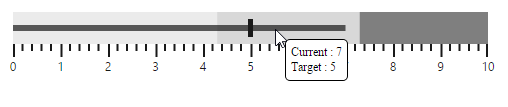

# User Interaction

## Animation

**Bullet Graph** supports animation that makes the performance measure bar to animate when rendering the **Bullet Graph**. **Animation** is enabled or disabled using **enableAnimation** property. By default, **Animation** is enabled in **Bullet Graph**.



<html xmlns="http://www.w3.org/1999/xhtml" lang="en" ng-app="BulletGraphApp">
    <head>
        <title>Essential Studio for AngularJS: BulletGraph</title>
        <!--CSS and Script file References -->
    </head>
    <body ng-controller="BulletGraphCtrl">
        

                 <ej-bulletgraph e-value="8" e-enableanimation="true" e-comparativemeasurevalue="5" >
                 </ej-bulletgraph>
        

     
     </body>
    </html>



## Responsiveness during browser resize

**Bullet Graph** is made responsive when resizing the browser by using **isResponsive** property. By default the value of this property is **true** in **Bullet Graph**.



<html xmlns="http://www.w3.org/1999/xhtml" lang="en" ng-app="BulletGraphApp">
    <head>
        <title>Essential Studio for AngularJS: BulletGraph</title>
        <!--CSS and Script file References -->
    </head>
    <body ng-controller="BulletGraphCtrl">
        

                 <ej-bulletgraph e-value="8" e-isresponsive="true" e-comparativemeasurevalue="5" >
                 </ej-bulletgraph>
        

     
     </body>
    </html>



## Applying same color to all ticks and labels in a range

Background color for qualitative range is applied to major ticks and minor ticks of the **Bullet Graph** using **applyRangeStrokeToTicks** property. The range colors are applied to labels using **applyRangeStrokeToLabels** property. By default same colors are not applied to a qualitative range and its corresponding ticks or labels.



<html xmlns="http://www.w3.org/1999/xhtml" lang="en" ng-app="BulletGraphApp">
    <head>
        <title>Essential Studio for AngularJS: BulletGraph</title>
        <!--CSS and Script file References -->
    </head>
    <body ng-controller="BulletGraphCtrl">
        

                 <ej-bulletgraph e-value="8" e-comparativemeasurevalue="5" >
                 <e-qualitativeranges>
                 <e-qualitativerange e-rangeend="3.5" e-rangestroke="darkred" e-rangeopacity="0.5">
                 </e-qualitativerange>
                 <e-qualitativerange e-rangeend="5.0" e-rangestroke="red" e-rangeopacity="1">
                 </e-qualitativerange>
                 <e-qualitativerange e-rangeend="7.5" e-rangestroke="blue" e-rangeopacity="0.7">
                 </e-qualitativerange>
                 <e-qualitativerange e-rangeend="9.0" e-rangestroke="lightblue" e-rangeopacity="1">
                 </e-qualitativerange>
                 <e-qualitativerange e-rangeend="10.5" e-rangestroke="green" e-rangeopacity="1">
                 </e-qualitativerange>
                 </e-qualitativeranges>
                 </ej-bulletgraph>
        

     
     </body>
    </html>



 

## Tooltip

By default **Bullet Graph** displays **Tooltip** when mouse is hovered over feature measure bar. **Tooltip** is enabled or disabled using visible property in **tooltipSettings**.

 

Bullet Graph supports Tooltip template instead of default Tooltip to customize the appearance and contents of Tooltip. The Tooltip template should be a &lt;div&gt; element with display set to ‘none’, so it is displayed only when mouse is placed on feature measure bar. The id value of the &lt;div&gt; element should be provided as value to the template property in tooltipSettings of Bullet Graph to display the customized &lt;div&gt; element as Tooltip instead of default Tooltip. The values displayed in default Tooltip such as current value, target value and category are accessed in template &lt;div&gt; element by using {{currentValue}}, {{targetValue}} and {{category}} respectively.



 

 Sales 
 
<table style="color:green"> <tr> <td> Current </td> <td> : </td> </tr> <tr> <td> Target </td> <td> : </td> </tr> </table> 





  <html xmlns="http://www.w3.org/1999/xhtml" lang="en" ng-app="BulletGraphApp">
    <head>
        <title>Essential Studio for AngularJS: BulletGraph</title>
        <!--CSS and Script file References -->
    </head>
    <body ng-controller="BulletGraphCtrl">
        

                 <ej-bulletgraph e-value="8" e-height="150" e-comparativemeasurevalue="5"
                 e-tooltipSettings-template="BulletGraphTooltip" >
                 </ej-bulletgraph>
        

     
     </body>
    </html>



The following screenshot displays **Bullet Graph** with a customized **Tooltip** including a header and contents such as current value and target value in different colors.

 

