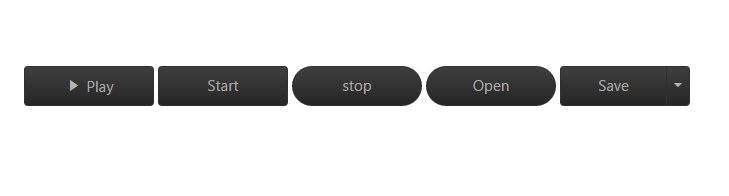
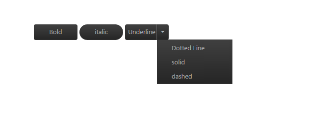
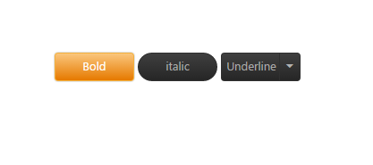

# Getting Started

This section explains you briefly on how to create a **Button** in your application with **JavaScript**. Essential JavaScript Button helps to display a Button widget within a web page and allows you to Click, Toggle Click, Reset, and Submit. The following example illustrates how to customize Button control in a Media Player and Office Ribbon Application. 

The following screenshot illustrates the functionality of a Button control in Media Player and Office Ribbon Application.

## Create Button Widget

Essential JavaScript Button control has different functionalities such as display only Image Content or Image Content with Text.

1. Create an HTML file and add required scripts and CSS files to render the Essential JavaScript component as given in the [Getting Started](https://help.syncfusion.com/js/control-initialization).
2. Essential JavaScript includes angular directives for all controls with the ej.widget.angular.min.js script file. All the Essential JS directives have been encapsulated into a single module called **ejangular**. To render our ej controls in angular, you need to refer the “angular.min.js” and “ej.widget.angular.min.js” in your application.



<!DOCTYPE html>
<html xmlns="http://www.w3.org/1999/xhtml" ng-app="BtnCtrl">
   <head>
      <meta name="viewport" content="width=device-width, initial-scale=1.0" charset="utf-8" />
      <!-- Style sheet for default theme (flat azure) -->
      <link href="http://cdn.syncfusion.com/{{ site.releaseversion }}/js/web/gradient-saffron-dark/ej.web.all.min.css" rel="stylesheet" />
      <!--Scripts-->
      
      
      <!--Add custom scripts here -->
   </head>
   <body ng-controller="BtnController">
      <!-- Add button element Here -->
      <button id="button1" ej-button e-showroundedcorner="true" e-size="medium" e-text="login"></button>      
   </body>
</html>



The ng-app directive explains the root element (<html> or <body> tags) of the application. You will assign a name to the ng-app directive, then you must create a module with that name. In this module, you will have to define your directives, services, filters and configurations.

Properties can be bind to ejButton control using the prefix e- and particular property name as shown as below.

Add &lt;Button&gt; element to create a Button control.



   <table>
        <tr>
            <td>
                <input type="checkbox" id="play" ej-togglebutton e-showroundedcorner="true" e-size="large" e-contenttype="textandimage" e-defaulttext="Play" e-activetext="Pause" e-defaultprefixicon="e-icon e-play" e-activeprefixicon="e-icon e-pause" />
            </td>
            <td>
                <button id="start" ej-button e-showroundedcorner="true" e-size="large" e-text="Start"></button>
            </td>
            <td>
                <button id="stop" ej-button e-showroundedcorner="true" e-size="large" e-text="stop"></button>
            </td>
            <td>
                <button id="open" ej-button e-showroundedcorner="true" e-size="large" e-text="Open"></button>
            </td>
            <td>
                <button id="save" ej-splitbutton e-size="large" e-showroundedcorner="true" e-targetid="menu1" e-text="Save"></button>                        
                <ul id="menu1">
                    <li>Open...</li>
                    <li>Save</li>
                    <li>Delete</li>
                </ul>
            </td>
        </tr>
   </table>

      



Add the following in the script section.



        angular.module('BtnCtrl', ['ejangular'])
           .controller('BtnController', function ($scope) {
              
           });



Add the following styles to show the Button control in the center of a webpage.





## Create Office Ribbon Control

In a real-time scenario, Microsoft Office Bold and Italic options work as **Toggle Button** and Underline option works as a **Split Button**. Here, you can learn how to use **Button** control feature using Office Ribbon options.

Add **&lt;Button&gt;** element using the following code example.



   

        <table>
            <tr>
                <td>
                    <input type="checkbox" id="bold" ej-togglebutton e-showroundedcorner="true" e-size="large"e-defaulttext="Bold" e-activetext="bold" e-click="boldClick" />
                </td>
                <td>
                    <button id="italic" ej-button e-showroundedcorner="true" e-size="small" e-text="italic" e-click="italicClick"></button>
                </td>
                <td>
                    <button id="Underline" ej-splitbutton e-size="small" e-showroundedcorner="true" e-text="Underline" e-targetid="menu11" e-click="underlineClick" e-create="spltbtnLoad"></button>                        
                    <ul id="menu11">
                        <li>Dotted Line</li>
                        <li>solid</li>
                        <li>dashed</li>
                    </ul>
                </td>
            </tr>
        </table>
   



Initialize &lt;Button&gt; script with required properties.

Add the following function definition for Button in the script section.



        angular.module('BtnCtrl', ['ejangular'])
           .controller('BtnController', function ($scope) {
              $scope.boldClick = function(e) {
                    if (e.isChecked) {
                        $(".sample span").wrap("<b></b>");// add the bold tag to span
                    }
                    else {
                        $(".sample span").unwrap("<b></b>");// remove the bold tag to span
                    }                  
              }
              $scope.italicClick = function(e) {                  
                    if ($(".sample span").parents().is("i")) {
                        $(".sample span").unwrap("<i></i>");// remove the italic tag to span
                    }
                    else {
                        $(".sample span").wrap("<i></i>");// remove the italic tag to span
                    }
              }
              $scope.underlineClick = function(e) {
                    if ($(".sample span").parents().is("u")) {
                        $(".sample span").unwrap("<u></u>");// remove the italic tag to span
                    } else {
                        $(".sample span").wrap("<u></u>");// remove the italic tag to span
                    }
              }
           });
           


The following screenshot displays Office Ribbon Application.

 

The following screenshot displays **Office Ribbon** **Bold** Option.	

