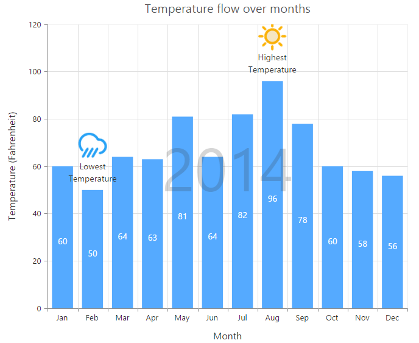
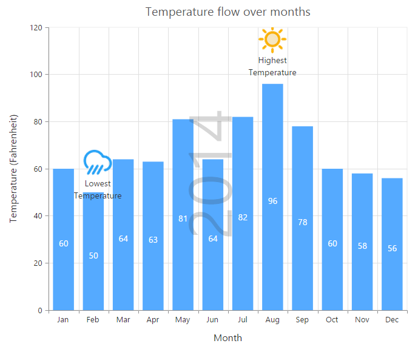
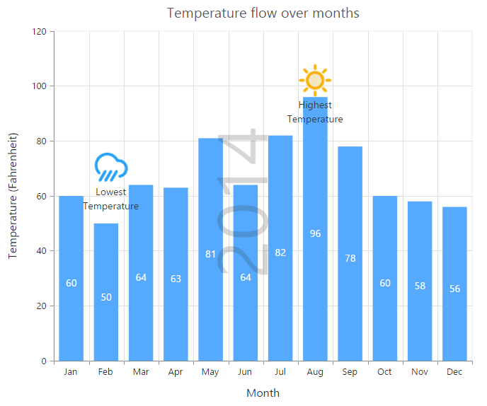

# Annotations

annotations are used to mark the specific area of interest in the chart area with texts, shapes or images. 

You can add annotations to the chart by using the `e-annotations` option. By using the `content` option of annotation object, you can specify the id of the element that needs to be displayed in the chart area.



 <html xmlns="http://www.w3.org/1999/xhtml" lang="en" ng-app="ChartApp">
    <head>
        <title>Essential Studio for AngularJS: Chart</title>
        <!--CSS and Script file References -->
    </head>
    <body ng-controller="ChartCtrl">
        
2014

        

        <e-annotations>
        <e-annotation  e-visible="true" e-content="watermark" e-opacity="0.2" e-region="series">
        </e-annotation>
        </e-annotations>
        

        
    </body>
</html>



N> Annotations are not supported in 3D chart types.

## Rotate the annotation template

To rotate the annotation template, you can use the `angle` property of the annotations. 



<html xmlns="http://www.w3.org/1999/xhtml" lang="en" ng-app="ChartApp">
    <head>
        <title>Essential Studio for AngularJS: Chart</title>
        <!--CSS and Script file References -->
    </head>
    <body ng-controller="ChartCtrl">
        
2014

        

        <e-annotations>
        <e-annotation  e-visible="true" e-content="watermark" e-angle="270">
        </e-annotation>
        </e-annotations>
        

        
    </body>
</html>



## Positioning Annotation

You can position annotations either by using the coordinates (`x` and `y` options or by using the alignment options `horizontalAlignment` and `verticalAlignment`).

By using the `coordinateUnit` option, you can specify whether the value provided in the `x`and `y` options are relative to the chart or axis.

* If the coordinateUnit is set to none, the annotations are placed relative to the chart/plot area by using the `horizontalAlignment`and `verticalAlignment` options.

* If the coordinateUnit is set to points, the x and y values of the annotation are the coordinates relative to the axis and annotation is positioned relative to the axis. By default, the x and y values are associated with the `e-primaryxaxis`and `e-primaryyaxis`. In case, when the chart contains multiple axis and you want to associate the annotation with a particular axis, you can specify the `e-xaxisname` and `e-yaxisname` options of the annotation object.

* If the coordinateUnit is set to pixels, the x and y values are coordinates relative to the top-left corner of the chart/plot area.   

N> By using the `region` option, you can specify whether the annotation is placed relative to the entire chart or plot area.



<html xmlns="http://www.w3.org/1999/xhtml" lang="en" ng-app="ChartApp">
    <head>
        <title>Essential Studio for AngularJS: Chart</title>
        <!--CSS and Script file References -->
    </head>
    <body ng-controller="ChartCtrl">
        

        <e-annotations>
        <e-annotation  e-visible="true" e-content="lowtemp" e-coordinateunit="pixels" 
        e-x="170" e-y="350">
        </e-annotation>
        </e-annotations>
        

        
    </body>
</html>



## Annotation alignments

When the coordinateUnit is set to pixels or points, you can align the annotation relative to the coordinates by using the `horizontalAlignment` and `verticalAlignment` options. 



<html xmlns="http://www.w3.org/1999/xhtml" lang="en" ng-app="ChartApp">
    <head>
        <title>Essential Studio for AngularJS: Chart</title>
        <!--CSS and Script file References -->
    </head>
    <body ng-controller="ChartCtrl">
        

        <e-annotations>
        <e-annotation  e-visible="true" e-content="hightemp" 
        e-verticalalignment="middle" e-horizontalalignment="near" e-margin-right="40">
        </e-annotation>
        </e-annotations>
        

        
    </body>
</html>



