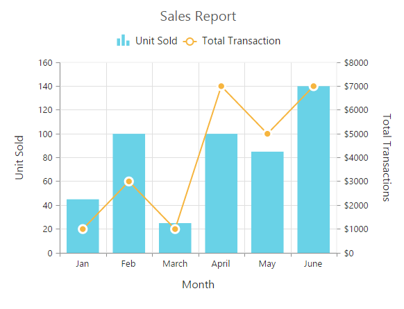
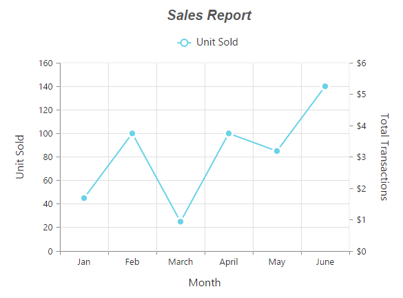

# Chart Series

## Multiple Series

In EjChart, you can add multiple series object in the `e-series` options. The series are rendered in the order it is added to the `e-series` option, by default. You can change this order by using the `e-series-zOrder` option.  


<html xmlns="http://www.w3.org/1999/xhtml" lang="en" ng-app="ChartApp">
    <head>
        <title>Essential Studio for AngularJS: Chart</title>
        <!--CSS and Script file References -->
    </head>
    <body ng-controller="ChartCtrl">
         

         <e-series>
         <e-series e-name="Gold" e-datasource=dataSource e-xname="XValue" e-yname="YValue1" >
         </e-series>
         <e-series e-name="Silver" e-datasource=dataSource e-xname="XValue" e-yname="YValue2" >
         </e-series>
         <e-series e-name="Bronze" e-datasource=dataSource e-xname="XValue" e-yname="YValue3">
         </e-series>
         </e-series>
         

         
    </body>
</html>



### Customizing all series together

By using the `e-commonSeriesOptions`, you can customize the series options for all the series commonly, instead of setting the options directly on each series object. 

N> The inline properties of the series has the first priority and override the commonSeriesOptions.

The following code example explains on how to enable marker, tooltip and animation for the chart series by using the commonSeriesOptions.



<html xmlns="http://www.w3.org/1999/xhtml" lang="en" ng-app="ChartApp">
    <head>
        <title>Essential Studio for AngularJS: Chart</title>
        <!--CSS and Script file References -->
    </head>
    <body ng-controller="ChartCtrl">
        

         <e-series>
         <e-series e-name="Gold" e-datasource=dataSource e-xname="XValue" e-yname="YValue1" >
         </e-series>
         <e-series e-name="Silver" e-datasource=dataSource e-xname="XValue" e-yname="YValue2" >
         </e-series>
         <e-series e-name="Bronze" e-datasource=dataSource e-xname="XValue" e-yname="YValue3">
         </e-series>
         </e-series>
        

        
    </body>
</html>
 

## Combination Series

EjChart allows you to render the combination of different series in the chart. 


<html xmlns="http://www.w3.org/1999/xhtml" lang="en" ng-app="ChartApp">
    <head>
        <title>Essential Studio for AngularJS: Chart</title>
        <!--CSS and Script file References -->
    </head>
    <body ng-controller="ChartCtrl">
         

         <e-series>
          //Set chart type to series1
         <e-series e-type="column" >
         </e-series>
          //Set chart type to series2
         <e-series e-type="line" >
         </e-series>
         </e-series>
         

         
    </body>
</html>



### Limitation of combination chart

* `Bar`, `StackingBar`, and `StackingBar100` cannot be combined with the other Cartesian type series.

* Cartesian type series cannot be combined with the accumulation series (`pie`, `doughnut`, `funnel`, and `pyramid`).

* `Polar` and `Radar` series cannot be combined with the accumulation and Cartesian type series.

When the combination of Cartesian and accumulation series types are added to the series option, the series that are similar to the first series are rendered and other series are ignored. The following code example illustrates this,  


<html xmlns="http://www.w3.org/1999/xhtml" lang="en" ng-app="ChartApp">
    <head>
        <title>Essential Studio for AngularJS: Chart</title>
        <!--CSS and Script file References -->
    </head>
    <body ng-controller="ChartCtrl">
         

         <e-series>
         <e-series e-type="line" e-name="Gold" e-datasource=dataSource e-xname="XValue" 
         e-yname="YValue1"></e-series>
         <e-series e-type="pie" e-name="Silver" e-datasource=dataSource e-xname="XValue" 
         e-yname="YValue2" ></e-series>
         </e-series>
         

         
    </body>
</html>



