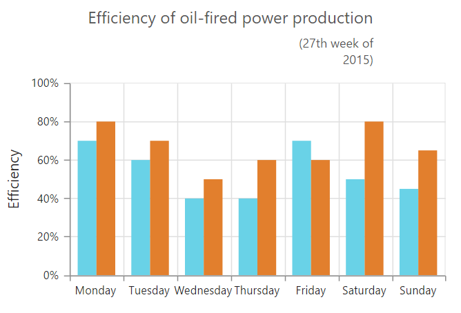

# Chart Title & Subtitle

## Title

By using the title option, you can add the `e-title-text` as well as customize its `e-title-border`,  `e-title-background` and `e-title-font`.



<html xmlns="http://www.w3.org/1999/xhtml" lang="en" ng-app="ChartApp">
    <head>
        <title>Essential Studio for AngularJS: Chart</title>
        <!--CSS and Script file References -->
    </head>
    <body ng-controller="ChartCtrl">
        

        

        
    </body>
</html>



We can trim, wrap and wrapAndTrim to the chart title using textOverflow property. The original text will be displayed as tooltip on mouse hover.



 <html xmlns="http://www.w3.org/1999/xhtml" lang="en" ng-app="ChartApp">
    <head>
        <title>Essential Studio for AngularJS: Chart</title>
        <!--CSS and Script file References -->
    </head>
    <body ng-controller="ChartCtrl">
        

        

        
    </body>
</html>



### Title Alignment

You can change the title alignment to *center*, *far* and *near* by using the `e-title-textAlignment` property of the chart title. 


<html xmlns="http://www.w3.org/1999/xhtml" lang="en" ng-app="ChartApp">
    <head>
        <title>Essential Studio for AngularJS: Chart</title>
        <!--CSS and Script file References -->
    </head>
    <body ng-controller="ChartCtrl">
        

        

        
    </body>
</html>

 

## Add Subtitle to the chart

By using the subTitle option, you can add the `e-title-subTitle` to the chart title and customize its `e-title-subtitle-border`,  `e-title-subtitle-background` color and `e-title-subtitle-font`. 



<html xmlns="http://www.w3.org/1999/xhtml" lang="en" ng-app="ChartApp">
    <head>
        <title>Essential Studio for AngularJS: Chart</title>
        <!--CSS and Script file References -->
    </head>
    <body ng-controller="ChartCtrl">
        

        

        
    </body>
</html>



We can trim, wrap and wrapAndTrim to the chart subtitle using textOverflow property. The original text will be displayed as tooltip on mouse hover.



 <html xmlns="http://www.w3.org/1999/xhtml" lang="en" ng-app="ChartApp">
    <head>
        <title>Essential Studio for AngularJS: Chart</title>
        <!--CSS and Script file References -->
    </head>
    <body ng-controller="ChartCtrl">
        

        

        
    </body>
</html>



### Subtitle Alignment

You can change the subtitle alignment to *center*, *far* and *near* by using the `e-title-subtitle-textAlignment` property of the subTitle.



<html xmlns="http://www.w3.org/1999/xhtml" lang="en" ng-app="ChartApp">
    <head>
        <title>Essential Studio for AngularJS: Chart</title>
        <!--CSS and Script file References -->
    </head>
    <body ng-controller="ChartCtrl">
        

        

        
    </body>
</html>



