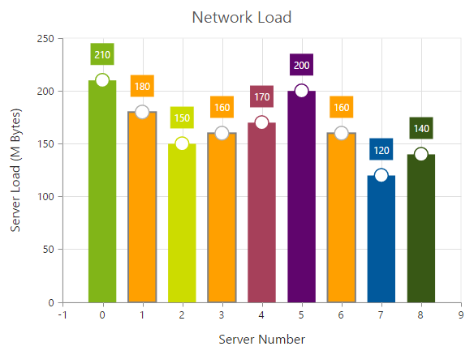

# Empty Points 

The Data points that uses the **null** or **undefined** as value are considered as empty points. Empty data points are ignored and not plotted in the Chart. When the data is provided by using the `e-points` property, you can set the **isEmpty** to true to specify that the particular point is an empty point.



<html xmlns="http://www.w3.org/1999/xhtml" lang="en" ng-app="ChartApp">
    <head>
        <title>Essential Studio for AngularJS: Chart</title>
        <!--CSS and Script file References -->
    </head>
    <body ng-controller="ChartCtrl">
        

        <e-series>
        <e-series >
        <e-points>
        <e-points e-x="0" e-y="210"></e-points>
        <e-points e-x="1" e-y="null"></e-points>
        <e-points e-x="2" e-y="150"></e-points>
        <e-points e-x="3" e-y="180" e-isempty="true"></e-points>
        <e-points e-x="4" e-y="170"></e-points>
        <e-points e-x="5" e-y="200"></e-points>
        <e-points e-x="6" e-y="140" e-isempty="true"></e-points>
        <e-points e-x="7" e-y="120"></e-points>
        <e-points e-x="8" e-y="140"></e-points>
        </e-points>
        </e-series>
        </e-series>
        

        
    </body>
</html>
   


## EmptyPointSettings

You can customize the empty points visibility and change its `displayMode` *(gap, zero and average)* using `e-emptypointsettings` option.


<html xmlns="http://www.w3.org/1999/xhtml" lang="en" ng-app="ChartApp">
    <head>
        <title>Essential Studio for AngularJS: Chart</title>
        <!--CSS and Script file References -->
    </head>
    <body ng-controller="ChartCtrl">
        

        <e-series>
        <e-series e-emptypointsettings-visible="true"
        e-emptypointsettings-displayMode="average"></e-series>
        </e-series>
        

        
    </body>
</html>



If the `visible` property of `e-emptypointsettings` is *false*, then the empty points has been dropped and chart will be rendered without empty points.

## Customizing Styles

Empty points color and border can be customized using `style` property of `e-emptypointsettings`.



<html xmlns="http://www.w3.org/1999/xhtml" lang="en" ng-app="ChartApp">
    <head>
        <title>Essential Studio for AngularJS: Chart</title>
        <!--CSS and Script file References -->
    </head>
    <body ng-controller="ChartCtrl">
        

        <e-series>
        <e-series e-emptypointsettings-visible="true"
        e-emptypointsettings-style-color="#ffa000"
        e-emptypointsettings-style-border-color="gray"
        e-emptypointsettings-style-border-width="2"></e-series>
        </e-series>
        

        
    </body>
</html>
 



