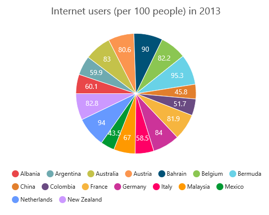
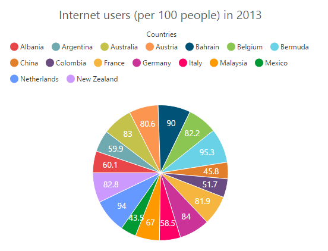
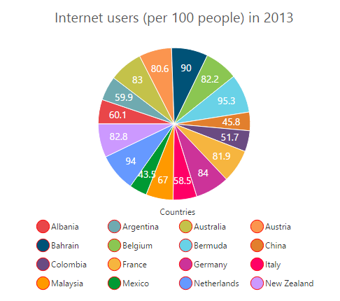
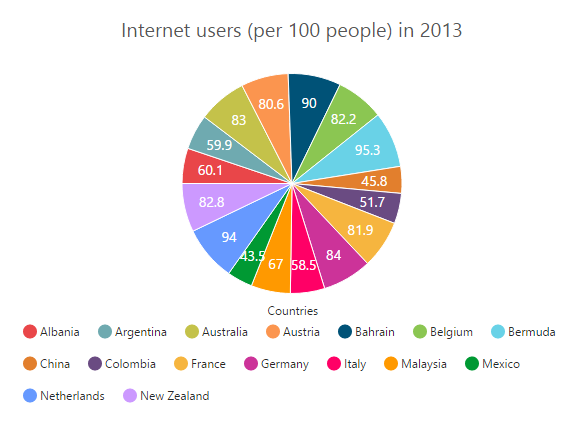
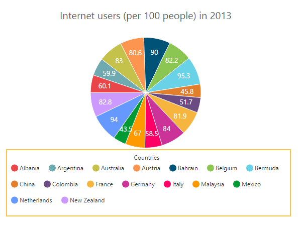
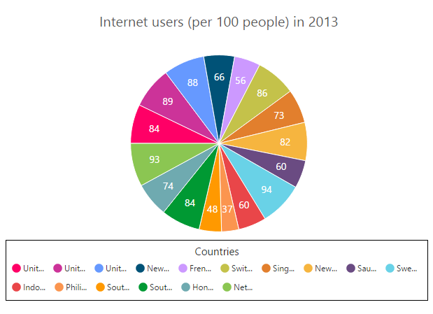
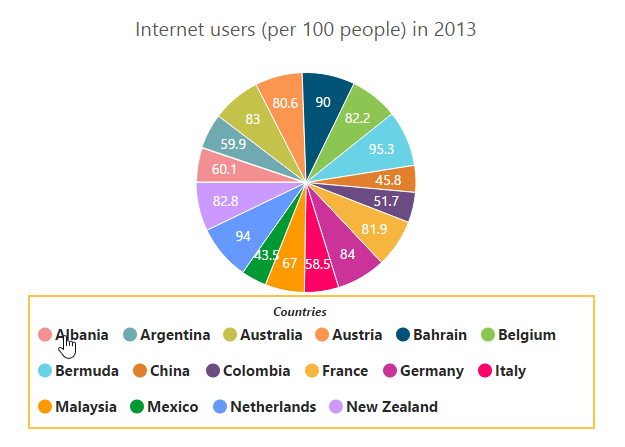

# Legend

The legend contains the list of chart series and Trendlines that appear in a chart. 

## Legend Visibility

By default, the legend is enabled in the chart. You can enable or disable it by using the `e-legend-visible` option .



<html xmlns="http://www.w3.org/1999/xhtml" lang="en" ng-app="ChartApp">
    <head>
        <title>Essential Studio for AngularJS: Chart</title>
        <!--CSS and Script file References -->
    </head>
    <body ng-controller="ChartCtrl">
        

        

        
    </body>
</html>



## Legend title

To add the title to the legend, you have to specify the `e-legend-title-text` option.



<html xmlns="http://www.w3.org/1999/xhtml" lang="en" ng-app="ChartApp">
    <head>
        <title>Essential Studio for AngularJS: Chart</title>
        <!--CSS and Script file References -->
    </head>
    <body ng-controller="ChartCtrl">
        

        

        
    </body>
</html>



## Position and Align the Legend

By using the `e-legend-position`option, you can position the legend at *left*, *right*, *top* or *bottom* of the chart. The legend is positioned at the **bottom** of the chart, by default.



<html xmlns="http://www.w3.org/1999/xhtml" lang="en" ng-app="ChartApp">
    <head>
        <title>Essential Studio for AngularJS: Chart</title>
        <!--CSS and Script file References -->
    </head>
    <body ng-controller="ChartCtrl">
        

        

        
    </body>
</html>



**Legend Alignment**

You can align the legend to the *center*, *far* or *near* based on its position by using the `e-legend-alignment` option.



<html xmlns="http://www.w3.org/1999/xhtml" lang="en" ng-app="ChartApp">
    <head>
        <title>Essential Studio for AngularJS: Chart</title>
        <!--CSS and Script file References -->
    </head>
    <body ng-controller="ChartCtrl">
        

        

        
    </body>
</html>



## Arrange legend items in the rows and columns

You can arrange the legend items horizontally and vertically by using the `e-legend-rowCount` and `e-legend-columnCount` options of the legend.

* When only the `e-legend-rowCount` is specified, the legend items are arranged according to the `e-legend-rowCount` and number of columns may vary based on the number of legend items.

* When only the `e-legend-columnCount` is specified, the legend items are arranged according to the `e-legend-columnCount` and number of rows may vary based on the number of legend items.

* When both the options are specified, then the one which has higher value is given preference. For example, when the `e-legend-rowCount` is 4 and `e-legend-columnCount` is 3, legend items are arranged in 4 rows.

* When both the options are specified and have the same value, the preference is given to the `e-legend-columnCount` when it is positioned at the top/bottom position. The preference is given to the `e-legend-rowCount` when it is positioned at the left/right position.
 



<html xmlns="http://www.w3.org/1999/xhtml" lang="en" ng-app="ChartApp">
    <head>
        <title>Essential Studio for AngularJS: Chart</title>
        <!--CSS and Script file References -->
    </head>
    <body ng-controller="ChartCtrl">
        

        

        
    </body>
</html>



## Customization

### Legend shape

To change the legend icon shape, you have to specify the shape in the `e-legend-shape` property of the legend. When you want the legend icon to display the prototype of the series, you have to set the **seriesType** as shape.



<html xmlns="http://www.w3.org/1999/xhtml" lang="en" ng-app="ChartApp">
    <head>
        <title>Essential Studio for AngularJS: Chart</title>
        <!--CSS and Script file References -->
    </head>
    <body ng-controller="ChartCtrl">
        

        

        
    </body>
</html>



### Legend items size and border

You can change the size of the legend items by using the `width` and `height` options. To change the legend item border, use `border` option of the legend itemStyle.



<html xmlns="http://www.w3.org/1999/xhtml" lang="en" ng-app="ChartApp">
    <head>
        <title>Essential Studio for AngularJS: Chart</title>
        <!--CSS and Script file References -->
    </head>
    <body ng-controller="ChartCtrl">
        

        

        
    </body>
</html>



### Legend size

By default, legend takes 20% of the **height** horizontally when it was placed on the top or bottom position and 20% of the **width** vertically while placing on the left or right position of the chart. You can change this default legend size by using the `e-legend-size` option of the legend.  


<html xmlns="http://www.w3.org/1999/xhtml" lang="en" ng-app="ChartApp">
    <head>
        <title>Essential Studio for AngularJS: Chart</title>
        <!--CSS and Script file References -->
    </head>
    <body ng-controller="ChartCtrl">
        

        

        
    </body>
</html>



### Legend Item Padding

You can control the spacing between the legend items by using the `e-legend-itemPadding` option of the legend.  The default value is 10. 



<html xmlns="http://www.w3.org/1999/xhtml" lang="en" ng-app="ChartApp">
    <head>
        <title>Essential Studio for AngularJS: Chart</title>
        <!--CSS and Script file References -->
    </head>
    <body ng-controller="ChartCtrl">
        

        

        
    </body>
</html>



### Legend border

You can customize the legend border by using the `e-legend-border` option in the legend. 


<html xmlns="http://www.w3.org/1999/xhtml" lang="en" ng-app="ChartApp">
    <head>
        <title>Essential Studio for AngularJS: Chart</title>
        <!--CSS and Script file References -->
    </head>
    <body ng-controller="ChartCtrl">
        

        

        
    </body>
</html>



### Scrollbar for legend

You can enable or disable the legend scrollbar by using the `e-legend-enableScrollbar` option of the legend. When you disable the scrollbar option, the legend does not consider the `default size` and chart draws in the remaining space. If you have specified the `size` to the legend with the scrollbar disabled, then the legends beyond this limit will get clipped. The default value of `e-legend-enableScrollbar` option is **true**.  



<html xmlns="http://www.w3.org/1999/xhtml" lang="en" ng-app="ChartApp">
    <head>
        <title>Essential Studio for AngularJS: Chart</title>
        <!--CSS and Script file References -->
    </head>
    <body ng-controller="ChartCtrl">
        

        

        
    </body>
</html>



### Customize the legend text

To customize the legend item text and title you can use the `e-legend-font` and `e-legend-title` options. You can change the legend title alignment by using the `e-legend-text-textAlignment`option of the legend title.



<html xmlns="http://www.w3.org/1999/xhtml" lang="en" ng-app="ChartApp">
    <head>
        <title>Essential Studio for AngularJS: Chart</title>
        <!--CSS and Script file References -->
    </head>
    <body ng-controller="ChartCtrl">
        

        

        
    </body>
</html>



### LegendItems Text Overflow

**Trim**

You can trim the legend item text when its width exceeds the `e-legend-textWidth`, by specifying `e-legend-textOverflow` as **"trim"**. The original text will be displayed on mouse hover.



<html xmlns="http://www.w3.org/1999/xhtml" lang="en" ng-app="ChartApp">
    <head>
        <title>Essential Studio for AngularJS: Chart</title>
        <!--CSS and Script file References -->
    </head>
    <body ng-controller="ChartCtrl">
        

        

        
    </body>
</html>
  
 

 

**Wrap**

By specifying `e-legend-textOverflow` as **"wrap"**, you can wrap the legend text by word.

**WrapAndTrim**

You can wrap and trim the legend text by specifying `e-legend-textOverflow` as **"wrapAndTrim"**. The original text will be displayed on mouse hover.

   

## Handle the legend item clicked

You can get the legend item details such as *index*, *bounds*, *shape* and *series* by subscribing the `e-legendItemClick` event on the chart. When the legend item is clicked, it triggers the event and returns the `legend information`. 



<html xmlns="http://www.w3.org/1999/xhtml" lang="en" ng-app="ChartApp">
    <head>
        <title>Essential Studio for AngularJS: Chart</title>
        <!--CSS and Script file References -->
    </head>
    <body ng-controller="ChartCtrl">
        

        

        
    </body>
</html>   



## Series selection on legend item click

You can select a specific series or point while clicking on the corresponding legend item through disabling the `e-toggleSeriesVisibility` option of the legend. The default value of toggleSeriesVisibility option is **true**. To customize the series selection refer to the series `e-series-selection`



<html xmlns="http://www.w3.org/1999/xhtml" lang="en" ng-app="ChartApp">
    <head>
        <title>Essential Studio for AngularJS: Chart</title>
        <!--CSS and Script file References -->
    </head>
    <body ng-controller="ChartCtrl">
        

        

        
    </body>
</html>   



## Collapsing legend item

You can collapse the specific series/point legend item displaying in the chart, by setting the `visibleOnLegend` as *"hidden"* in the point or series.



<html xmlns="http://www.w3.org/1999/xhtml" lang="en" ng-app="ChartApp">
    <head>
        <title>Essential Studio for AngularJS: Chart</title>
        <!--CSS and Script file References -->
    </head>
    <body ng-controller="ChartCtrl">
        

        <e-series>
        <e-series>
        <e-points>
        <e-points e-x="Albania" e-y="60.1"></e-points>
          //...
           //Collapse the point's legend item in the legend collection
        <e-points e-x="New Zealand" e-y="82.8" e-visibleOnLegend="hidden"></e-points>
        </e-points>
        </e-series>
        </e-series>
        

        
    </body>
</html>

      


