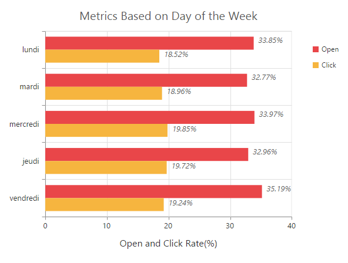

# Localization

EjChart supports localization for its axis labels and tooltip. To render the chart with specific culture you have to refer the corresponding **globalize** culture script and need to specify the culture name in `e-locale` property of chart.   



<html xmlns="http://www.w3.org/1999/xhtml" lang="en" ng-app="ChartApp">
    <head>
        <title>Essential Studio for AngularJS: Chart</title>
        <!--CSS and Script file References -->
        <!--Refer french globalize culture script-->
    
    </head>
    <body ng-controller="ChartCtrl">
        

        

        
    </body>
</html>



