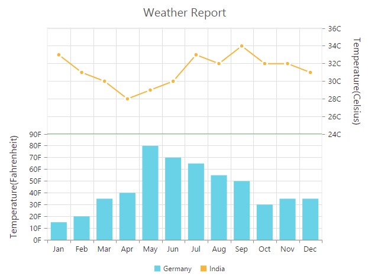

# Multiple panes

Chart area can be divided into multiple panes using the `e-rowDefinitions` and `e-columnDefinitions` properties.

### Row Definitions

To split the chart area vertically into a number of rows, use `e-rowDefinitions` of the chart. 

* You can allocate space for each row by using the `unit` option that determines whether the chart area should be split by *percentage* or *pixels* for the given `rowHeight` value of the rowDefinitions.
 
* To associate a vertical axis to a row, specify the rowDefinitions **index** value to the `e-rowIndex` property of the chart axis.

* To customize each row’s horizontal line, use `lineColor` and `lineWidth` property.



<html xmlns="http://www.w3.org/1999/xhtml" lang="en" ng-app="ChartApp">
    <head>
        <title>Essential Studio for AngularJS: Chart</title>
        <!--CSS and Script file References -->
    </head>
    <body ng-controller="ChartCtrl">
        

        <e-rowdefinitions>
        <e-rowdefinition e-unit="percentage" e-linecolor="Gray" e-rowheight="50"
        e-linewidth="0"></e-rowdefinition>
        <e-rowdefinition e-unit="percentage" e-linecolor="green" e-rowheight="50"
        e-linewidth="0"></e-rowdefinition>
        <e-rowdefinitions>
        <e-axes>
        <e-axis e-name="yAxis1" e-rowindex="1">
        </e-axes>
        <e-series>
        <e-series e-yAxisName="yAxis1"></e-series>
        </e-series>
        

        
    </body>
</html>



**Row Span**

For spanning the vertical axis along multiple panes vertically, you can use `e-primaryyaxis-rowSpan` property of axis. 



<html xmlns="http://www.w3.org/1999/xhtml" lang="en" ng-app="ChartApp">
    <head>
        <title>Essential Studio for AngularJS: Chart</title>
        <!--CSS and Script file References -->
    </head>
    <body ng-controller="ChartCtrl">
        

        <e-rowdefinitions>
         //...
        <e-rowdefinitions>
        <e-axes>
        <e-axis ></e-axis>
        </e-axes>
        <e-series>
        <e-series e-yAxisName="yAxis1"></e-series>
        </e-series>
        

        
    </body>
</html>



## Column Definitions

To split the chart area horizontally into a number of columns, use `e-columnDefinitions` of the chart.

* You can allocate space for each column by using the `unit` option that determines whether the chart area should be split by *percentage* or *pixels* for the given `columnWidth` value of the columnDefinitions.
 
* To associate a horizontal axis to a column, specify the columnDefinitions **index** value to the `e-columnIndex` property of the chart axis.
 

<html xmlns="http://www.w3.org/1999/xhtml" lang="en" ng-app="ChartApp">
    <head>
        <title>Essential Studio for AngularJS: Chart</title>
        <!--CSS and Script file References -->
    </head>
    <body ng-controller="ChartCtrl">
        

        <e-columndefinitions>
        <e-columndefinition e-unit="percentage" e-columnwidth="50">
        </e-columndefinition>
        <e-columndefinition e-unit="percentage"  e-columnwidth="50">
        </e-columndefinition>
        <e-columndefinitions>
        <e-axes>
        <e-axis e-name="xAxis1" e-columnindex="1">
        </e-axes>
        <e-series>
        <e-series e-xAxisName="yAxis1"></e-series>
        </e-series>
        

        
    </body>
</html>


**Column Span**

For spanning the horizontal axis along multiple panes horizontally, you can use `e-columnSpan` property of axis. 



 <html xmlns="http://www.w3.org/1999/xhtml" lang="en" ng-app="ChartApp">
    <head>
        <title>Essential Studio for AngularJS: Chart</title>
        <!--CSS and Script file References -->
    </head>
    <body ng-controller="ChartCtrl">
        

        <e-columndefinitions>
        // ..
        <e-columndefinitions>
        <e-axes>
        <e-axis ></e-axis>
        </e-axes>
        <e-series>
        <e-series e-xAxisName="xAxis1"></e-series>
        </e-series>
        

        
    </body>
</html>



