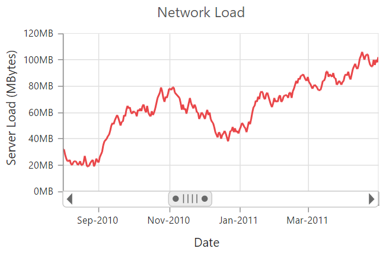

# Performance 

* When there are large number of points to load, you can enable canvas rendering mode in chart. Canvas rendering is faster than SVG because it does not involve manipulating DOM elements as much as SVG rendering.   



<html xmlns="http://www.w3.org/1999/xhtml" lang="en" ng-app="ChartApp">
    <head>
        <title>Essential Studio for AngularJS: Chart</title>
        <!--CSS and Script file References -->
    </head>
    <body ng-controller="ChartCtrl">
        

        

        
    </body>
</html>



* Instead of enabling data markers and labels when there are large number of data points, you can use **trackball** and **tooltip** to view point information.

## Lazy Loading

Lazy loading feature provides an effective way for loading data on demand by scrolling and viewing a smaller range of data from a larger collection.



<html xmlns="http://www.w3.org/1999/xhtml" lang="en" ng-app="ChartApp">
    <head>
        <title>Essential Studio for AngularJS: Chart</title>
        <!--CSS and Script file References -->
    </head>
    <body ng-controller="ChartCtrl">
        

        

        
    </body>
</html>
 
 

