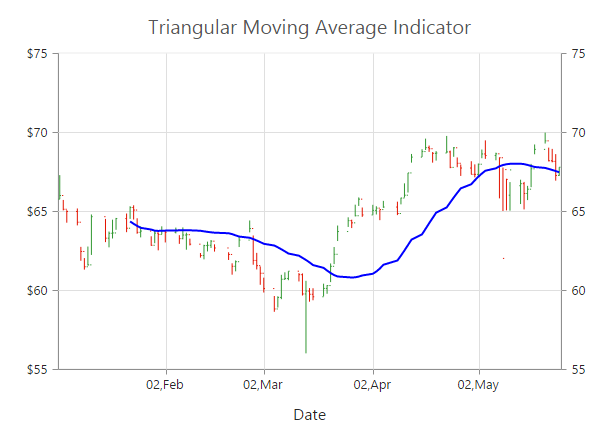

# Technical Indicators

EjChart control supports 10 types of technical indicators. 

## Bind data to render the indicator

You can bind the series `e-series-datasource` to the indicator by setting the specific series name to the indicator by using the `e-indicators-seriesName` property.



<html xmlns="http://www.w3.org/1999/xhtml" lang="en" ng-app="ChartApp">
    <head>
        <title>Essential Studio for AngularJS: Chart</title>
        <!--CSS and Script file References -->
    </head>
    <body ng-controller="ChartCtrl">
        

        <e-series>
        <e-series e-datasource="dataSource" e-xname="xDate" e-high="High" e-low="Low" e-open="Open" 
        e-close="Close" e-name="Hilo" e-type="hiloopenclose"></e-series>
        </e-series>
        <e-indicators>
        <e-indicator e-seriesname="Hilo"></e-indicator>
        </e-indicators>
        

        
    </body>
</html>



Also, you can add data to the indicator directly by using the `dataSource` option of the indicator.  



<html xmlns="http://www.w3.org/1999/xhtml" lang="en" ng-app="ChartApp">
    <head>
        <title>Essential Studio for AngularJS: Chart</title>
        <!--CSS and Script file References -->
    </head>
    <body ng-controller="ChartCtrl">
        

        <e-indicators>
        <e-indicator e-datasource=chartData e-xname="xDate" e-high="High" e-low="Low"
        e-open="Open" e-close="Close"></e-indicator>
        </e-indicators>
        

        
    </body>
</html>



	
## Indicator Types

### Accumulation Distribution

To create an Accumulation Distribution indicator, set the `indicators.type` as **"accumulationdistribution"**. Accumulation Distribution require **‘volume’** field additionally with the `dataSource` to calculate the signal line.



<html xmlns="http://www.w3.org/1999/xhtml" lang="en" ng-app="ChartApp">
    <head>
        <title>Essential Studio for AngularJS: Chart</title>
        <!--CSS and Script file References -->
    </head>
    <body ng-controller="ChartCtrl">
        

        <e-series>
        <e-series e-datasource="dataSource" e-xname="xDate" e-high="high" e-low="low" e-open="open" 
        e-close="close" e-name="hilo" e-type="hiloopenclose" e-volume="volume"></e-series>
        </e-series>
        <e-indicators>
        <e-indicator e-seriesname="hilo" e-type="accumulationdistribution"></e-indicator>
        </e-indicators>
        

        
    </body>
</html>



### Average True Range (ATR)

You can create an ATR indicator by setting the `indicators.type` as **"atr"** in the `e-indicators`. 



<html xmlns="http://www.w3.org/1999/xhtml" lang="en" ng-app="ChartApp">
    <head>
        <title>Essential Studio for AngularJS: Chart</title>
        <!--CSS and Script file References -->
    </head>
    <body ng-controller="ChartCtrl">
        

        <e-series>
        <e-series e-datasource="dataSource" e-xname="xDate" e-high="high" e-low="low" e-open="open" 
        e-close="close" e-name="hilo" e-type="hiloopenclose" ></e-series>
        </e-series>
        <e-indicators>
        <e-indicator e-seriesname="hilo" e-type="atr"></e-indicator>
        </e-indicators>
        

        
    </body>
</html>



### Bollinger Band 

Bollinger Band indicator is created by setting the `indicators.type` as **"bollingerband"**. It contains three lines, namely upper band, lower band and signal line. Bollinger Band default value of the period is 14 and standardDeviations is 2.



<html xmlns="http://www.w3.org/1999/xhtml" lang="en" ng-app="ChartApp">
    <head>
        <title>Essential Studio for AngularJS: Chart</title>
        <!--CSS and Script file References -->
    </head>
    <body ng-controller="ChartCtrl">
        

        <e-series>
        <e-series e-datasource="dataSource" e-xname="xDate" e-high="high" e-low="low" e-open="open" 
        e-close="close" e-name="hilo" e-type="hiloopenclose" ></e-series>
        </e-series>
        <e-indicators>
        <e-indicator e-seriesname="hilo" e-type="bollingerband"></e-indicator>
        </e-indicators>
        

        
    </body>
</html>


### Exponential Moving Average (EMA)

To render an EMA indicator, you have to set the `indicators.type` as **"ema"**.  



<html xmlns="http://www.w3.org/1999/xhtml" lang="en" ng-app="ChartApp">
    <head>
        <title>Essential Studio for AngularJS: Chart</title>
        <!--CSS and Script file References -->
    </head>
    <body ng-controller="ChartCtrl">
        

        <e-series>
        <e-series e-datasource="dataSource" e-xname="xDate" e-high="high" e-low="low" e-open="open" 
        e-close="close" e-name="hilo" e-type="hiloopenclose" ></e-series>
        </e-series>
        <e-indicators>
        <e-indicator e-seriesname="hilo" e-type="ema"></e-indicator>
        </e-indicators>
        

        
    </body>
</html>



### Momentum 

Momentum Technical indicator is created by setting the `indicators.type` as **"momentum"**. The momentum indicator renders two lines, namely upper band and signal line. Upper band always rendered at the value 100 and the signal line is calculated based on the momentum of the data.



<html xmlns="http://www.w3.org/1999/xhtml" lang="en" ng-app="ChartApp">
    <head>
        <title>Essential Studio for AngularJS: Chart</title>
        <!--CSS and Script file References -->
    </head>
    <body ng-controller="ChartCtrl">
        

        <e-series>
        <e-series e-datasource="dataSource" e-xname="xDate" e-high="high" e-low="low" e-open="open" 
        e-close="close" e-name="hilo" e-type="hiloopenclose" ></e-series>
        </e-series>
         <e-indicators>
        <e-indicator e-seriesname="hilo" e-type="momentum"></e-indicator>
        </e-indicators>
        

        
    </body>
</html>


### Moving Average Convergence Divergence (MACD)

To render an MACD indicator, you have to set the `indicators.type` as **"macd"**.  MACD indicator contains MACD line, Signal line and Histogram column. Histogram is used to differentiate MACD and signal line.



<html xmlns="http://www.w3.org/1999/xhtml" lang="en" ng-app="ChartApp">
    <head>
        <title>Essential Studio for AngularJS: Chart</title>
        <!--CSS and Script file References -->
    </head>
    <body ng-controller="ChartCtrl">
        

        <e-series>
        <e-series e-datasource="dataSource" e-xname="xDate" e-high="high" e-low="low" e-open="open" 
        e-close="close" e-name="hilo" e-type="hiloopenclose" ></e-series>
         <e-indicators>
        <e-indicator e-seriesname="hilo" e-type="macd"></e-indicator>
        </e-indicators>
        </e-series>
        

        
    </body>
</html>



#### macdType

By using the `macdType` enumeration property, you can change the MACD rendering as *line*, *histogram* or *both*. 



<html xmlns="http://www.w3.org/1999/xhtml" lang="en" ng-app="ChartApp">
    <head>
        <title>Essential Studio for AngularJS: Chart</title>
        <!--CSS and Script file References -->
    </head>
    <body ng-controller="ChartCtrl">
        

        <e-series>
        <e-series e-datasource="dataSource" e-xname="xDate" e-high="high" e-low="low" e-open="open" 
        e-close="close" e-name="hilo" e-type="hiloopenclose" ></e-series>
        </e-series>
        <e-indicators>
        <e-indicator e-seriesname="hilo" e-type="macd" e-macdtype="histogram"></e-indicator>
        </e-indicators>
        

        
    </body>
</html>
        



### Relative Strength Index (RSI)

To render the RSI indicator, set the `indicators.type` as **"rsi"**. It contains three lines, namely upper band, lower band and signal line. Upper and lower band always render at value 70 and 30 respectively and signal line is calculated based on the **RSI** formula.



<html xmlns="http://www.w3.org/1999/xhtml" lang="en" ng-app="ChartApp">
    <head>
        <title>Essential Studio for AngularJS: Chart</title>
        <!--CSS and Script file References -->
    </head>
    <body ng-controller="ChartCtrl">
        

        <e-series>
        <e-series e-datasource="dataSource" e-xname="xDate" e-high="high" e-low="low" e-open="open" 
        e-close="close" e-name="hilo" e-type="hiloopenclose" ></e-series>
        </e-series>
        <e-indicators>
        <e-indicator e-seriesname="hilo" e-type="rsi"></e-indicator>
        </e-indicators>
        

        
    </body>
</html>



### Simple Moving Average (SMA)

To render the SMA indicator, you should specify the `indicators.type` as **"sma"**.  



<html xmlns="http://www.w3.org/1999/xhtml" lang="en" ng-app="ChartApp">
    <head>
        <title>Essential Studio for AngularJS: Chart</title>
        <!--CSS and Script file References -->
    </head>
    <body ng-controller="ChartCtrl">
        

        <e-series>
        <e-series e-datasource="dataSource" e-xname="xDate" e-high="high" e-low="low" e-open="open" 
        e-close="close" e-name="hilo" e-type="hiloopenclose" ></e-series>
        </e-series>
         <e-indicators>
        <e-indicator e-seriesname="hilo" e-type="sma"></e-indicator>
        </e-indicators>
        

        
    </body>
</html>



### Stochastic 

For the Stochastic indicator, you need to set the `indicators.type` as **"stochastic"**. The Stochastic indicator renders four lines namely, upper line, lower line, stochastic line and the signal line. Upper line always rendered at value 80 and the lower line is rendered at value 20. Stochastic and Signal Lines are calculated based on the stochastic formula.



<html xmlns="http://www.w3.org/1999/xhtml" lang="en" ng-app="ChartApp">
    <head>
        <title>Essential Studio for AngularJS: Chart</title>
        <!--CSS and Script file References -->
    </head>
    <body ng-controller="ChartCtrl">
        

        <e-series>
        <e-series e-datasource="dataSource" e-xname="xDate" e-high="high" e-low="low" e-open="open" 
        e-close="close" e-name="hilo" e-type="hiloopenclose" ></e-series>
        <e-indicators>
        <e-indicator e-seriesname="hilo" e-type="stochastic"></e-indicator>
        </e-indicators>
        </e-series>
        

        
    </body>
</html>



### Triangular Moving Average (TMA)

To render the TMA indicator, you should specify the `indicators.type` as **"tma"**. 


<html xmlns="http://www.w3.org/1999/xhtml" lang="en" ng-app="ChartApp">
    <head>
        <title>Essential Studio for AngularJS: Chart</title>
        <!--CSS and Script file References -->
    </head>
    <body ng-controller="ChartCtrl">
        

        <e-series>
        <e-series e-datasource="dataSource" e-xname="xDate" e-high="high" e-low="low" e-open="open" 
        e-close="close" e-name="hilo" e-type="hiloopenclose" ></e-series>
        </e-series>
        <e-indicators>
        <e-indicator e-seriesname="hilo" e-type="tma"></e-indicator>
        </e-indicators>
        

        
    </body>
</html>



## Enable Tooltip 

To display the indicator tooltip, use `visible` option of the `indicators.tooltip`. Also, you can change and customize the tooltip color, border, format and font properties similar to the series tooltip.



<html xmlns="http://www.w3.org/1999/xhtml" lang="en" ng-app="ChartApp">
    <head>
        <title>Essential Studio for AngularJS: Chart</title>
        <!--CSS and Script file References -->
    </head>
    <body ng-controller="ChartCtrl">
        

        <e-series>
        <e-series e-datasource="dataSource" e-xname="xDate" e-high="high" e-low="low" e-open="open" 
        e-close="close" e-name="hilo" e-type="hiloopenclose" ></e-series>
        </e-series>
        <e-indicators>
        <e-indicator e-tooltip-visible="true"></e-indicator>
        </e-indicators>
        

        
    </body>
</html>



