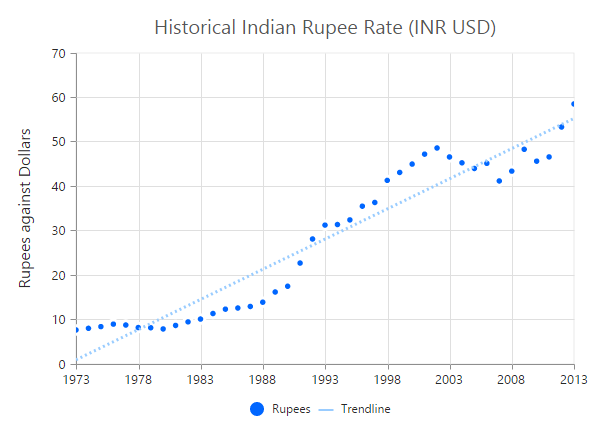
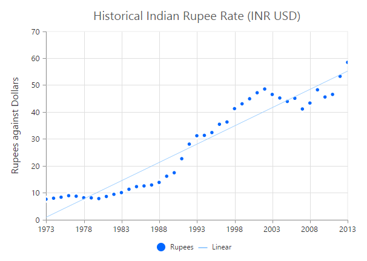
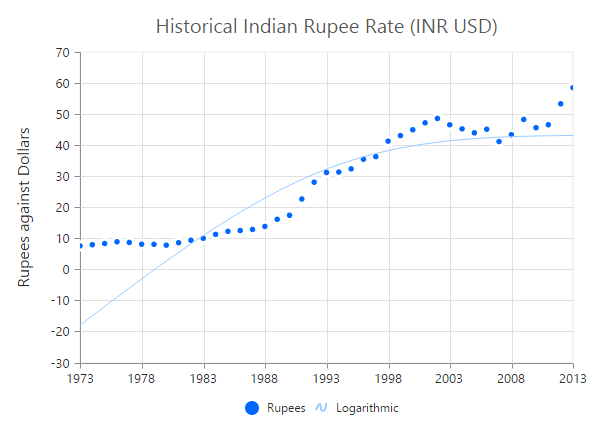
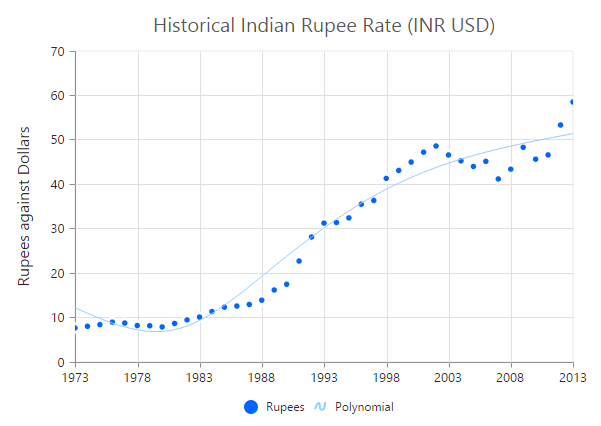
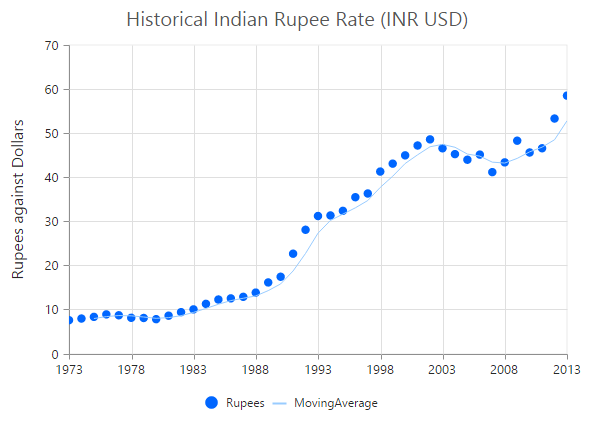

# Trendlines

EjChart can generate Trendlines for Cartesian type series *(Line, Column, Scatter, Area, Candle, HiLo etc.)* except bar type series. You can add more than one trendline object to the `e-trendlines` option.



<html xmlns="http://www.w3.org/1999/xhtml" lang="en" ng-app="ChartApp">
    <head>
        <title>Essential Studio for AngularJS: Chart</title>
        <!--CSS and Script file References -->
    </head>
    <body ng-controller="ChartCtrl">
        

        <e-series>
        <e-series e-trendlines="trendline"></e-series>
        </e-series>
        

        
    </body>
</html>



## Customize the trendline styles

A trendline can be customized by using the properties such as `fill`, `width`, **dashArray** and **opacity**. The default type of trendline is **"linear"**.



<html xmlns="http://www.w3.org/1999/xhtml" lang="en" ng-app="ChartApp">
    <head>
        <title>Essential Studio for AngularJS: Chart</title>
        <!--CSS and Script file References -->
    </head>
    <body ng-controller="ChartCtrl">
        

        <e-series>
        <e-series e-trendlines="trendline"></e-series>
        </e-series>
        

        
    </body>
</html>



## Types of Trendline

EjChart supports the following type of Trendlines.

* Linear
* Exponential
* Logarithmic
* Power 
* Polynomial
* MovingAverage

### Linear

To render Linear Trendline, you have to set the `type` as **"linear"**. 



<html xmlns="http://www.w3.org/1999/xhtml" lang="en" ng-app="ChartApp">
    <head>
        <title>Essential Studio for AngularJS: Chart</title>
        <!--CSS and Script file References -->
    </head>
    <body ng-controller="ChartCtrl">
        

        <e-series>
        <e-series e-trendlines="trendline"></e-series>
        </e-series>
        

        
    </body>
</html>
 



### Exponential

Exponential Trendline can be rendered by setting the `type` as **"exponential"**. 



 <html xmlns="http://www.w3.org/1999/xhtml" lang="en" ng-app="ChartApp">
    <head>
        <title>Essential Studio for AngularJS: Chart</title>
        <!--CSS and Script file References -->
    </head>
    <body ng-controller="ChartCtrl">
        

        <e-series>
        <e-series e-trendlines="trendline"></e-series>
        </e-series>
        

        
    </body>
</html>



### Logarithmic

Logarithmic Trendline can be rendered by setting the `type` as **"Logarithmic"**.  


<html xmlns="http://www.w3.org/1999/xhtml" lang="en" ng-app="ChartApp">
    <head>
        <title>Essential Studio for AngularJS: Chart</title>
        <!--CSS and Script file References -->
    </head>
    <body ng-controller="ChartCtrl">
        

        <e-series>
        <e-series e-trendlines="trendline"></e-series>
        </e-series>
        

        
    </body>
</html>



### Power

Power Trendline can be rendered by setting the `type` of the trendline as **"power"**. 



 <html xmlns="http://www.w3.org/1999/xhtml" lang="en" ng-app="ChartApp">
    <head>
        <title>Essential Studio for AngularJS: Chart</title>
        <!--CSS and Script file References -->
    </head>
    <body ng-controller="ChartCtrl">
        

        <e-series>
        <e-series e-trendlines="trendline"></e-series>
        </e-series>
        

        
    </body>
</html>



### Polynomial

Polynomial Trendline can be rendered by setting the trendline `type` as **"polynomial"**.  You can change the polynomial order by using the **polynomialOrder** of the trendlines. It ranges from 2 to 6.


<html xmlns="http://www.w3.org/1999/xhtml" lang="en" ng-app="ChartApp">
    <head>
        <title>Essential Studio for AngularJS: Chart</title>
        <!--CSS and Script file References -->
    </head>
    <body ng-controller="ChartCtrl">
        

        <e-series>
        <e-series e-trendlines="trendline"></e-series>
        </e-series>
        

        
    </body>
</html>



### MovingAverage

MovingAverage Trendline can be rendered by setting the `type` of the trendline as **"movingAverage"**. 



  <html xmlns="http://www.w3.org/1999/xhtml" lang="en" ng-app="ChartApp">
    <head>
        <title>Essential Studio for AngularJS: Chart</title>
        <!--CSS and Script file References -->
    </head>
    <body ng-controller="ChartCtrl">
        

        <e-series>
        <e-series e-trendlines="trendline"></e-series>
        </e-series>
        

        
    </body>
</html>



## Forecasting

**Trendline forecasting** is the prediction of future/past situations.  **Forecasting** can be classified into two types as follows.

  * Forward Forecasting
  * Backward Forecasting

### Forward Forecasting

The value set for `forwardForecast` is used to determine the distance moving towards the future trend.


<html xmlns="http://www.w3.org/1999/xhtml" lang="en" ng-app="ChartApp">
    <head>
        <title>Essential Studio for AngularJS: Chart</title>
        <!--CSS and Script file References -->
    </head>
    <body ng-controller="ChartCtrl">
        

        <e-series>
        <e-series e-trendlines="trendline"></e-series>
        </e-series>
        

        
    </body>
</html>



### Backward Forecasting

The value set for the `backwardForecast` is used to determine the past trends.



  <html xmlns="http://www.w3.org/1999/xhtml" lang="en" ng-app="ChartApp">
    <head>
        <title>Essential Studio for AngularJS: Chart</title>
        <!--CSS and Script file References -->
    </head>
    <body ng-controller="ChartCtrl">
        

        <e-series>
        <e-series e-trendlines="trendline"></e-series>
        </e-series>
        

        
    </body>
</html>



## Trendlines Legend

To display the legend item for trendline, use the `name` property. You can interact with the trendline legends similar to the series legends *(show/hide trendlines on legend click)*.  



<html xmlns="http://www.w3.org/1999/xhtml" lang="en" ng-app="ChartApp">
    <head>
        <title>Essential Studio for AngularJS: Chart</title>
        <!--CSS and Script file References -->
    </head>
    <body ng-controller="ChartCtrl">
        

        <e-series>
        <e-series e-trendlines="trendline"></e-series>
        </e-series>
        

        
    </body>
</html>



