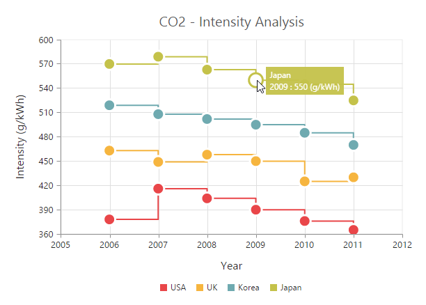
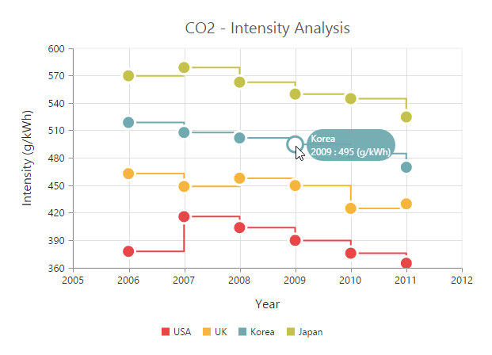
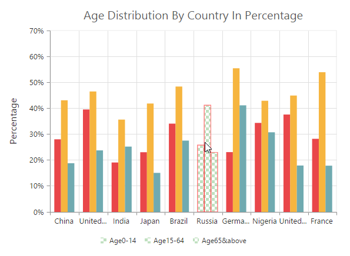
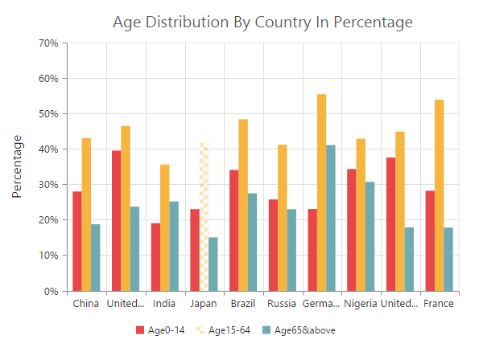
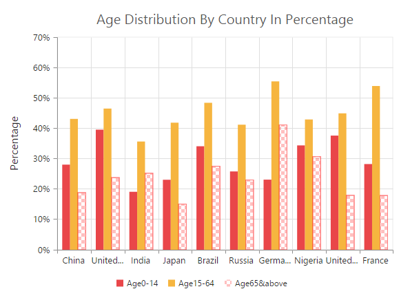

# User Interactions

## Tooltip

### Enable tooltip for data point

Tooltip for the data points can be enabled by using the `visible` option of the `e-tooltip` in the series.



<html xmlns="http://www.w3.org/1999/xhtml" lang="en" ng-app="ChartApp">
    <head>
        <title>Essential Studio for AngularJS: Chart</title>
        <!--CSS and Script file References -->
    </head>
    <body ng-controller="ChartCtrl">
        

        <e-series>
        <e-series e-tooltip-visible="true"></e-series>
        </e-series>
        

        
    </body>
</html>



### Format the tooltip 

Tooltip displays data specified by the `format` option of the tooltip. The default value of the format option is * **#point.x# : #point.y#** *. Here, * **#point.x#** * is the placeholder for x value of the point and * **#point.y#** * is the placeholder for y value of the point.

You can also use * **#series.<optionname>#** * as placeholder to display the value of an option in corresponding series and use * **#point.<optionname>#** * as place holder to display the value of an option in the corresponding point.



<html xmlns="http://www.w3.org/1999/xhtml" lang="en" ng-app="ChartApp">
    <head>
        <title>Essential Studio for AngularJS: Chart</title>
        <!--CSS and Script file References -->
    </head>
    <body ng-controller="ChartCtrl">
        

        <e-series>
        <e-series e-tooltip-visible="true"
        e-tooltip-format="#series.name#   #point.x# : #point.y#  (g/kWh)"></e-series>
        </e-series>
        

        
    </body>
</html>



### Tooltip Template

HTML elements can be displayed in the tooltip by using the `template` option of the tooltip. The template option takes the value of the id attribute of the HTML element. You can use the * **#point.x#** * and * **#point.y#** * as place holders in the HTML element to display the x and y values of the corresponding data point. 

You can also use * **#series.<optionname>#** * as place holder to display the value of an option in corresponding series of the tooltip and use * **#point.<optionname>#** * as place holder to display the value of an option in the corresponding point for which the tooltip is displayed.
  



<html xmlns="http://www.w3.org/1999/xhtml" lang="en" ng-app="ChartApp">
    <head>
        <title>Essential Studio for AngularJS: Chart</title>
        <!--CSS and Script file References -->
    </head>
    <body ng-controller="ChartCtrl">
    

              
 
 
  

        

            

               <label id="efpercentage">&nbsp;#point.y#% </label>
               <label id="ef">Efficiency </label>
            

        

    

        

        <e-series>
        <e-series e-tooltip-template="Tooltip"></e-series>
        </e-series>
        

        
    </body>
</html>



[Click](http://ngjq.syncfusion.com/#/chart/line) here to view the Tooltip template online demo sample.

#### Tooltip template animation

You can enable animation by setting the `e-enableAnimation` to true. Tooltip animates when the mouse moves from one data point to another point. The `e-duration` property in tooltip specifies the time taken to animate the tooltip. the duration is set to **"500ms"**, by default.

N> Tooltip is animated only if the template is specified for tooltip.



<html xmlns="http://www.w3.org/1999/xhtml" lang="en" ng-app="ChartApp">
    <head>
        <title>Essential Studio for AngularJS: Chart</title>
        <!--CSS and Script file References -->
    </head>
    <body ng-controller="ChartCtrl">
    

              
 
 
  

        

            

               <label id="efpercentage">&nbsp;#point.y#% </label>
               <label id="ef">Efficiency </label>
            

        

    

        

        <e-series>
        <e-series e-tooltip-template="Tooltip"
        e-tooltip-enableAnimation="true" e-tooltip-duration="1000ms"></e-series>
        </e-series>
        

        
    </body>
</html>



### Customize the appearance of tooltip   

The `fill` and `border` options are used to customize the background color and border of the tooltip respectively. The `font` option in the tooltip is used to customize the font of the tooltip text.



<html xmlns="http://www.w3.org/1999/xhtml" lang="en" ng-app="ChartApp">
    <head>
        <title>Essential Studio for AngularJS: Chart</title>
        <!--CSS and Script file References -->
    </head>
    <body ng-controller="ChartCtrl">
        

        <e-series>
        <e-series e-tooltip-fill="#FF9933" e-tooltip-border-width="1"
        e-tooltip-border-color="#993300"></e-series>
        </e-series>
        

        
    </body>
</html>



#### Tooltip with rounded corners

The options `rx` and `ry` are used to customize the corner radius of the tooltip rectangle.



<html xmlns="http://www.w3.org/1999/xhtml" lang="en" ng-app="ChartApp">
    <head>
        <title>Essential Studio for AngularJS: Chart</title>
        <!--CSS and Script file References -->
    </head>
    <body ng-controller="ChartCtrl">
        

        <e-series>
        <e-series e-tooltip-rx="50" e-tooltip-ry="50"></e-series>
        </e-series>
        

        
    </body>
</html>



## Zooming and Panning

### Enable Zooming

There are two ways you can zoom the chart,

* When the `e-zooming-enable` option is set to true, you can zoom the chart by using the rubber band selection.

* When the `e-zooming-enableMouseWheel` option is set to true, you can zoom the chart on mouse wheel scrolling. 

* When `e-zooming-enablePinching` option is set to *true*, you can zoom the chart through pinch gesture.

N> Pinch zooming is supported only in browsers that support multi-touch gestures. Currently IE10, IE11, Chrome and Opera browsers support multi-touch in desktop devices.



<html xmlns="http://www.w3.org/1999/xhtml" lang="en" ng-app="ChartApp">
    <head>
        <title>Essential Studio for AngularJS: Chart</title>
        <!--CSS and Script file References -->
    </head>
    <body ng-controller="ChartCtrl">
        

        

        
    </body>
</html>



After zooming the chart, a zooming toolbar will appear with options to *zoom*, *pan* and *reset*. Selecting the Pan option will allow to pan the chart and selecting the Reset option will reset the zoomed chart.

### Types of zooming

The `e-zooming-type` option in zooming specifies whether the chart is allowed to scale along the horizontal axis or vertical axis or along both axis. The default value of the `e-zooming-type` is **"xy"** (both axis).



<html xmlns="http://www.w3.org/1999/xhtml" lang="en" ng-app="ChartApp">
    <head>
        <title>Essential Studio for AngularJS: Chart</title>
        <!--CSS and Script file References -->
    </head>
    <body ng-controller="ChartCtrl">
        

        

        
    </body>
</html>



### Customizing zooming toolbar

You can choose the items displayed in the zooming toolbar by specifying the property `e-zooming-toolBarItems`.



<html xmlns="http://www.w3.org/1999/xhtml" lang="en" ng-app="ChartApp">
    <head>
        <title>Essential Studio for AngularJS: Chart</title>
        <!--CSS and Script file References -->
    </head>
    <body ng-controller="ChartCtrl">
        

        

        
    </body>
</html>



### Enable ScrollBar

EjChart provides scrollbar support to view the other portions of chart area which is not shown in the view port when zoomed, by setting true to `e-zooming-enableScrollbar` option in `e-zooming`.  



<html xmlns="http://www.w3.org/1999/xhtml" lang="en" ng-app="ChartApp">
    <head>
        <title>Essential Studio for AngularJS: Chart</title>
        <!--CSS and Script file References -->
    </head>
    <body ng-controller="ChartCtrl">
        

        

        
    </body>
</html>



## Crosshair

Crosshair is used to view the value of an axis at mouse position or touch contact point. 

### Enable crosshair and crosshair label

Crosshair can be enabled by using the `e-crosshair-visible` option . Crosshair label for an axis can be enabled by using the `e-primaryyaxis-crosshairLabel-visible`  option  in the corresponding axis.



<html xmlns="http://www.w3.org/1999/xhtml" lang="en" ng-app="ChartApp">
    <head>
        <title>Essential Studio for AngularJS: Chart</title>
        <!--CSS and Script file References -->
    </head>
    <body ng-controller="ChartCtrl">
    

    

    
    </body>
</html>
     



### Customize the crosshair line and crosshair label

The `fill` and `border` options of the `e-primaryxaxis-crosshairLabel` is used to customize the background color and border of the crosshair label respectively. Color and width of the crosshair line can be customized by using the `line` option in the crosshair .



<html xmlns="http://www.w3.org/1999/xhtml" lang="en" ng-app="ChartApp">
    <head>
        <title>Essential Studio for AngularJS: Chart</title>
        <!--CSS and Script file References -->
    </head>
    <body ng-controller="ChartCtrl">
    

    

    
    </body>
</html>



## Trackball

Trackball is used to track a data point close to the mouse position or touch contact point. Trackball marker indicates the closest point and trackball tooltip displays the information about the point.

### Enable Trackball

Trackball can be enabled by setting the `e-crosshair-visible` option  to *true* and then set the `e-crosshair-type` as **"trackball"**. The default value of type is **"crosshair"**.



<html xmlns="http://www.w3.org/1999/xhtml" lang="en" ng-app="ChartApp">
    <head>
        <title>Essential Studio for AngularJS: Chart</title>
        <!--CSS and Script file References -->
    </head>
    <body ng-controller="ChartCtrl">
    

    

    
    </body>
</html>
     



#### Customize trackball marker and trackball line

Shape and size of the trackball marker can be customized by using the `shape`and `size` options of the crosshair marker. Color and width of the trackball line can be customized by using the `line` option in the crosshair.



<html xmlns="http://www.w3.org/1999/xhtml" lang="en" ng-app="ChartApp">
    <head>
        <title>Essential Studio for AngularJS: Chart</title>
        <!--CSS and Script file References -->
    </head>
    <body ng-controller="ChartCtrl">
    

    

    
    </body>
</html>



### Format Trackball tooltip

X and Y values displayed in the trackball tooltip are formatted based on its axis `e-primaryxaxis-labelFormat`.  



<html xmlns="http://www.w3.org/1999/xhtml" lang="en" ng-app="ChartApp">
    <head>
        <title>Essential Studio for AngularJS: Chart</title>
        <!--CSS and Script file References -->
    </head>
    <body ng-controller="ChartCtrl">
    

    

    
    </body>
</html>



You can able to show the trackball tooltip in two modes, using trackballTooltipSettings.

                1.Grouping.
                2.Float. 



<html xmlns="http://www.w3.org/1999/xhtml" lang="en" ng-app="ChartApp">
    <head>
        <title>Essential Studio for AngularJS: Chart</title>
        <!--CSS and Script file References -->
    </head>
    <body ng-controller="ChartCtrl">
    

    

    
    </body>
</html>



#### Trackball tooltip template:
Trackball tooltip template is used to display the tooltip in customized template format. You can define the desired template in css style. You can enable the **toolTipTemplate**  by using the following code snippet.



<html xmlns="http://www.w3.org/1999/xhtml" lang="en" ng-app="ChartApp">
    <head>
        <title>Essential Studio for AngularJS: Chart</title>
        <!--CSS and Script file References -->
    </head>
    <body ng-controller="ChartCtrl">
    

    

    
    </body>
</html>



## Highlight

EjChart provides highlighting support for the series and data points on mouse hover. To enable the highlighting option, set the `enable` property to *true* in the `e-highlightsettings` of the series.

N> When hovering mouse on the data points, the corresponding series legend also will be highlighted.



<html xmlns="http://www.w3.org/1999/xhtml" lang="en" ng-app="ChartApp">
    <head>
        <title>Essential Studio for AngularJS: Chart</title>
        <!--CSS and Script file References -->
    </head>
    <body ng-controller="ChartCtrl">
    

    <e-series>
    <e-series e-highlightsettings-enable="true"></e-series>
    </e-series>
    

    
    </body>
</html>



### Highlight Mode

You can set three different highlight mode for the highlighting data point and series by using the `mode` property of the `e-highlightsettings`.

* Series
* Points
* Cluster

**Series mode**

To highlight all the data points of the specified series, you can set the **"series"** value to the `mode` option in the highlightSettings. 



<html xmlns="http://www.w3.org/1999/xhtml" lang="en" ng-app="ChartApp">
    <head>
        <title>Essential Studio for AngularJS: Chart</title>
        <!--CSS and Script file References -->
    </head>
    <body ng-controller="ChartCtrl">
    

    <e-series>
    <e-series e-highlightsettings-enable="true" e-highlightsettings-mode="series"></e-series>
    </e-series>
    

    
    </body>
</html>



**Point mode**

To highlight a single point, you can set the **"point"** value to the `mode` option.



<html xmlns="http://www.w3.org/1999/xhtml" lang="en" ng-app="ChartApp">
    <head>
        <title>Essential Studio for AngularJS: Chart</title>
        <!--CSS and Script file References -->
    </head>
    <body ng-controller="ChartCtrl">
    

    <e-series>
    <e-series e-highlightsettings-enable="true" e-highlightsettings-mode="point"></e-series>
    </e-series>
    

    
    </body>
</html>



**Cluster mode**

To highlight the points that corresponds to the same index in all the series, set the **"cluster"** value to the `mode` option.



<html xmlns="http://www.w3.org/1999/xhtml" lang="en" ng-app="ChartApp">
    <head>
        <title>Essential Studio for AngularJS: Chart</title>
        <!--CSS and Script file References -->
    </head>
    <body ng-controller="ChartCtrl">
    

    <e-series>
    <e-series e-highlightsettings-enable="true" e-highlightsettings-mode="cluster"></e-series>
    </e-series>
    

    
    </body>
</html>



### Customize the highlight styles

To customize the highlighted series, use the `color`, `border` and `opacity` options in the highlightSettings.



<html xmlns="http://www.w3.org/1999/xhtml" lang="en" ng-app="ChartApp">
    <head>
        <title>Essential Studio for AngularJS: Chart</title>
        <!--CSS and Script file References -->
    </head>
    <body ng-controller="ChartCtrl">
    

    <e-series>
    <e-series e-highlightsettings-enable="true" e-highlightsettings-border-width="1.5"
    e-highlightsettings-border-color="red" e-highlightsettings-opacity="0.5"
    e-highlightsettings-color="green"></e-series>
    </e-series>
    

    
    </body>
</html>



### Patterns to highlight

EjChart provides pattern support for highlighting the data by setting the value to the `pattern` property of the highlightSettings. The different types of highlight patterns are as follows.

1.	chessboard
2.	crosshatch
3.	dots
4.	pacman
5.	grid
6.	turquoise
7.	star
8.	triangle
9.	circle
10.	tile
11.	horizontalDash
12.	verticalDash
13.	rectangle
14.	box
15.	verticalStripe
16.	horizontalStripe
17.	bubble
18.	diagonalBackward
19.	diagonalForward



 <html xmlns="http://www.w3.org/1999/xhtml" lang="en" ng-app="ChartApp">
    <head>
        <title>Essential Studio for AngularJS: Chart</title>
        <!--CSS and Script file References -->
    </head>
    <body ng-controller="ChartCtrl">
    

    <e-series>
    <e-series e-highlightsettings-enable="true" e-highlightsettings-pattern="chessboard">
    </e-series>
    </e-series>
    

    
    </body>
</html>



#### Custom pattern

To create a custom pattern for the highlighting data points, set the pattern type as **"custom"** and add the custom pattern **id** in the `customPattern` option of the highlightSettings.



<html xmlns="http://www.w3.org/1999/xhtml" lang="en" ng-app="ChartApp">
    <head>
        <title>Essential Studio for AngularJS: Chart</title>
        <!--CSS and Script file References -->
    </head>
    <body ng-controller="ChartCtrl">
    <svg>
    <pattern id="dots_a" patternUnits="userSpaceOnUse" width="6" height="6">
    <rect x="0" y="0" width="6" height="6" transform="translate(0,0)" fill="black" opacity="1"></rect>
    <path d='M 3 -3 L -3 3 M 0 6 L 6 0 M 9 3 L 3 9'stroke-width="1" stroke="white"></path>
    </pattern>
    </svg>
    

    <e-series>
    <e-series e-highlightsettings-enable="true" e-highlightsettings-pattern="custom"
    e-highlightsettings-customPattern="dots_a"></e-series>
    </e-series>
    

    
    </body>
</html>
   


## Selection

EjChart provides selection support for the series and data points on mouse click. To enable the selection option, set the `enable` property to *true* in the `e-selectionsettings` of the series.

N> When mouse is clicked on the data points, the corresponding series legend also will be selected.



<html xmlns="http://www.w3.org/1999/xhtml" lang="en" ng-app="ChartApp">
    <head>
        <title>Essential Studio for AngularJS: Chart</title>
        <!--CSS and Script file References -->
    </head>
    <body ng-controller="ChartCtrl">
    

    <e-series>
    <e-series e-selectionsettings-enable="true"></e-series>
    </e-series>
    

    
    </body>
</html>



### Selection Mode

You can set four different selection mode for highlighting the data point and series by using the `mode` property of the selectionSettings.

* Series
* Points
* Cluster
* Range

**Series mode**

To select all the data points of the specified series, you can set the **"series"** value to the `mode` option in the selectionSettings.



<html xmlns="http://www.w3.org/1999/xhtml" lang="en" ng-app="ChartApp">
    <head>
        <title>Essential Studio for AngularJS: Chart</title>
        <!--CSS and Script file References -->
    </head>
    <body ng-controller="ChartCtrl">
    

    <e-series>
    <e-series e-selectionsettings-enable="true" e-selectionsettings-mode="series"
    e-selectionsettings-pattern="chessboard"></e-series>
    </e-series>
    

    
    </body>
</html>



**Point mode**

To highlight a single point, you can set the **"point"** value to the `mode` option. 



<html xmlns="http://www.w3.org/1999/xhtml" lang="en" ng-app="ChartApp">
    <head>
        <title>Essential Studio for AngularJS: Chart</title>
        <!--CSS and Script file References -->
    </head>
    <body ng-controller="ChartCtrl">
    

    <e-series>
    <e-series e-selectionsettings-enable="true" e-selectionsettings-mode="point"></e-series>
    </e-series>
    

    
    </body>
</html>



**Cluster mode**

To select the points that corresponds to the same index in all the series, set the **"cluster"** value to the `mode` option.



<html xmlns="http://www.w3.org/1999/xhtml" lang="en" ng-app="ChartApp">
    <head>
        <title>Essential Studio for AngularJS: Chart</title>
        <!--CSS and Script file References -->
    </head>
    <body ng-controller="ChartCtrl">
    

    <e-series>
    <e-series e-selectionsettings-enable="true" e-selectionsettings-mode="cluster"></e-series>
    </e-series>
    

    
    </body>
</html>
   


**Range mode**

To fetch the selected area data points value, you can set the selectionSettings `mode` as **range** in the chart series. The selection rectangle can be drawn as horizontally, vertically or in both direction by using `rangeType` property and the selected data’s are returned as an array collection in the `e-rangeselected` event.  



<html xmlns="http://www.w3.org/1999/xhtml" lang="en" ng-app="ChartApp">
    <head>
        <title>Essential Studio for AngularJS: Chart</title>
        <!--CSS and Script file References -->
    </head>
    <body ng-controller="ChartCtrl">
    

    <e-series>
    <e-series e-selectionsettings-enable="true" e-selectionsettings-mode="range"
    e-selectionsettings-rangeType="xy"></e-series>
    </e-series>
    

    
    </body>
</html>     



### Selection Type

You can set two different selection type for selecting the data point and series on mouse click by using the `type` property of the selectionSettings. 

* Single 
* Multiple 

**Single Type**

To select a data point or a series on mouse click based on the `selectionSettings.mode`, set `selectionSettings.type` as **"single"** in the series.



<html xmlns="http://www.w3.org/1999/xhtml" lang="en" ng-app="ChartApp">
    <head>
        <title>Essential Studio for AngularJS: Chart</title>
        <!--CSS and Script file References -->
    </head>
    <body ng-controller="ChartCtrl">
    

    

    
    </body>
</html>



**Multiple Type**

For selecting multiple data points or series on mouse click, set `selectionSettings.type` as **"multiple"** in the series.



<html xmlns="http://www.w3.org/1999/xhtml" lang="en" ng-app="ChartApp">
    <head>
        <title>Essential Studio for AngularJS: Chart</title>
        <!--CSS and Script file References -->
    </head>
    <body ng-controller="ChartCtrl">
    

    

    
    </body>
</html>



### Customizing selection styles

To customize the selection styles, use the `color`, `border` and `opacity` options in the selectionSettings.



<html xmlns="http://www.w3.org/1999/xhtml" lang="en" ng-app="ChartApp">
    <head>
        <title>Essential Studio for AngularJS: Chart</title>
        <!--CSS and Script file References -->
    </head>
    <body ng-controller="ChartCtrl">
    

    <e-series>
    <e-series e-selectionsettings-enable="true" e-selectionsettings-border-width="1.5"
    e-selectionsettings-border-color="red" e-selectionsettings-opacity="0.5"
    e-selectionsettings-color="red"></e-series>
    </e-series>
    

    
    </body>
</html>



### Patterns for selection

EjChart provides pattern support for the data selection by setting the value to the `pattern` property of the selectionSettings. The different types of selection patterns are as follows.

1.	chessboard
2.	crosshatch
3.	dots
4.	pacman
5.	grid
6.	turquoise
7.	star
8.	triangle
9.	circle
10.	tile
11.	horizontalDash
12.	verticalDash
13.	rectangle
14.	box
15.	verticalStripe
16.	horizontalStripe
17.	bubble
18.	diagonalBackward
19.	diagonalForward



<html xmlns="http://www.w3.org/1999/xhtml" lang="en" ng-app="ChartApp">
    <head>
        <title>Essential Studio for AngularJS: Chart</title>
        <!--CSS and Script file References -->
    </head>
    <body ng-controller="ChartCtrl">
    

    <e-series>
    <e-series e-selectionsettings-enable="true" e-selectionsettings-pattern="diagonalForward">
    </e-series>
    </e-series>
    

    
    </body>
</html>



#### Custom pattern

To create a custom pattern for selecting the data points, set the `pattern` type as **"custom"** and add the custom pattern **id** in the `customPattern` option of the selectionSettings.



<html xmlns="http://www.w3.org/1999/xhtml" lang="en" ng-app="ChartApp">
    <head>
        <title>Essential Studio for AngularJS: Chart</title>
        <!--CSS and Script file References -->
    </head>
    <body ng-controller="ChartCtrl">
    <svg>
    <pattern id="dots_a" patternUnits="userSpaceOnUse" width="6" height="6">
    <rect x="0" y="0" width="6" height="6" transform="translate(0,0)" fill="black" opacity="1"></rect>
    <path d='M 3 -3 L -3 3 M 0 6 L 6 0 M 9 3 L 3 9'stroke-width="1" stroke="white"></path>
    </pattern>
    </svg>
    

    <e-series>
    <e-series e-selectionsettings-enable="true"
    e-selectionsettings-pattern="custom" e-selectionsettings-customPattern="dots_a">
    </e-series>
    </e-series>
    

    
    </body>
</html>



### Handling Series Selection

To get the series information when selecting the specific series, subscribe to the `e-seriesregionclick` event and set the **selectionSettings.mode** as **"series"**.


<html xmlns="http://www.w3.org/1999/xhtml" lang="en" ng-app="ChartApp">
    <head>
        <title>Essential Studio for AngularJS: Chart</title>
        <!--CSS and Script file References -->
    </head>
    <body ng-controller="ChartCtrl">
    

    <e-series>
    <e-series e-selectionsettings-enable="true"></e-series>
    </e-series>
    

    
    </body>
</html>

       



### Selection on Load

We can able to select the point/series programmatically on chart load, by setting series and point index in the selectedDataPointIndexes property.



<html xmlns="http://www.w3.org/1999/xhtml" lang="en" ng-app="ChartApp">
    <head>
        <title>Essential Studio for AngularJS: Chart</title>
        <!--CSS and Script file References -->
    </head>
    <body ng-controller="ChartCtrl">
    

    <e-series>
    <e-series e-selectionsettings-enable="true"></e-series>
    </e-series>
        

        
    </body>
</html>
    



## Data Editing

EjChart provides support to change the location of the rendered points. This can be done by dragging the point and dropping it on another location in chart. To enable the data editing, set the `enable` property to true in the `e-dragSettings` of the series.



<html xmlns="http://www.w3.org/1999/xhtml" lang="en" ng-app="ChartApp">
    <head>
        <title>Essential Studio for AngularJS: Chart</title>
        <!--CSS and Script file References -->
    </head>
    <body ng-controller="ChartCtrl">
    

    <e-series>
    <e-series e-dragsettings-enable="true" >
    </e-series>
    </e-series>
    

    
    </body>
</html>



[Click](http://ngjq.syncfusion.com/#/chart/dragdrop) here to view the data editing online demo sample.

### Customize Dragging direction

To drag the point along x and y axes, you can specify `e-dragsettings-type` as xy in dragSettings. And to drag along x axis alone, specify the type as x and to drag along y axis, specify type as y.



<html xmlns="http://www.w3.org/1999/xhtml" lang="en" ng-app="ChartApp">
    <head>
        <title>Essential Studio for AngularJS: Chart</title>
        <!--CSS and Script file References -->
    </head>
    <body ng-controller="ChartCtrl">
    

    <e-series>
    <e-series e-dragsettings-type="y" >
    </e-series>
    </e-series>
    

    
    </body>
</html>



