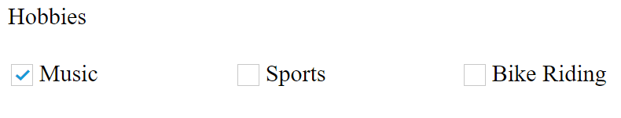
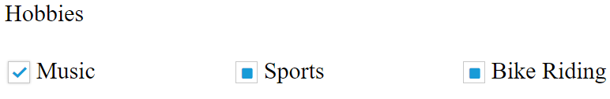
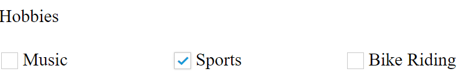

# Behavior Settings

In AngularJS, **CheckBox** control allows you to check an option to perform an action. This control allows you to select true or false or an intermediate option. These **ej-checkBox** are supported with themes.

This section helps us to render the **ej-checkBox** component in AngularJS platform.

**HTML View Section**



    

            Hobbies   
            <table>
                <tr>
                <td class="chkrad">
                        <input type="checkbox" ej-checkbox id="check1" e-value="Music" e-checked="true"/>
                        <label for="check1">Music</label>
                    </td>
                    <td class="chkrad">
                        <input type="checkbox" ej-checkbox id="Checkbox3" e-value="Sports" ng-model="all"/>
                        <label for="Checkbox3">Sports</label>
                    </td>
                    <td class="chkrad">
                        <input type="checkbox" ej-checkbox id="Checkbox4" e-value="BikeRiding"/>
                        <label for="Checkbox4">Bike Riding</label>
                    </td>
                </tr>
            </table>  
            Favorite Search Engines  
            <table>
                <tr>
                    <td class="chkrad">
                        <input type="checkbox" ej-checkbox id="Checkbox1" e-value="playingGames" e-size="medium" e-checked="true"/>
                        <label for="Checkbox1">Playing Games</label>
                        
 Value of playing Games: {{PlayingGames}}

                    </td>
                    <td class="chkrad">
                        <input type="checkbox" ej-checkbox id="Checkbox5" e-value="HearingSongs" e-size="medium"/>
                        <label for="Checkbox5">Hearing Songs</label>
                    </td>
                    <td class="chkrad">
                        <input type="checkbox" ej-checkbox id="Checkbox6" e-value="WatchingTV" e-size="medium" />
                        <label for="Checkbox6">Watching TV</label>
                    </td>
                </tr>
            </table>  
            Media Player  
            <table>
                <tr>
                    <td class="chkrad">
                        <input type="checkbox" ej-checkbox id="Checkbox2" e-value="Video" e-size="medium" />
                        <label for="Checkbox2">Video</label>
                    </td>
                    <td class="chkrad">
                        <input type="checkbox" ej-checkbox id="Checkbox7" e-value="Audio" e-size="medium" />
                        <label for="Checkbox7">Audio</label>
                    </td>
                    <td class="chkrad">
                        <input type="checkbox" ej-checkbox id="Checkbox8" e-value="Picture" e-size="medium" />
                        <label for="Checkbox8">Picture</label>
                    </td>
                </tr>
                
            </table>
             
        

 

**Controller Section**

 

    

 

## Checked	

This **checked** API of the checkbox specifies whether **ej-checkBox** has to be in checked or not. By default, we can manually set the **ej-checkBox** in checked state for our application.

**HTML View Section**



        
    <table>
            <tr>
                <td class="chkrad">
                        <input type="checkbox" ej-checkbox id="check1" e-value="Music" e-checked="true"/>
                        <label for="check1">Music</label>
                    </td>
                    <td class="chkrad">
                        <input type="checkbox" ej-checkbox id="Checkbox3" e-value="Sports" ng-model="all"/>
                        <label for="Checkbox3">Sports</label>
                    </td>
                    <td class="chkrad">
                        <input type="checkbox" ej-checkbox id="Checkbox4" e-value="BikeRiding"/>
                        <label for="Checkbox4">Bike Riding</label>
                    </td>
                </tr>
            </table>

 

**Controller Section**



    

 

The code will render the following output.

 

## enabled

      In AngularJS, enabled API of **ej-checkBox** control specifies the checkbox control state. The enabled API can be set with Boolean value to specifies current state of the component.

**HTML View Section**



    <table>
                <tr>
                <td class="chkrad">
                        <input type="checkbox" ej-checkbox id="check1" e-value="Music" e-checked="true" e-enabled="true"/>
                        <label for="check1">Music</label>
                    </td>
                    <td class="chkrad">
                        <input type="checkbox" ej-checkbox id="Checkbox3" e-value="Sports" e-enabled="false"/>
                        <label for="Checkbox3">Sports</label>
                    </td>
                    <td class="chkrad">
                        <input type="checkbox" ej-checkbox id="Checkbox4" e-value="BikeRiding"/>
                        <label for="Checkbox4">Bike Riding</label>
                    </td>
                </tr>
            </table>

 

**Controller Section**



    

 

The above code will render the following output.

 

## enableTristate

In AngularJS, enableTriState API of **ej-checkbox** control defines the enable or disabled state of component.

**HTML View Section**



     <table>
           <tr>
                <td class="chkrad">
                    <input type="checkbox" ej-checkbox id="check1" e-value="Music" e-enabletristate="true"/>
                    <label for="check1">Music</label>
                </td>
                <td class="chkrad">
                    <input type="checkbox" ej-checkbox id="Checkbox3" e-value="Sports" e-enabletristate="true" />
                    <label for="Checkbox3">Sports</label>
                </td>
                <td class="chkrad">
                    <input type="checkbox" ej-checkbox id="Checkbox4" e-value="BikeRiding" e-enabletristate="true"/>
                    <label for="Checkbox4">Bike Riding</label>
                </td>
            </tr>
        </table>



**Controller Section**



    



The above code will render the following output.

 

## enablePersistence

In AngularJS, **e-enablePersistence** API specifies the persistent property for **ej-checkBox** while initialization. The e-enablePersistance API save current model value to browser cookies for state maintains. While refreshing the **ej-checkbox** control page the model value apply from browser cookies.

**HTML View Section**



    <table> 
    <tr>
        <td class="chkrad">
        <input type="checkbox" ej-checkbox id="check1" e-value="Music" e-enablepersistence="false" />
            <label for="check1">Music</label>
                </td>
                <td class="chkrad">
                <input type="checkbox" ej-checkbox id="Checkbox3" e-value="Sports" e-enablepersistence="false"/>
                    <label for="Checkbox3">Sports</label>
                    </td>
                    <td class="chkrad">
                        <input type="checkbox" ej-checkbox id="Checkbox4" e-value="BikeRiding" e-enablepersistence="false"/>
                        <label for="Checkbox4">Bike Riding</label>
                    </td>
                </tr>
            </table>



**Controller Section**



    



 