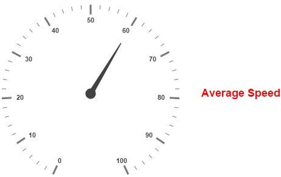

# Custom labels

Custom labels are the texts that you can use them in any location of the **Gauge**.

## Adding Custom Label Collection

Custom labels collection is directly added to the scale object. Refer the following code to add custom labels collection in a **Gauge** control.



<html xmlns="http://www.w3.org/1999/xhtml" lang="en" ng-app="CircularGaugeApp">
    <head>
        <title>Essential Studio for AngularJS: CircularGauge</title>
        <!--CSS and Script file References -->
    </head>
    <body ng-controller="CircularGaugeCtrl">
        

                <ej-circulargauge >
                <e-scales>
                <e-scale  e-showCustomLabels="true">
                <e-customlabels>
                <e-customlabel e-color="red">
                </e-customlabel>
                </e-customlabels>
                </e-scale>
                <e-scales> 
                </ej-circulargauge>
        

        
    </body>
</html>



**Basic Customization**

You can customize custom labels using the properties such as **textAngle**, **color** and **font**. **textAngle** attribute is used to display the custom labels in the specified angles and **color** attribute is used to display the custom labels in specified color. 

You can use **Value** attribute to set the text value in the custom labels. To display the custom labels, set **showCustomLabels** as ‘true’. To set the location of the custom label in **Circular Gauge**, **location** property is used. By using **x** and **y** axis you can adjust the position of the custom labels.

Font option is also available on  custom labels. The basic three properties of fonts such as size, family and style can be achieved by **size**, **fontStyle** and **fontFamily** attributes. 



<html xmlns="http://www.w3.org/1999/xhtml" lang="en" ng-app="CircularGaugeApp">
    <head>
        <title>Essential Studio for AngularJS: CircularGauge</title>
        <!--CSS and Script file References -->
    </head>
    <body ng-controller="CircularGaugeCtrl">
        

                <ej-circulargauge >
                <e-scales>
                <e-scale e-size="2" e-shadowOffset="10"  e-showRanges="true" e-showScaleBar="true"
                e-showCustomLabels="true" e-radius="150">
                <e-customlabels>
                <e-customlabel e-color="red" e-textAngle="10" e-value="CustomLabel1" e-font-size="18px"
                e-font-fontFamily="Arial" e-font-fontStyle="bold" e-position-x="180" e-position-y="100">
                </e-customlabel>
                </e-customlabels>
                </e-scale>
                <e-scales> 
                </ej-circulargauge>
        

        
    </body>
</html>



Execute the above code to render the following output.

## Multiple Custom Labels

You can set multiple custom labels in a single **Circular Gauge** by adding an array of custom label objects. Refer the following code example for multiple custom label functionality.



<html xmlns="http://www.w3.org/1999/xhtml" lang="en" ng-app="CircularGaugeApp">
    <head>
        <title>Essential Studio for AngularJS: CircularGauge</title>
        <!--CSS and Script file References -->
    </head>
    <body ng-controller="CircularGaugeCtrl">
        

                <ej-circulargauge >
                <e-scales>
                <e-scale e-size="2" e-shadowOffset="10"  e-showRanges="true" e-showScaleBar="true"
                 e-showCustomLabels="true" e-radius="150">
                <e-customlabels>
                <e-customlabel e-color="red" e-textAngle="10" e-value="CustomLabel1" e-font-size="18px"
                e-font-fontFamily="Arial" e-font-fontStyle="bold" e-position-x="180" e-position-y="100">
                </e-customlabel>
                <e-customlabel e-color="green" e-textAngle="10" e-value="CustomLabel2" e-font-size="18px"
                e-font-fontFamily="Arial" e-font-fontStyle="bold" e-position-x="180" e-position-y="250">
                </e-customlabel> 
                </e-customlabels>
                </e-scale>
                <e-scales> 
                </ej-circulargauge>
        

        
    </body>
</html>


Execute the above code to render the following output.

## Outer Custom Label

**Outer Custom Label** is used to show custom labels outside the **gauge** control. The **Outer Custom Label** can be positioned with API called **outerCustomLabelPosition.** The value for this API is enumerable type and its possible values are,

* Right

* Left

* Top

* Bottom

When a custom label is to be displayed as an **Outer Custom Label**, set the API **customLabelType** as Outer. Refer to the following code example to get the **Outer Custom Label**.



<html xmlns="http://www.w3.org/1999/xhtml" lang="en" ng-app="CircularGaugeApp">
    <head>
        <title>Essential Studio for AngularJS: CircularGauge</title>
        <!--CSS and Script file References -->
    </head>
    <body ng-controller="CircularGaugeCtrl">
        

                <ej-circulargauge e-outerCustomLabelPosition="right" 
                e-tooltip-showCustomLabelTooltip="true">
                <e-scales>
                <e-scale   e-showLabels="true" e-radius="150">
                <e-customlabels>
                <e-customlabel e-color="red" e-textAngle="10" e-value="Average Speed" e-font-size="18px"
                e-font-fontFamily="Arial" e-font-fontStyle="bold" e-position-x="360" e-position-y="30">
                </e-customlabel>
                </e-customlabels>
                <e-pointers>
                <e-pointer e-length="100" e-value="60">
                </e-pointers>
                </e-scale>
                <e-scales> 
                </ej-circulargauge>
        

        
    </body>
</html>



Execute the above code to render the following output.

