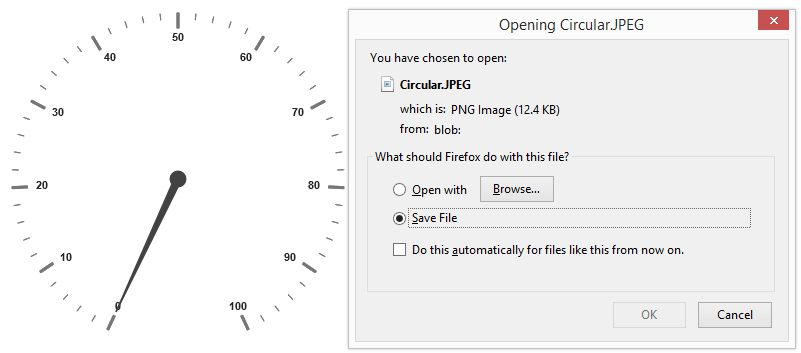

# Exporting

**Circular Gauge** has an exporting feature that converts **Gauge** control into image format and then export in client side. The method API **exportImage** is used to export the **Circular Gauge**. It has two arguments such as **file name** and **file format** to specify the file name and file formats. For exporting refer the following code example.



<input type="submit" value="Export Image" id="ExportImage">
    

            
FileName 

            <input type="text" id="txtFileName">
            
FileFormat 

            <select id="FileType">
            <option value="JPEG">JPEG</option>
            <option value="PNG">PNG</option>
            </select>
    <script>
       angular.module('CircularGaugeApp', ['ejangular'])
       .controller('CircularGaugeCtrl', function ($scope) {
                  });
       $(function () {
       $("#ExportImage").ejButton({ width: "100px", click: "buttonClickEvent", });
       });
    function buttonClickEvent() {
        var FileName = $("#txtFileName").val();
        var FileFormat = $("#FileType").val();
        $("#circulargauge").ejCircularGauge("exportImage", FileName, FileFormat);
    }



Execute the above code to render the following output.

