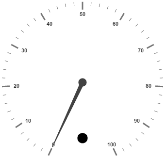
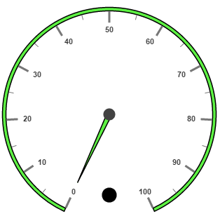
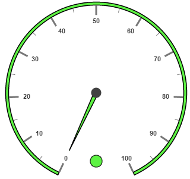
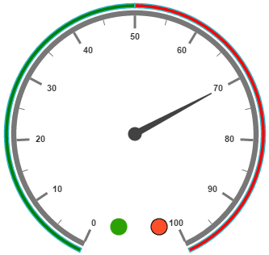

# Indicators

Indicators simply indicates the current status of the pointer. Indicators are in several formats such as in shape format, textual format and image format.

## Adding Indicator Collection 

Indicators collection is directly added to the scale object. Refer the following code to add indicator collection in a **Gauge** control.



<html xmlns="http://www.w3.org/1999/xhtml" lang="en" ng-app="CircularGaugeApp">
    <head>
        <title>Essential Studio for AngularJS: CircularGauge</title>
        <!--CSS and Script file References -->
    </head>
    <body ng-controller="CircularGaugeCtrl">
        

                <ej-circulargauge >
                <e-scales>
                <e-scale  e-showIndicators="true">
                <e-indicators>
                <e-indicator e-height="10" e-width="10" e-type="circle" e-value="0" e-position-x="185" 
                e-position-y="300">
                </e-indicator>
                </e-indicators>
                </e-scale>
                <e-scales> 
                </ej-circulargauge>
        

        
    </body>
</html>



Execute the above code to render the following output.

## Basic Customization

You can enable indicators by setting **showIndicators** to ‘true’. The **height** and **width** property for the indicators are used to specify the area allocated to the indicator for the width and height respectively. You can use the position collection to position the indicators along **x** and **y** axis. 

Indicators are of several types such as, circle, rectangle, rounded rectangle, text and image. By using the **type** property you can avail those shapes. For image type **imageUrl** property is used. 



<html xmlns="http://www.w3.org/1999/xhtml" lang="en" ng-app="CircularGaugeApp">
    <head>
        <title>Essential Studio for AngularJS: CircularGauge</title>
        <!--CSS and Script file References -->
    </head>
    <body ng-controller="CircularGaugeCtrl">
        

                <ej-circulargauge >
                <e-scales>
                <e-scale  e-showIndicators="true" e-radius="150" e-size="5" e-showscalebar="true"
                e-minorIntervalValue="5" e-backgroundColor="#5DF243" e-border-color="black" 
                e-border-width="1.5">
                <e-pointers>
                <e-pointer e-length="110" e-backgroundColor="#5DF243" e-border-color="black" 
                e-border-width="1.5">
                </e-pointer>
                </e-pointers>
                <e-indicators>
                <e-indicator e-height="10" e-width="10" e-type="circle" e-value="0" 
                e-position-x="185" e-position-y="300">
                </e-indicators>
                </e-scale>
                <e-scales> 
                </ej-circulargauge>
        

        
    </body>
</html>



Execute the above code to render the following output.

## State Ranges

State ranges are used to specify the indicator behavior in the specified region. Use **startValue** and **endValue** to set the range bound for the pointer. Whenever the pointer cross the specified region, the indicator attributes are applied for ranges. 

The **backgroundColor** and **borderColor** sets the appearance behavior for the indicators. For text type indicators you can give value for text. And **text** can be changed whenever the pointer crosses its state range area. There are many basic font options available for the text in the state range such as size, fontStyle and fontFamily.



<html xmlns="http://www.w3.org/1999/xhtml" lang="en" ng-app="CircularGaugeApp">
    <head>
        <title>Essential Studio for AngularJS: CircularGauge</title>
        <!--CSS and Script file References -->
    </head>
    <body ng-controller="CircularGaugeCtrl">
        

                <ej-circulargauge >
                <e-scales>
                <e-scale  e-showIndicators="true" e-radius="150" e-size="5" e-showscalebar="true"
                e-minorIntervalValue="5" e-backgroundColor="#5DF243" e-border-color="black" 
                e-border-width="1.5">
                <e-pointers>
                <e-pointer e-length="110" e-backgroundColor="#5DF243" e-border-color="black" 
                e-border-width="1.5">
                </e-pointer>
                </e-pointers>
                <e-indicators>
                <e-indicator e-height="10" e-width="10" e-type="circle" e-value="0" 
                e-position-x="185" e-position-y="300"> 
                <e-stateranges>
                <e-staterange e-endvalue="100"  e-startvalue="0" e-text="" e-backgroundcolor="#5DF243"
                e-bordercolor="black" e-textcolor="#870505"></e-staterange>
                </e-stateranges>
                 </e-indicator>
                </e-indicators>
                </e-scale>
                <e-scales> 
                </ej-circulargauge>
        

        
    </body>
</html>



Execute the above code to render the following output.

## Multiple Indicators

You can use multiple indicators for a single **Gauge**. Each indicator have a list of state ranges. Refer the following code example for multiple Indicators.



<html xmlns="http://www.w3.org/1999/xhtml" lang="en" ng-app="CircularGaugeApp">
    <head>
        <title>Essential Studio for AngularJS: CircularGauge</title>
        <!--CSS and Script file References -->
    </head>
    <body ng-controller="CircularGaugeCtrl">
        

                <ej-circulargauge >
                <e-scales>
                <e-scale  e-readonly="false" e-showIndicators="true" e-showranges="true" e-size="5"
                e-radius="150"  e-minorIntervalValue="20" e-showscalebar="true" >
                <e-pointers>
                <e-pointer e-value="70" e-length="110"></e-pointer>
                </e-pointers>
                <e-ranges>
                <e-range e-startValue="0" e-endValue="50" e-backgroundcolor="green"  e-placement="far" 
                e-distanceFromScale="-30" ></e-range>
                <e-range e-startValue="50" e-endValue="100" e-backgroundcolor="red"  e-placement="far"
                e-distanceFromScale="-30" ></e-range>
                </e-ranges>
                <e-indicators>
                <e-indicator e-height="10" e-width="10" e-type="circle" e-value="0" e-position-x="165" 
                e-position-y="300"> 
                <e-stateranges>
                <e-staterange e-endvalue="50"  e-startvalue="0"  e-backgroundcolor="#24F92F" 
                e-bordercolor="black"></e-staterange>
                <e-staterange e-endvalue="50"  e-startvalue="100"  e-backgroundcolor="#322C04" 
                e-bordercolor="black"></e-staterange>
                </e-stateranges>
                </e-indicator>
                <e-indicator e-height="10" e-width="10" e-type="circle" e-value="0" e-position-x="215"
                e-position-y="300"> 
                <e-stateranges>
                <e-staterange e-endvalue="50"  e-startvalue="0"  e-backgroundcolor="#600000" 
                e-bordercolor="black"></e-staterange>
                <e-staterange e-endvalue="50"  e-startvalue="100"  e-backgroundcolor="#FF4F2A" 
                e-bordercolor="black"></e-staterange>
                </e-stateranges>
                </e-indicator>
                </e-indicators>
                </e-scale>
                <e-scales> 
                </ej-circulargauge>
        

        
    </body>
</html>



Execute the above code to render the following output.

