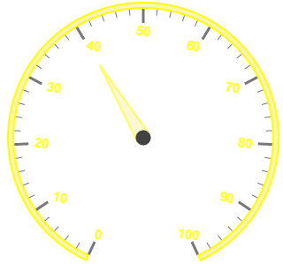
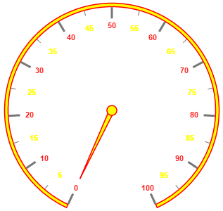

# Labels

**Labels** are units that are used to display the values in the scales. You can customize Labels with the properties like angle, color, font, opacity, etc.

## Adding Label Collection 

**Label collection** is directly added to the scale object. Refer the following code example to add label collection in a **Gauge**.



<html xmlns="http://www.w3.org/1999/xhtml" lang="en" ng-app="CircularGaugeApp">
    <head>
        <title>Essential Studio for AngularJS: CircularGauge</title>
        <!--CSS and Script file References -->
    </head>
    <body ng-controller="CircularGaugeCtrl">
        

                <ej-circulargauge >
                <e-scales>
                <e-scale>
                <e-labels>
                <e-label e-angle="30">
                </e-label>
                </e-labels>
                </e-scale>
                <e-scales> 
                </ej-circulargauge>
        

        
    </body>
</html>



Execute the above code to render the following output.

## Label Customization

**Appearance**

The **attribute** angle is used to display the labels in the specified angles and **color** attribute is used to display the labels in specified color. You can adjust the opacity of the label with the property **opacity** and the values of it lies between 0 and 1. You can adjust the labels based on the tick’s direction by setting **autoAngle** as true. **includeFirstValue** is an special property especially used in some special scenarios such as in clock, where the value 0 needs to be replaced with that of 12. By enabling this property the first value of the label is not rendered.

Font option is also available on the labels. The basic three properties of fonts such as size, family and style can be achieved by **size**, **fontStyle** and **fontFamily**. Labels are two types such as major and minor.Major types labels are for major interval values and minor types labels are for minor interval values.



<html xmlns="http://www.w3.org/1999/xhtml" lang="en" ng-app="CircularGaugeApp">
    <head>
        <title>Essential Studio for AngularJS: CircularGauge</title>
        <!--CSS and Script file References -->
    </head>
    <body ng-controller="CircularGaugeCtrl">
        

                <ej-circulargauge >
                <e-scales>
                <e-scale e-showScaleBar="true"  e-radius="150" e-width="10" e-backgroundColor="#FAF4B5"
                e-border-color="yellow" e-border-width="2" >
                <e-pointers>
                <e-pointer e-value="40" e-length="100" e-backgroundColor="#FAF4B5" 
                e-border-color="yellow" e-border-width="2" e-opacity="0.6" e-width="16"></e-pointer>
                </e-pointers>
                <e-labels>
                <e-label e-color="yellow" e-includeFirstValue="false" e-angle="10" e-opacity="0.8"
                e-font-size="15px" e-font-fontFamily="arial" e-font-fontStyle="bold">
                </e-label>
                </e-labels>
                </e-scale>
                <e-scales> 
                </ej-circulargauge>
        

        
    </body>
</html>



Execute the above code to render the following output.

**Unit text and Position**

**unitText** is used to add some text along with the labels. For example, in speedometer, you need to mention the units in kph. You can also add the unit text in front of the labels. You can achieve this by using an enumerable property **unitTextPosition**. With this you can position the unit text in front or back.

Labels can be positioned with the help of two properties such as **distanceFromScale** and **placement**. **distanceFromScale** property defines the distance between the scale and labels.  Placement property is used to locate the labels with respect to scale either inside the scale or outside the scale or along the scale. It is an enumerable data type.



<html xmlns="http://www.w3.org/1999/xhtml" lang="en" ng-app="CircularGaugeApp">
    <head>
        <title>Essential Studio for AngularJS: CircularGauge</title>
        <!--CSS and Script file References -->
    </head>
    <body ng-controller="CircularGaugeCtrl">
        

                <ej-circulargauge >
                <e-scales>
                <e-scale e-size="2" e-showScaleBar="true"  e-radius="150" e-showRanges="true" >
                <e-pointers>
                <e-pointer e-value="40" e-length="100" e-showbackneedle="true"></e-pointer>
                </e-pointers>
                <e-labels>
                <e-label e-unitText="kmph" e-unitTextPosition="back">
                </e-label>
                </e-labels>
                <e-ranges>
                <e-range e-backgroundcolor="green" e-placement="far" e-distanceFromScale="-30"
                e-startValue="0" e-endValue="50" e-size="40"></e-range>
                <e-range e-startValue="50" e-endValue="80" e-backgroundcolor="yellow"  
                e-placement="far" e-distanceFromScale="-30" e-size="40"></e-range>
                <e-range e-startValue="80" e-endValue="100" e-backgroundcolor="red"  
                e-placement="far" e-distanceFromScale="-30" e-size="40"></e-range>
                </e-ranges>
                </e-scale>
                <e-scales> 
                </ej-circulargauge>
        

        
    </body>
</html>



Execute the above code to render the following output.

## Multiple Labels

You can achieve multiple labels such as minor and major in a **Gauge** sample scale. Refer the following code example for multiple labels variation.



<html xmlns="http://www.w3.org/1999/xhtml" lang="en" ng-app="CircularGaugeApp">
    <head>
        <title>Essential Studio for AngularJS: CircularGauge</title>
        <!--CSS and Script file References -->
    </head>
    <body ng-controller="CircularGaugeCtrl">
        

                <ej-circulargauge >
                <e-scales>
                <e-scale e-showRanges="true" e-minorIntervalValue="5" e-backgroundColor="yellow"
                e-border-width="2" e-border-color="red" e-showScaleBar="true" e-radius="150" 
                e-size="5" e-pointerCap-borderWidth="1.5" e-pointerCap-borderColor="red" 
                e-pointerCap-backgroundColor="yellow" >
                <e-pointers>
                <e-pointer e-backgroundColor="yellow" e-length="110" e-border-color="red"
                e-border-width="1.5"></e-pointer>
                </e-pointers>
                <e-labels>
                <e-label e-type="minor" e-color="yellow">
                </e-label>
                <e-label e-type="major" e-color="red">
                </e-label>
                </e-labels>
                </e-scale>
                <e-scales> 
                </ej-circulargauge>
        

        
    </body>
</html>



Execute the above code to render the following output.

