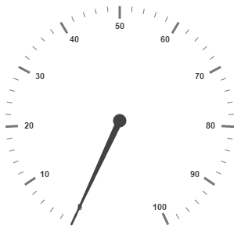
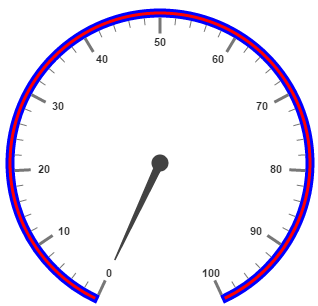
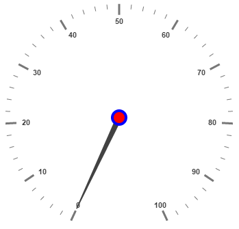
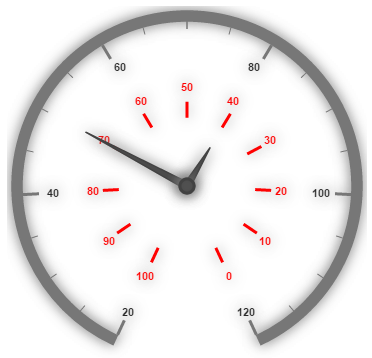

# Scales

**Scales** are the basic functional block of the **Circular Gauge**. By customizing the scales, the appearance of the **Gauge** can be improved. The functional blocks of Circular Gauge are 

* Pointers

* Labels

* CustomLabels

* Indicators

* Ticks

* Ranges

* Sub gauges.

## Adding Scale Collection

**Scale collection** is directly added to the **Gauge** object. Refer the following code example to add scale collection in **Gauge** control.



<html xmlns="http://www.w3.org/1999/xhtml" lang="en" ng-app="CircularGaugeApp">
    <head>
        <title>Essential Studio for AngularJS: CircularGauge</title>
        <!--CSS and Script file References -->
    </head>
    <body ng-controller="CircularGaugeCtrl">
        

                <ej-circulargauge >
                <e-scales>
                <e-scale e-radius="150"></e-scale>
                <e-scales> 
                </ej-circulargauge>
        

        
    </body>
</html>



Execute the above code to render the following output.

## Scale Customization

**Colors and Border**

The Scale border is modified with the object called **border**. It has two border property namely **color** and **width** which are used to customize the border color of the scale and border width of the scale. Setting the background color improves the look and feel of the **Circular Gauge**. You can customize the background color of the scale using **backgroundColor**. 



<html xmlns="http://www.w3.org/1999/xhtml" lang="en" ng-app="CircularGaugeApp">
    <head>
        <title>Essential Studio for AngularJS: CircularGauge</title>
        <!--CSS and Script file References -->
    </head>
    <body ng-controller="CircularGaugeCtrl">
        

                <ej-circulargauge >
                <e-scales>
                <e-scale e-radius="150" e-showscalebar="true" e-backgroundcolor="red"
                e-border-color="blue" e-border-color-width="3">
                <e-pointers>
                <e-pointer e-length="100">
                </e-pointer>
                </e-pointers>
                </e-scale>
                <e-scales> 
                </ej-circulargauge>
        

        
    </body>
</html>



Execute the above code to render the following output.

**Pointer Cap**

**Pointer cap** is a circular shape element that is located at the center of the **Circular Gauge**. The pointer cap is one of the cynosure of the **Circular Gauge**. By customizing the pointer cap, Gauge style is improved. The pointer cap is modified with the object **pointerCap**. It contains radius, borderColor, borderWidth, interiorGradient and backgroundColor properties. The property **radius** is used to set the radius for the pointer cap. **interiorGradient** is used to provide the gradient effects to the pointer cap.



<html xmlns="http://www.w3.org/1999/xhtml" lang="en" ng-app="CircularGaugeApp">
    <head>
        <title>Essential Studio for AngularJS: CircularGauge</title>
        <!--CSS and Script file References -->
    </head>
    <body ng-controller="CircularGaugeCtrl">
        

                <ej-circulargauge >
                <e-scales>
                <e-scale e-pointerCap-radius="10" e-pointerCap-borderWidth="4"
                e-pointerCap-borderColor="blue" e-pointerCap-backgroundcolor="red" >
                </e-scale>
                <e-scales> 
                </ej-circulargauge>
        

        
    </body>
</html>



Execute the above code to render the following output.

**Appearance**

**Circular Gauge** contains two types of scale direction such as clockwise and counter clockwise. You can set them by enumerable property called **direction**. And you can set the minimum and maximum values for the scale with the properties **minimum** and **maximum**. The two properties **minorIntervalValue** and **majorIntervalValue** are the values used to set interval value for the ticks and labels. The **radius** property is used to set the radius value for the circular scale and the **size** property is used to set the scale bar width. You can also adjust the Opacity of the scale with the property **opacity**. The value for opacity lies between 0 and 1. You can also give some shadow effects for the scale by using the property **shadowOffset.** The property **startAngle** is used to set starting position of the scale at certain angle and **sweepAngle** is used to shrink or expand the scale to certain angle. 


<html xmlns="http://www.w3.org/1999/xhtml" lang="en" ng-app="CircularGaugeApp">
    <head>
        <title>Essential Studio for AngularJS: CircularGauge</title>
        <!--CSS and Script file References -->
    </head>
    <body ng-controller="CircularGaugeCtrl">
        

                <ej-circulargauge >
                <e-scales>
                <e-scale e-size="30" e-scaleRadius="130" e-minimum="20" e-maximum="120"
                e-majorIntervalValue="20" e-minorIntervalValue="5" e-backgroundcolor="red" 
                e-opacity="0.5" e-shadowOffset="20" e-direction="CounterClockwise"  >
                </e-scale>
                <e-scales> 
                </ej-circulargauge>
        

        
    </body>
</html>


Execute the above code to render the following output.

**Enable/Disable properties**

You can enable / disable properties in Circular Gauge using some properties in scale collection. The **showIndicators** property is used to enable/disable the indicators. **ShowLabels**, **showTicks**, **showRanges**, **showPointers** ans **showScaleBar** are used to enable/ disable labels, ticks, ranges, pointers and scale bar respectively. 

## Multiple Scales

You can set **Multiple scales** for a single **Circular Gauge** control by using an array of scale objects. Each scale object is independent of each other. The following code example refers to two scale objects in a **Gauge**.



<html xmlns="http://www.w3.org/1999/xhtml" lang="en" ng-app="CircularGaugeApp">
    <head>
        <title>Essential Studio for AngularJS: CircularGauge</title>
        <!--CSS and Script file References -->
    </head>
    <body ng-controller="CircularGaugeCtrl">
        

                <ej-circulargauge >
                <e-scales>
                <e-scale e-size="10" e-showScaleBar="true"  e-scaleRadius="150" e-minimum="20"
                e-maximum="120" e-majorIntervalValue="20" e-minorIntervalValue="5" 
                e-shadowOffset="20" e-direction="Clockwise"  >
                <e-pointers>
                <e-pointer e-value="50" e-length="120"></e-pointer>
                </e-pointers>
                </e-scale>
                <e-scale e-size="10" e-showScaleBar="false"  e-scaleRadius="80"  
                e-majorIntervalValue="10" e-shadowOffset="20" e-direction="CounterClockwise" 
                e-opacity="0.5"  >
                <e-pointers>
                <e-pointer e-value="40" e-length="50"></e-pointer>
                </e-pointers>
                <e-labels>
                <e-label e-color="red" e-distanceFromScale="40">
                </e-label>
                </e-labels>
                <e-ticks>
                <e-tick e-distanceFromScale="80" e-color="red">
                </e-tick>
                </e-ticks>
                </e-scale>
                <e-scales> 
                </ej-circulargauge>
        

        
    </body>
</html>



Execute the above code to render the following output.

