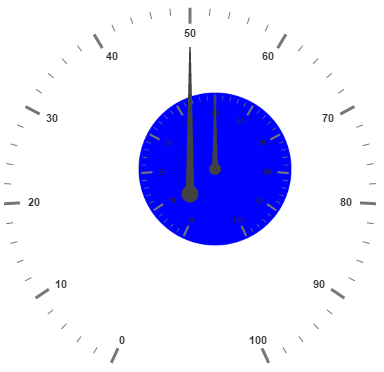
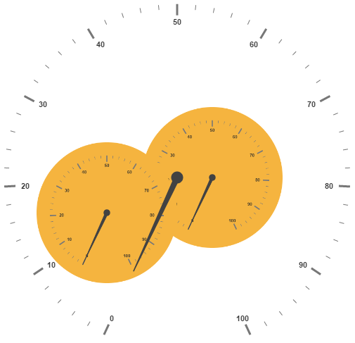

# Sub Gauges

A **Circular Gauge** containing another circular gauge is said to be **Sub Gauges**. In order to make a sample like watch that has second gauge, minute gauge and hour gauge, sub gauges are used.

## Adding SubGauges

Sub gauge collection is directly added to the scale object. Refer the following code example to add custom sub gauge collection in a **Gauge** control.



<html xmlns="http://www.w3.org/1999/xhtml" lang="en" ng-app="CircularGaugeApp">
    <head>
        <title>Essential Studio for AngularJS: CircularGauge</title>
        <!--CSS and Script file References -->
    </head>
    <body ng-controller="CircularGaugeCtrl">
    

        

                <ej-circulargauge >
                <e-scales>
                <e-scale   e-showSubGauges="true" >
                <e-subgauges>
                <e-subgauge e-gaugeid="Gauge1"></e-subgauge>
                </e-subgauges>
                </e-scale>
                <e-scales> 
                </ej-circulargauge>
        

        

        
    </body>
</html>



**Basic Customization**

Basic attributes such as **height** and **width** property are used to set height and width of the sub gauge. You can easily position the gauge in another gauge using the **position** object and by giving the **X** and **Y** Coordinates value. **controlID** attribute is used to specify the sub gauge ID.



<html xmlns="http://www.w3.org/1999/xhtml" lang="en" ng-app="CircularGaugeApp">
    <head>
        <title>Essential Studio for AngularJS: CircularGauge</title>
        <!--CSS and Script file References -->
    </head>
    <body ng-controller="CircularGaugeCtrl">
     

                <ej-circulargauge e-backgroundcolor="blue" e-value="50" e-radius="110">
                    <e-scales>
                    <e-scale e-radius="110">
                    </e-scale>
                    <e-scales>
                </ej-circulargauge>
                

                

                    <ej-circulargauge e-height="500" e-width="500" e-value="50">
                        <e-scales>
                        <e-scale e-showsubgauges="true" e-radius="190">
                        <e-subgauges>
                        <e-subgauge e-controlid="Gauge1" e-height="250" e-width="250" 
                        e-position-x="150" e-position-y="100"></e-subgauge>
                        </e-subgauges>
                        </e-scale>
                        <e-scales>
                    </ej-circulargauge>
                

               
        </body>
</html>



Execute the above code to render the following output.

## Multiple SubGauges

You can set multiple sub gauges in a single **Circular Gauge** by adding an array of sub gauge objects. Refer the following code example for multiple sub gauges functionality.



<html xmlns="http://www.w3.org/1999/xhtml" lang="en" ng-app="CircularGaugeApp">
    <head>
        <title>Essential Studio for AngularJS: CircularGauge</title>
        <!--CSS and Script file References -->
    </head>
    <body ng-controller="CircularGaugeCtrl">
     

                <ej-circulargauge e-backgroundcolor="#f5b43f">
                    <e-scales>
                    <e-scale e-radius="150">
                    </e-scale>
                    <e-scales>
                </ej-circulargauge>
                

                

                <ej-circulargauge e-backgroundcolor="#f5b43f">
                    <e-scales>
                    <e-scale e-radius="150">
                    </e-scale>
                    <e-scales>
                </ej-circulargauge>
                

                

                    <ej-circulargauge e-height="500" e-width="500" >
                        <e-scales>
                        <e-scale e-showsubgauges="true" e-radius="250">
                        <e-subgauges>
                        <e-subgauge e-controlid="SubGauge1" e-height="200" e-width="200"
                        e-position-x="200" e-position-y="150"></e-subgauge>
                        </e-subgauges>
                        <e-subgauges>
                        <e-subgauge e-controlid="SubGauge2" e-height="200" e-width="200"
                        e-position-x="50" e-position-y="200"></e-subgauge>
                        </e-subgauges>
                        </e-scale>
                        <e-scales>
                    </ej-circulargauge>
                

               
        </body>
</html>



Execute the above code to render the following output.

