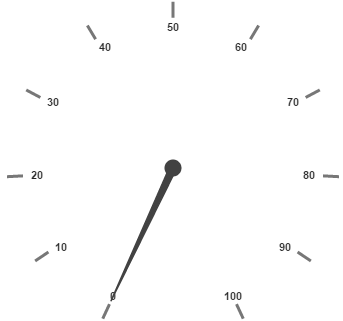
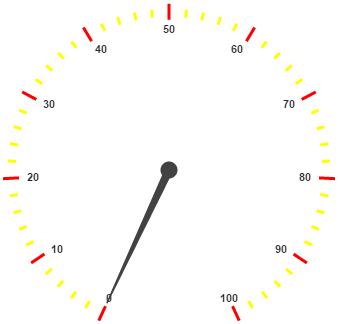

# Ticks

Ticks are used to mark some values on the scale. Based on the tick’s value you can set the labels on the required position.

## Adding Tick Collection 

Tick collection is directly added to the scale object. Refer the following code example to add tick collection in a **Gauge** control.



<html xmlns="http://www.w3.org/1999/xhtml" lang="en" ng-app="CircularGaugeApp">
    <head>
        <title>Essential Studio for AngularJS: CircularGauge</title>
        <!--CSS and Script file References -->
    </head>
    <body ng-controller="CircularGaugeCtrl">
        

                <ej-circulargauge >
                <e-scales>
                <e-scale >
                <e-ticks>
                <e-tick e-value="30">
                </e-tick>
                </e-ticks>
                </e-scale>
                <e-scales> 
                </ej-circulargauge>
        

        
    </body>
</html>



Execute the above code to render the following output.

## Tick Customization

Height and width of the ticks can be applied by using the properties **height** and **width**. You can customize ticks with the properties such as angle, color, etc. **angle** attribute is used to display the labels in the specified angles and **color** attribute is used to display the labels in specified color. Ticks are two types such as major and minor.

Major type ticks are for major interval values and minor type ticks are for minor interval values.You can position ticks with the help of two properties such as **distanceFromScale** and **placement**. **distanceFromScale** property defines the distance between the scale and ticks.  **Placement** property is used to locate the ticks with respect to scale either inside the scale or outside the scale or along the scale. It is an enumerable data type.



<html xmlns="http://www.w3.org/1999/xhtml" lang="en" ng-app="CircularGaugeApp">
    <head>
        <title>Essential Studio for AngularJS: CircularGauge</title>
        <!--CSS and Script file References -->
    </head>
    <body ng-controller="CircularGaugeCtrl">
        

                <ej-circulargauge >
                <e-scales>
                <e-scale >
                <e-ticks>
                <e-tick e-type="major" e-color="red">
                </e-tick>
                <e-tick e-type="minor" e-color="yellow" e-height="8" e-placement="near"
                e-distanceFromScale="5">
                </e-tick>
                </e-ticks>
                </e-scale>
                <e-scales> 
                </ej-circulargauge>
        

        
    </body>
</html>



Execute the above code to render the following output.

