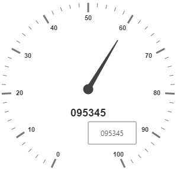

# Tooltip

**Tooltip** feature has been added to the **Circular Gauge**. **Circular Gauge** has several elements such as pointers, label, customLabel, scales, etc. There is a need for **Tooltip** feature in the **Circular Gauge** control because whenever the text hides or overrides with other gauge elements, it may not be fully visible. For resolving those problems **Tooltip** feature has been implemented in the **Circular Gauge** control.

## Default Tooltip

**Tooltip** has three attributes in it. The first two attributes such as **showLabelTooltip** and **showCustomLabelTooltip** are for enabling the **Tooltip** for label as well as custom label in default appearance. 

**ShowLabelTooltip** is to enable the **Tooltip** for labels and **showCustomLabelTooltip** is for enabling the **Tooltip** option for customLabels.


<html xmlns="http://www.w3.org/1999/xhtml" lang="en" ng-app="CircularGaugeApp">
    <head>
        <title>Essential Studio for AngularJS: CircularGauge</title>
        <!--CSS and Script file References -->
    </head>
    <body ng-controller="CircularGaugeCtrl">
        

                <ej-circulargauge e-tooltip-ShowLabelTooltip="true" 
                e-tooltip-showCustomLabelTooltip="true">
                <e-scales>
                <e-scale   e-showLabels="true" e-radius="150">
                <e-customlabels>
                <e-customlabel e-color="red" e-textAngle="10" e-value="095345" e-font-size="18px"
                e-font-fontFamily="Arial" e-font-fontStyle="bold" e-position-x="180" 
                e-position-y="220">
                </e-customlabel>
                </e-customlabels>
                <e-pointers>
                <e-pointer e-length="100" e-value="60">
                </e-pointers>
                </e-scale>
                <e-scales> 
                </ej-circulargauge>
        

        
    </body>
</html>



Execute the above code to render the following output.

## Tooltip Template

In **Tooltip** option, you can customize the Tooltip window by adding the tooltip template on that page with the help of API **TemplateID**. Refer to the following code example to know more about Tooltip template.



<html xmlns="http://www.w3.org/1999/xhtml" lang="en" ng-app="CircularGaugeApp">
    <head>
        <title>Essential Studio for AngularJS: CircularGauge</title>
        <!--CSS and Script file References -->
    </head>
    <body ng-controller="CircularGaugeCtrl">
    

    

        

    

    

        

            <label id="efpercentage">&nbsp;#label#</label>
        

    

    

        

                <ej-circulargauge e-tooltip-ShowLabelTooltip="true"
                e-tooltip-showCustomLabelTooltip="true" e-tooltip-templateid="Tooltip">
                <e-scales>
                <e-scale   e-showLabels="true" e-radius="150">
                <e-customlabels>
                <e-customlabel e-color="red" e-textAngle="10" e-value="0 9 5 3 4 5" e-font-size="18px" 
                e-font-fontFamily="Arial" e-font-fontStyle="bold" e-position-x="180" e-position-y="220">
                </e-customlabel>
                </e-customlabels>
                <e-pointers>
                <e-pointer e-length="100" e-value="60">
                </e-pointers>
                </e-scale>
                <e-scales> 
                </ej-circulargauge>
        

        
    </body>
</html>







Execute the above code to render the following output.

