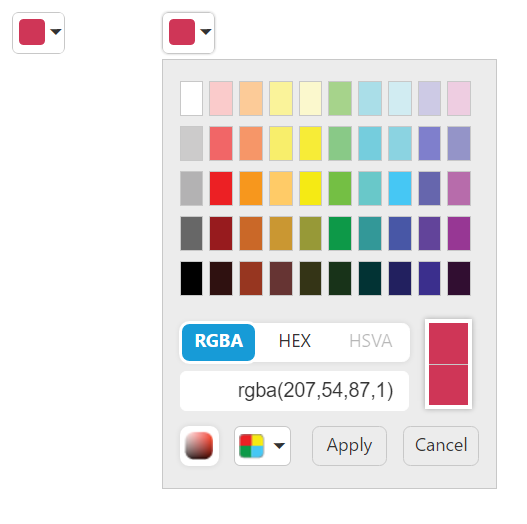

# Data and Event Binding

## Two-way binding

In **AngularJS** framework, any changes to view proximately update to model, any changes in model directly updated with view rapidly.  With **ColorPicker** control, value API enabled with two way binding to achieve this delightful functionality. 

**HTML View Section**



     <input id="colorpicker1" ej-colorpicker e-value="value" e-modeltype="picker"/>
     <input id="colorpicker2" ej-colorpicker e-value="value" e-modeltype="modelType"/>



**Controller Section**



        



Run the above code to render the following output.

## Event Binding

Component events and captured and processed based on application needs. These events can be registered with scope to enhance the component functionality with AngularJS. Please refer the below code example,

**HTML View Section**



     <input id="colorpicker" ej-colorpicker e-value="value" e-close="colorchanged"/>



**Controller Section**



        


