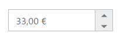
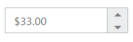

# Globalization Support

**Globalization** is language support based on the culture in CurrencyTextBox. You can achieve the **Globalization** using “**locale”** property in CurrencyTextBox. 

The CurrencyTextBox widget provides multi-language support using globalization. You can customize the CurrencyTextBox with your own language style by using this feature. You can change the globalization by using the **locale** property. The default value for **locale** property is **en-US** in CurrencyTextBox controls. Also you can specify the [currencySymbol](https://help.syncfusion.com/api/js/ejtextboxes#members:currencysymbol) property when the user wants to overwrite the currency symbol commonly instead of the current culture symbol.

More than 350 culture specific files are available to localize the value. To know more about EJ globalize support, please refer the below link      
 [http://help.syncfusion.com/js/localization](http://help.syncfusion.com/js/localization) 
 
 N> Seven culture-specific script files are available in the below specified location. For all other culture files, please download from the [GitHub](https://github.com/syncfusion/ej-global/tree/master/i18n) location.

<table>
<tr>
<td>

    '(installed location)\Syncfusion\Essential Studio\{{ site.releaseversion }}\JavaScript\assets\scripts\i18n'
</td>
</tr>
<tr>
<td>

    For example, If you have installed the Essential Studio package within C:\Program Files (x86), then navigate to the below location, 
    C:\Program Files (x86)\Syncfusion\Essential Studio\{{ site.releaseversion }}\JavaScript\assets\scripts\i18n

</td></tr>
</table>

Refer the below German culture file in head section of HTML page after the reference of **ej.web.all.min.js** file.

 
   
           
                
 

You can dynamically change the language based on their culture.

## Configure Globalization

The following example describes the way to use localization for **CurrencyTextBox** widgets.



<input id="currency" type="text" ej-currencytextbox e-value="33" e-decimalplaces="2" e-locale="de-DE" />



The output for **CurrencyTextBox** with Globalization.

CurrencyTextBox with de-DE locale
{:.caption}

CurrencyTextBox with en-US locale
{:.caption}

