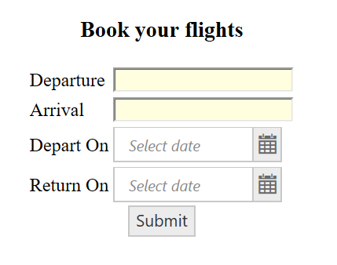
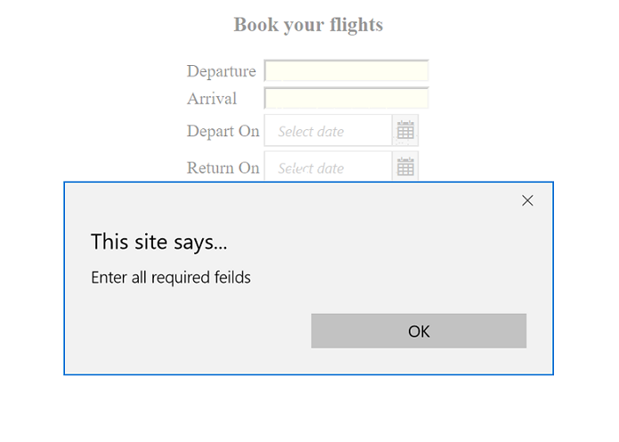

# Validation

**EJ AngularJS DatePicker** is a form control and can be used within **ng-form**. This will support with the AngularJS validation and update the AngularJS validation related built-in classes to element based on current state of the element.
State of the element can be **touched/dirty/valid**, based on this states the  corresponding classes will be add to control. These classes will be used to identify the state and picturing the components based on these using CSS to provide easily understandable validation status. To know more about 
AngularJS form validation and related classes please refer below

Just adding the **e-value** bounded component inside the ng-form, will work suitably with AngularJS validation.

**HTML View Section:**



     <form name="myForm">      
        

          <h3>
            Book your flights
          </h3>
          

            <table>
               <tr>
                 <td><label for="from"> Departure</label> </td>
                 <td><input id="from" ng-model="depart" ng-required="required"/></td>
              </tr> 
               <tr>
                 <td><label for="to"> Arrival</label> </td>
                 <td><input id="to" ng-model="arrival" ng-required="required"/></td>
              </tr>		
      	 	<tr>
                 <td><label for ="datepice">Depart On</label></td>
                 <td><input id="datepic_2" ej-datepicker e-value="date.val1" ng-required="required"/></td>
              </tr>
            <tr>
              <td><label for ="datepic_2">Return On</label></td>
              <td><input id="datepic" ej-datepicker e-value="date.val2" ng-required="required"/></td>
            </tr>
         </table>
          

          <button ej-button e-text="buttonValue" e-click="submitForm"></button>
          
   
	 </form>



Refer the below code for  uses the CSS to display validation of each form control.



   



**Controller Section:**



     



Before updating the value to view, the state will be ng-pristine state, once view updated its will change to ng-dirty state until it updated to model.

Please refer the below screenshot to know the validation with DatePicker

