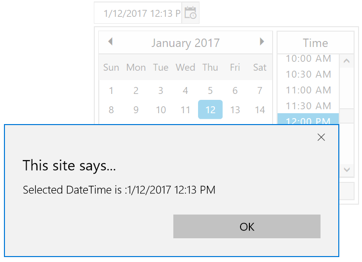
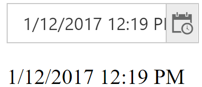

# Data Binding

## Event Binding

The event binding allows you to add an event handler for a specified event so that your chosen function will be invoked when that event is triggered for the associated DOM element.

In AngularJS, we can bind functions to event that occurs in the **DateTimePicker** component. Events associated with **DateTimePicker** component is **e-beforeClose**, **e-beforeOpen**, **e-open**, **e-close**, **e-create**, **e-destroy**, **e-focusIn**, **e-focusOut**.

**HTML View Section**



    <input type="text" id="dateTime1" ej-datetimepicker e-value="value" e-close="Close"/>



**Controller Section**



            
    



## Two-way Binding

When data in the model changes, the view reflects the change, and when data in the view changes, the mode updated as well. This happens immediately and automatically, which makes sure that the model and the view is updated always.

Two-Way binding with the **DateTimePicker** has been explained below. Here, once the date and time value has been changed and the element is focused out, the value will be updated below the **DateTimePicker**. Please check the below example code for two-way binding.

**HTML View Section**



     

               <input type="text" id="dateTime1" ej-datetimepicker e-value="value"/>
               
{{value}}

            



**Controller Section**



    



