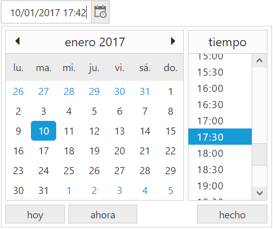

## Globalization

**DateTimePicker** has been provided with Built-in localization support, so that it will be able adapt based on culture specific locale defined for it.
**ej.globalize** library is used to globalize **DateTimePicker**. Globalize values will be automatically used when **e-locale** property is set with locale string value for example es-ES.

More than 350 culture specific files are available to localize the date. To know more about **EJ globalize support**,[please refer the below link](http://help.syncfusion.com/js/localization)

To translate our control content from default English to any of the culture, say For example – **spanish language**, then you need to refer the **ej.culture.es-ES.min.js** file in your application,
The en-US locale is currently being used as default culture in **DateTimePicker**. You can set any other culture to **DateTimePicker** by using **e-locale** property. Below code example shows **Spanish** cultured **DateTimePicker**.

**HTML View Section**



    //reference script needed to localize DateTimePicker 
    

    <input type="text" id="dateTime1" ej-datetimepicker e-value="value" e-locale="locale" e-buttontext="buttonText"/>



**Controller Section**



        



