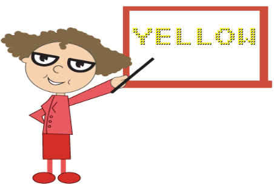

# Character Settings

## Appearance

The opacity of the character is adjustable with the help of **opacity** property. The space between two characters are adjusted with **spacing** property as like in the segment settings.



<html xmlns="http://www.w3.org/1999/xhtml" lang="en" ng-app="DigitalGaugeApp">
    <head>
        <title>Essential Studio for AngularJS: DigitalGauge</title>
        <!--CSS and Script file References -->
    </head>
    <body ng-controller="DigitalGaugeCtrl">
        

                 <ej-digitalgauge e-width="800" >
                 <e-items>
                 <e-item e-value="SYNCFUSION" e-charactersettings-opacity="0.3"
                 e-charactersettings-spacing="3">
                 </e-item>
                 </e-items>
                 </ej-digitalgauge>
        

        
    </body>
</html>



Execute the above code examples to render the **Digital****Gauge** as follows.

## Count and Type

The number of text to be displayed can be limited by the attribute called **count**. In **Digital Gauge** five different types of characters are supported. They are as follows, 

  * EightCrossEightDotMatrix

  * SevenSegment

  * FourteenSegment

  * SixteenSegment 

  * EightCrossEightSquareMatrix.



<html xmlns="http://www.w3.org/1999/xhtml" lang="en" ng-app="DigitalGaugeApp">
    <head>
        <title>Essential Studio for AngularJS: DigitalGauge</title>
        <!--CSS and Script file References -->
    </head>
    <body ng-controller="DigitalGaugeCtrl">
        

                 <ej-digitalgauge e-width="800" >
                 <e-items>
                 <e-item e-value="1234567890" e-segmentsettings-length="8" e-segmentsettings-width="1" 
                 e-charactersettings-count="10" e-charactersettings-spacing="10" 
                 e-charactersettings-type="SevenSegment">
                 </e-item>
                 </e-items>
                 </ej-digitalgauge>
        

        
    </body>
</html>



Execute the above code examples to render the **Digital****Gauge** as follows.

## Text Positioning

The text in the **Digital****Gauge** is positioned with position object. This object contains two attributes such as **x** and **y.** The **x** variable positions the text in the horizontal axis and the **y** variable positions the text in the vertical axis.



<html xmlns="http://www.w3.org/1999/xhtml" lang="en" ng-app="DigitalGaugeApp">
    <head>
        <title>Essential Studio for AngularJS: DigitalGauge</title>
        <!--CSS and Script file References -->
    </head>
    <body ng-controller="DigitalGaugeCtrl">
        

                 <ej-digitalgauge e-width="800" e-height="300" e-frame-backgroundimageurl="board1.jpg" >
                 <e-items>
                 <e-item e-value="YELLOW" e-segmentsettings-color="yellow" e-position-x="80"
                 e-position-y="10">
                 </e-item>
                 </e-items>
                 </ej-digitalgauge>
        

        
    </body>
</html>



Execute the above code examples to render the **Digital****Gauge** as follows.

## Shadow Effects

The text in the **Digital Gauge** is positioned with position object. This object contains two attributes such as **x** and **y.** The **x** variable positions the text in the horizontal axis and **y** variable positions the text in the vertical axis.



<html xmlns="http://www.w3.org/1999/xhtml" lang="en" ng-app="DigitalGaugeApp">
    <head>
        <title>Essential Studio for AngularJS: DigitalGauge</title>
        <!--CSS and Script file References -->
    </head>
    <body ng-controller="DigitalGaugeCtrl">
        

                 <ej-digitalgauge e-width="800" >
                 <e-items>
                 <e-item e-value="WELCOME" e-segmentsettings-length="3" e-segmentsettings-width="3" 
                 e-shadowcolor="yellow" e-shadowblur="20" e-shadowoffsetx="15" e-shadowoffsety="15">
                 </e-item>
                 </e-items>
                 </ej-digitalgauge>
        

        
    </body>
</html>



Execute the above code examples to render the **Digital****Gauge** as follows.

## Font Customization

You can customize the **font** of the text as per your requirement. To customize the font, you have to set `e-enablecustomfont`. Following font customization options are available.

**Font-family**- used to set the font-family of the text.

**Font-style**- used to set the font-style of the text.

**Font-size**- used to set the font-size of the text.



<html xmlns="http://www.w3.org/1999/xhtml" lang="en" ng-app="DigitalGaugeApp">
    <head>
        <title>Essential Studio for AngularJS: DigitalGauge</title>
        <!--CSS and Script file References -->
    </head>
    <body ng-controller="DigitalGaugeCtrl">
        

                 <ej-digitalgauge e-width="800" >
                 <e-items>
                 <e-item e-value="WELCOME" e-enablecustomfont="true" e-font-fontfamily="Arial" e-font-fontsize="18px"
                 e-font-fontWeight="normal" e-font-fontStyle="bold">
                 </e-item>
                 </e-items>
                 </ej-digitalgauge>
        

        
    </body>
</html>



