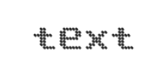
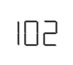
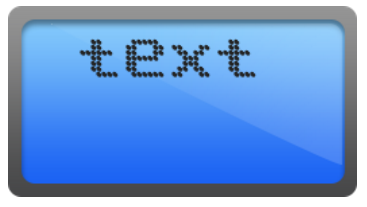
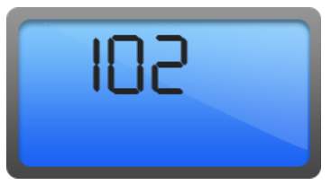
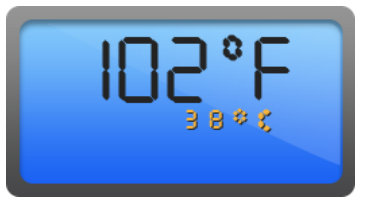

# Getting Started

Before we start with the digital gauge, please refer [this page](http://help.syncfusion.com/js/angularjs) page for general information regarding integrating Syncfusion widget’s.

## Adding JavaScript and CSS references

To render the digital gauge control, the following list of external dependencies are needed, 

* [jQuery](http://jquery.com) - 1.7.1 and later versions
* [Angular](https://angularjs.org/) - angular latest versions

The required angular script as `angular.min.js` and `ej.widget.angular.min.js` which can be available in below [CDN](/js/cdn) links:

* `angular.min.js` - [http://cdn.syncfusion.com/js/assets/external/angular.min.js](http://cdn.syncfusion.com/js/assets/external/angular.min.js)
* `ej.widget.angular.min.js` - [http://cdn.syncfusion.com/{{ site.releaseversion }}/js/common/ej.widget.angular.min.js](http://cdn.syncfusion.com/14.3.0.49/js/common/ej.widget.angular.min.js)

The other required internal dependencies are tabulated below,

<table>
   <tr>
      <th>
         <b>Files</b>
      </th>
      <th>
         <b>Description/Usage </b>
      </th>
   </tr>
   <tr>
      <td>
         ej.core.min.js
      </td>
      <td>
        It is referred always before using all the JS controls.
      </td>
   </tr>
   <tr>
      <td>
         ej.data.min.js
      </td>
      <td>
         Used to handle data operation and is used while binding data to the JS controls.
      </td>
   </tr>
   <tr>
      <td>
        ej.digitalgauge.min.js 
      </td>
      <td>
         DigitalGauge core script file which includes digital gauge related scripts files.
      </td>
   </tr>
    <tr>
      <td>
        ej.excanvas.min.js 
      </td>
      <td>
          
      </td>
   </tr>
</table>

N> Refer the `ej.web.all.min.js` (which encapsulates all the `ej` controls and frameworks in a single file) in the application instead of referring all the above specified internal dependencies. 

To get the real appearance of the digital gauge, the dependent CSS file `ej.web.all.min.css` (which includes styles of all the widgets) should also needs to be referred.

So the complete boilerplate code is



    <!DOCTYPE html>
    <html xmlns="http://www.w3.org/1999/xhtml" lang="en" ng-app="LinearGaugeApp">
    <head>
    <title>Essential Studio for AngularJS: DigitalGauge</title>
    <!-- Essential Studio for JavaScript  theme reference -->
    <link href="http://cdn.syncfusion.com/{{ site.releaseversion }}/js/web/flat-azure/ej.web.all.min.css" rel="stylesheet" />
    <!-- Essential Studio for JavaScript  script references -->
    
        
    
    
    <!-- Add your custom scripts here -->
    </head>
    <body>
    </body>
    </html>



N> 1. In production, we highly recommend you to use our [`custom script generator`](http://help.syncfusion.com/js/custom-script-generator) to create custom script file with required controls and its dependencies only. Also to reduce the file size further please use [`GZip compression`](https://developers.google.com/web/fundamentals/performance/optimizing-content-efficiency/optimize-encoding-and-transfer?hl=en) in your server.
N> 2. For themes, you can use the `ej.web.all.min.css` CDN link from the code snippet given. To add the themes in your application, please refer to [`this link`](http://help.syncfusion.com/js/theming-in-essential-javascript-components).

## Create a DigitalGauge

All the Essential JavaScript directives have been encapsulated into a single module called `ejangular` so the first step would be to declare dependency for this module within your AngularJS application.

The digitalGauge can be created using `ej-digitalgauge` AngularJS directive and its properties can be defined using `e-` prefix followed by the property name.(For example, e-height)

The code example for defining controls in AngularJS is as follows,



<html xmlns="http://www.w3.org/1999/xhtml" lang="en" ng-app="DigitalGaugeApp">
    <head>
        <title>Essential Studio for AngularJS: DigitalGauge</title>
        <!--CSS and Script file References -->
    </head>
    <body ng-controller="DigitalGaugeCtrl">
        

                 <ej-digitalgauge></ej-digitalgauge>
        

    </body>
</html>



On executing the above code, sample renders a default **Digital Gauge** with default values as follows.

## Set Height and Width values

Basic attributes of each canvas elements are height and width. You can set the height and width of the gauge.



<ej-digitalgauge e-height="145" e-width="260">
</ej-digitalgauge>



On executing the above code, sample renders a default **Digital Gauge** with the specified height and width values.

## Set Items Property

You can customize the **Digital Gauge** using different properties.

**Add Segment and Character Properties**

* In this example, the **Digital Gauge** uses a welcome board in which the text color must be distinctly visible in nature. In order to meet this requirement, you can give some segment properties such as segment spacing, segment width, segment color, segment length and segment opacity.

* **Character** type is used to define the Digital representation of the character. Thee five types of character representation are as follows:

  * EightCrossEightDotMatrix

  * SevenSegment

  * FourteenSegment

  * SixteenSegment 

  * EightCrossEightSquareMatrix.



        <ej-digitalgauge>
            <e-items>
                <e-item e-value='"102"' e-segmentSettings-width="2" e-segmentSettings-length="20"
                 e-characterSettings-type="SevenSegment" e-characterSettings-spacing="12"></e-item>
            </e-items>
        </ej-digitalgauge>
    

    <style>
        #frame {
        align: center;
        position: relative;
        margin: 0px auto;
        display: table;
        background-image: url("Scripts/frame.png");
        background-repeat: no-repeat;
    }



On executing the above code, sample renders a **Digital Gauge** with default values as follows.

## Add Background Image

You can add a **&lt;div&gt;** element to set the background for the **Digital Gauge** and attach the styles to the **HTML** page such as height , width, background image **URL** ,background repeat property, etc.



    

    





 #frameDiv {
        align: center;
        position: relative;
        margin: 0px auto;
        display: table;
        background-image: url("script/frame.png");
        background-repeat: no-repeat;
    }



On executing the above code, sample renders a default **Digital Gauge** as follows.           

## Add Location

You can position the digital letters inside the canvas element using **location** property.



<ej-digitalgauge>
    <e-items>
       <e-item e-value='"102"' e-segmentSettings-width="2" e-segmentSettings-length="20" 
       e-characterSettings-type="SevenSegment" e-characterSettings-spacing="12" 
       e-position-x="15" e-position-y="12"></e-item>
       </e-items>
</ej-digitalgauge>



On executing the above code, sample renders a default **Digital Gauge** as follows.

## Add Items collection

You can add **Items collection** to display the temperature value as used in the Digital thermometer.



<ej-digitalgauge>
    <e-items>
        //For Displaying Fahrenheit value
        <e-item e-value='"102"' e-segmentSettings-width="2" e-segmentSettings-length="20" 
        e-characterSettings-type="SevenSegment" e-characterSettings-spacing="12" 
        e-position-x="15" e-position-y="12"></e-item>
         //For displaying degree symbol
         <e-item e-value='"0"' e-segmentSettings-width="2" e-segmentSettings-length="5" 
         e-segmentSettings-spacing="0" e-characterSettings-type="SevenSegment" 
         e-characterSettings-spacing="5" e-position-x="47" e-position-y="7">
         </e-item>
         //For displaying Fahrenheit symbol
         <e-item e-value="F" e-segmentSettings-width="2" e-segmentSettings-length="20" 
         e-segmentSettings-spacing="0" e-characterSettings-type="SevenSegment" 
         e-characterSettings-spacing="12" e-position-x="76" e-position-y="12">
         </e-item>
         //For displaying Celcius value
         <e-item e-value='"38"' e-segmentSettings-width="1" e-segmentSettings-length="5" 
         e-segmentSettings-spacing="0" e-segmentSettings-color="#F5b43f" 
         e-characterSettings-type="SevenSegment" e-characterSettings-spacing="12" 
         e-position-x="40" e-position-y="58">
         </e-item>
         //For displaying degree symbol
         <e-item e-value='"0"' e-segmentSettings-width="2" e-segmentSettings-length="2" 
         e-segmentSettings-spacing="0" e-segmentSettings-color="#F5b43f"
         e-characterSettings-type="SevenSegment" e-characterSettings-spacing="12" 
         e-position-x="52" e-position-y="55">
         </e-item>
         //For displaying Celcius symbol
         <e-item e-value="c" e-segmentSettings-width="2" e-segmentSettings-length="4" 
         e-segmentSettings-spacing="0" e-segmentSettings-color="#F5b43f"
         e-characterSettings-type="SevenSegment" e-characterSettings-spacing="12" 
         e-position-x="60" e-position-y="58">
         </e-item>
     </e-items>
</ej-digitalgauge>



The following screenshot displays a **Digital Gauge** with all the customizations discussed earlier.

