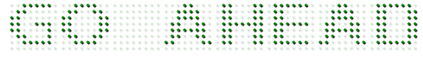

# Segment Settings

## Appearance

* **Digital Gauge** consists of several digital segments. Segment is customized with some properties. Color of the segment is set by using **color** property. Color is either given as string or hexadecimal value. 

* You can add gradient effects to the segments with the help of **gradient** attribute. The **opacity** of the segment is also adjustable. The space between two segments are adjusted with **spacing** property.



<html xmlns="http://www.w3.org/1999/xhtml" lang="en" ng-app="DigitalGaugeApp">
    <head>
        <title>Essential Studio for AngularJS: DigitalGauge</title>
        <!--CSS and Script file References -->
    </head>
    <body ng-controller="DigitalGaugeCtrl">
        

                 <ej-digitalgauge >
                 <e-items>
                 <e-item e-value="GO AHEAD" e-segmentsettings-color="green" e-segmentsettings-spacing="4" 
                 e-segmentsettings-opacity="0.1">
                 </e-item>
                 </e-items>
                 </ej-digitalgauge>
        

        
    </body>
</html>



Execute the above code examples to render the **Digital****Gauge** as follows.

## Dimension Modification

* **Digital Gauge** consists of several digital segments. Segment is customized with some properties. Color of the segment is set by using **color** property. Color is either given as string or hexadecimal value. 

* You can add gradient effects to the segments with the help of **gradient** attribute. The **opacity** of the segment is also adjustable. The space between two segments are adjusted with **spacing** property.



<html xmlns="http://www.w3.org/1999/xhtml" lang="en" ng-app="DigitalGaugeApp">
    <head>
        <title>Essential Studio for AngularJS: DigitalGauge</title>
        <!--CSS and Script file References -->
    </head>
    <body ng-controller="DigitalGaugeCtrl">
        

                 <ej-digitalgauge >
                 <e-items>
                 <e-item e-value="WELCOME" e-segmentsettings-length="3" e-segmentsettings-width="3" >
                 </e-item>
                 </e-items>
                 </ej-digitalgauge>
        

        
    </body>
</html>



Execute the above code examples to render the **Digital****Gauge** as follows.

