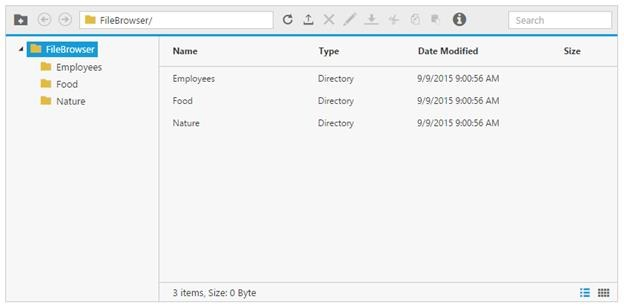

# Getting Started

The following section is briefly explain the things to get started with FileExplorer control.

## Preparing the HTML Document

Create a new Html file and include the below code.


<!DOCTYPE html>

<html xmlns="http://www.w3.org/1999/xhtml">

<head>

    <meta charset="utf-8">

    <title> </title>

</head>

<body>

</body>

</html>


## Adding the References

## CSS References

Add the below CSS reference in the head section, for the default theme


<link rel="stylesheet" href="http://cdn.syncfusion.com/{{ site.releaseversion }}/js/web/flat-azure/ej.web.all.min.css" />


<b>Script References</b>

The external script dependencies of the FileExplorer widget are,

* [jQuery 1.7.1](http://jquery.com/#) or later versions.
* [jsrender](https://www.jsviews.com/#jsrender) – for grid view template.

And the internal script dependencies of the FileExplorer widget are:

<table>
<tr>
<td>
<b>File</b>  </td><td>
<b>Description/Usage</b>  </td></tr>
<tr>
<td>
Angular.min.js  </td><td>
Angular common source file  </td></tr>
<tr>
<td>
ej.core.min.js   </td><td>
Must be referred always before using all the JS controls.   </td></tr>
<tr>
<td>
ej.data.min.js   </td><td>
Used to handle data operation and should be used while binding data to JS controls.   </td></tr>
<tr>
<td>
ej. draggable.min.js   </td><td>
Used to handle the drag and drop functionality   </td></tr>
<tr>
<td>
ej.scroller.min.js   </td><td>
Used to show the scroller in the layout area   </td></tr>
<tr>
<td>
ej.button.min.js   </td><td>
Used to display the buttons in the toolbar   </td></tr>
<tr>
<td>
ej.treeview.min.js   </td><td>
Used to display the treeview in the navigation pane   </td></tr>
<tr>
<td>
ej.uploadbox.min.js   </td><td>
Used to perform the upload functionality    </td></tr>
<tr>
<td>
ej.waitingpopup.min.js   </td><td>
Used to showcase the waiting popup   </td></tr>
<tr>
<td>
ej.dialog.min.js   </td><td>
Used to create the alert windows    </td></tr>
<tr>
<td>
ej.splitter.min.js   </td><td>
Used as the body section to separate the navigation and layout area   </td></tr>
<tr>
<td>
ej.toolbar.min.js   </td><td>
Used to showcase the hearer section   </td></tr>
<tr>
<td>
ej.menu.min.js   </td><td>
Used to showcase the context menu   </td></tr>
<tr>
<td>
ej.grid.min.js   </td><td>
Used to showcase the grid layout view  </td></tr>
<tr>
<td>
ej.widget.angular.min.js  </td><td>
Essential Studio angular source file  </td></tr>
</table>
For getting started you can use the “**ej****.****web****.****all****.****min****.****js**” file, which encapsulates all the ej controls and frameworks in one single file.

Essential JavaScript includes angular directives for all controls with the ej.widget.angular.min.js script file. All the Essential JS directives have been encapsulated into a single module called **ejangular****.** To render our ej controls in angular, you need to refer the “angular.min.js” and “ej.widget.angular.min.js” in your application.

So you can add the below Script references in the head section:


<!doctype html>
<html lang="en" ng-app="'FileApp'">
<head>
    <title>Essential Studio for JavaScript : Angular JS Support for FileExplorer </title>
    <!-- Style sheet for default theme (flat azure) -->
    <link href="http://cdn.syncfusion.com/{{ site.releaseversion }}/js/web/flat-azure/ej.web.all.min.css" rel="stylesheet" />
    <!--Scripts-->
    
    
    
    
    
    <!--Add custom scripts here -->

</head>
<body>
    <!--Add the elements here-->
</body>
</html>


## Initialize and configure the control

The ng-app directive explains the root element (<html> or <body> tags) of the application. You will assign a name to the ng-app directive, then you must create a module with that name. In this module, you will have to define your directives, services, filters and configurations.

Once added the element you can initialize the control from the script section like below:






angular.module('FileCtrl', ['ejangular']).controller('FileCtrl', function ($scope) {
    $scope.path = "http://js.syncfusion.com/demos/ejServices/Content/FileBrowser/",
    $scope.ajaxaction = "http://js.syncfusion.com/demos/ejServices/api/FileExplorer/FileOperations"

});


To perform the server side actions using local web API service, please refer the [link](https://help.syncfusion.com/js/fileexplorer/how-to#service-for-fileexplorer)

Once you completed the above steps, you get an output like below,

