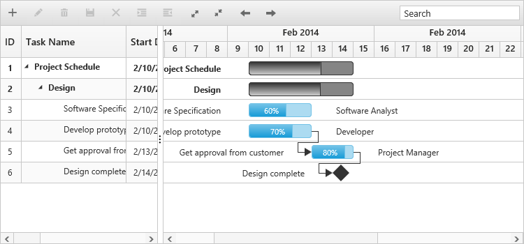
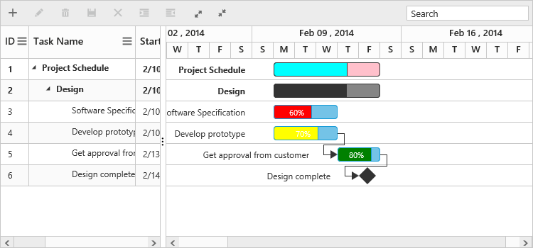
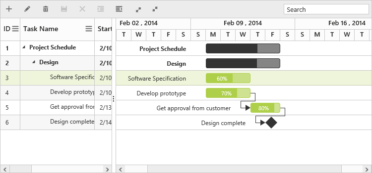

# Appearance and styling

You can customize the look and feel of the Gantt control by applying themes and formatting the schedule header.

## Schedule header customization

You can customize the week header format and day header format in the schedule part of the Gantt control by using the following code example:



<!doctype html>
<html lang="en" ng-app="listCtrl">
   <head>
      //...
   </head>
   <body ng-controller="GanttCtrl">
      <!--Add  Gantt control here-->    
      

      

       
   </body>
</html>



The following screenshot shows the customized format schedule header in the Gantt control:

## Taskbar customization

You can customize the taskbar based on the task information in the Gantt control to highlight the task. The following code example shows how to customize the taskbar in the Gantt control:



 <body ng-controller="GanttCtrl">
   <!--Add  Gantt control here-->    
   

   

    
</body>



The following screenshot shows the customized taskbar in the Gantt control:

## Themes

 The following are the types of themes available in the Gantt control:

1.Flat Azure                  
2.Flat Azure dark
3.Flat lime                    
4.Flat lime dark
5.Flat saffron
6.Flat saffron dark
7.Gradient Azure
8.Gradient Azure dark
9.Gradient lime
10.Gradient lime dark
11.Gradient saffron
12.Gradient saffron dark
13.Bootstrap

You can apply the theme (gradient lime) to the Gantt control by using the style sheet from the online link as follows:



    <!DOCTYPE html>

    <html xmlns="http://www.w3.org/1999/xhtml">
        <head>
        <title>Getting Started with Gantt Control for JavaScript</title>
        <!-- style sheet for default theme(gradient lime) -->
        <link href="http://cdn.syncfusion.com/{{ site.releaseversion }}/js/web/flat-azure/ej.web.all.min.css" rel="stylesheet" /> 
        //...
    </html>



The following screenshot shows the Gantt control with `Gradient-lime` theme:

