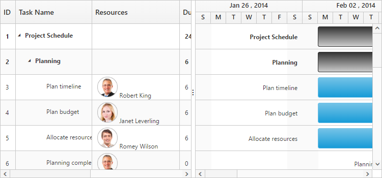
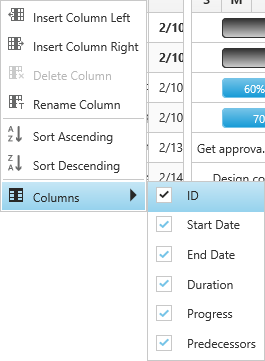
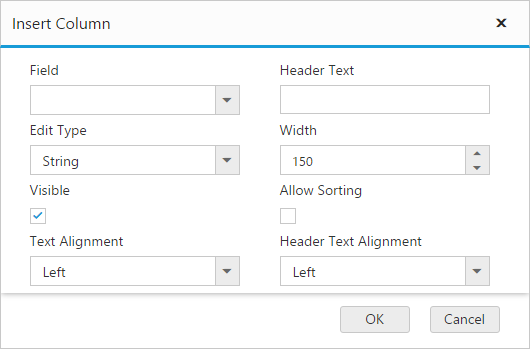
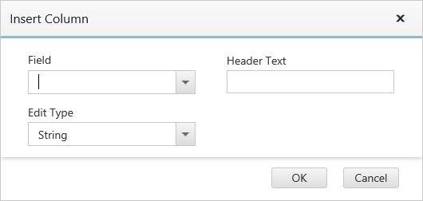

# Columns

The column displays the information from a bounded data source and it will be editable to update the task details through the tree grid.

## Column edit types

The Gantt supports the following types of column editors:

  * String
  * Date
  * Datetime
  * Numeric
  * Mask
  * Currency
  * Dropdown
  
## Format column

You can format a column using the ‘load’ event. The following code examples show how to format the ‘progress’ column with percentage value.



<body ng-controller="GanttCtrl">
      <!--Add  Gantt control here-->    
      

      

       
   </body>
   


Note: For more numeric format strings, refer to this [link](https://msdn.microsoft.com/library/dwhawy9k(v=vs.100).aspx).

For more date format strings, refer to this [link](https://msdn.microsoft.com/library/az4se3k1(v=vs.100).aspx).

## Column resizing

You can change the width of the column to show the entire text of the column by resizing the column. The following code example shows how to enable the column resize feature when initializing the **Gantt**:



<body ng-controller="GanttCtrl">
      <!--Add  Gantt control here-->    
      

      

   </body>



## Column template

The column template is used to customize the column’s look and feel based on the requirement.

The following code example shows how to display a column with resource images:



<!doctype html>
<html lang="en" ng-app="listCtrl">
   <head>
      //...
   </head>
   <body ng-controller="GanttCtrl">
      
      
      <!--Add  Gantt control here-->    
      

      

   </body>
</html>



The following screenshot displays the customized column in the Gantt control:

## Column menu

### Show column chooser

The Gantt supports enabling and disabling the visibility of columns dynamically by using the [e-showcolumnchooser](https://help.syncfusion.com/api/js/ejgantt#members:showcolumnchooser "showColumnChooser") property. The visibility of custom columns can also be toggled with this property. The column chooser option is rendered as a sub menu item within the column menu in Gantt columns.

The column menu is enabled with the [e-showcolumnchooser](https://help.syncfusion.com/api/js/ejgantt#members:showcolumnchooser "showColumnChooser") property and the default value of this property is `false`.

The column menu provides the following options:

* Sort ascending
* Sort descending
* Columns 

Sort ascending and sort descending options can be enabled or disabled by using the [e-allowsorting](https://help.syncfusion.com/api/js/ejgantt#members:allowsorting "allowSorting") property. The single level sorting can be performed with these options. To perform multilevel sorting, the [e-allowmultisorting](https://help.syncfusion.com/api/js/ejgantt#members:allowmultisorting "allowmultisorting") property should be enabled. You can also disable the visibility of a particular column in the column collection manually by setting the `visible` property to `false`.



<!doctype html>
<html lang="en" ng-app="listCtrl">
   <head>
      //...
   </head>
   <body ng-controller="GanttCtrl">
      <!--Add  Gantt control here-->    
      

      

   </body>
</html>



The following screenshot displays the column chooser in the Gantt control:

### Show column options

You can customize the column with some more options by using the [e-showcolumnoptions](https://help.syncfusion.com/api/js/ejgantt#members:showcolumnoptions "showColumnOptions") property. Insert new column, delete column, and update the header text of the column can be done by using this property.

The column options can be enabled or disabled by using the e-showcolumnoptions property in which the default value for this property is false.

The column provides the following options:

* Insert column left
* Insert column right
* Delete column
* Rename column

When you insert a column the following dialog will open, in which you can enter the details for the column.

These fields can be customized by the [e-columndialogfields](https://help.syncfusion.com/api/js/ejgantt#members:columndialogfields "columnDialogFields") property. The following code shows how to customize these fields:



<!doctype html>
<html lang="en" ng-app="listCtrl">
   <head>
      //...
   </head>
   <body ng-controller="GanttCtrl">
      <!--Add  Gantt control here-->    
      

      

       
   </body>
</html>



