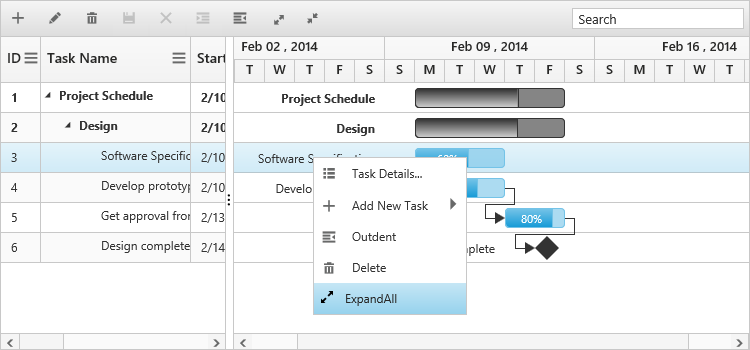
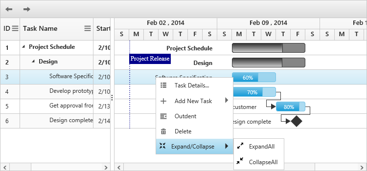

# Context menu

## Default menu items

The context menu in the Gantt has the following default menu items:

* Task details
* Add new task
* Indent
* Outdent
* Delete

The following code example explains how to enable the context menu in the Gantt control:



<!doctype html>
<html lang="en" ng-app="listCtrl">
   <head>
      //...
   </head>
   <body ng-controller="GanttCtrl">
      <!--Add  Gantt control here-->    
      

      

   </body>
</html>



The following screenshot shows the default context menu in the Gantt control:

## Custom menu item

You can add a custom context menu item in the Gantt control. The following code example explains how to add the custom context menu item:



 <body ng-controller="GanttCtrl">
   <!--Add  Gantt control here-->    
   

   

</body>



The following screenshot shows the custom context menu items in the Gantt control:

### Custom menu item with sub menu item

You can create a custom menu item with a sub menu by mapping the parentMenuId property from the contextMenuItems argument in the contextMenuOpen event.

The following code example explains how to add the sub context menu for custom menu items:



 <body ng-controller="GanttCtrl">
   <!--Add  Gantt control here-->    
   

   

</body>



The following screenshot shows the custom context menu items in the Gantt control:

