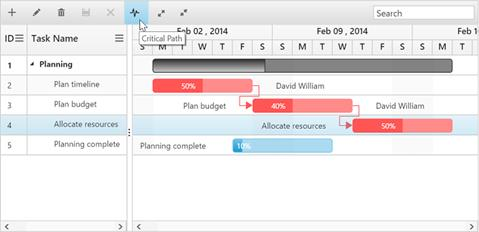
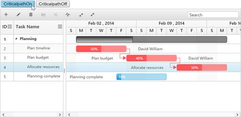
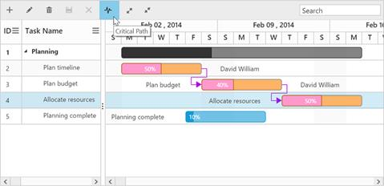

# Critical path

The critical path in a project is indicated by a single task or a series of tasks in the project. It describes the calculated start date or end date of the project. If a task in a critical path is delayed, then the entire project will be delayed.

The critical path can be enabled in the Gantt by using the built-in toolbar button or **showCriticalPath** method.

## Using toolbar icon

You can enable or disable the critical path in the Gantt by using the toolbar button which is enabled in the Gantt toolbar by using the following code example:


 

<!doctype html>
<html lang="en" ng-app="listCtrl">
   <head>
      //...
   </head>
   <body ng-controller="GanttCtrl">
      <!--Add  Gantt control here-->    
      

      

      
   </body>
</html>



## Using method

You can enable the critical path by using the **showCriticalPath****()** method with parameter as **true**. The critical path can be disabled by using the same method with parameter as **false**.


 



## Customizing critical path background

You can customize the critical task background by setting custom color codes to the critical task elements’ class names as follows:

Taskbar–.e-ganttchart .e-criticaltaskbar 

Progressbar–.e-ganttchart .e-criticalprogressbar     

Connector line–.e-ganttchart .e-criticalconnectorline       

Connector line left arrow– .e-ganttchart .e-criticalconnectorlineleftarrow  

Connector line right arrow–  .e-ganttchart .e-criticalconnectorlinerightarrow 





