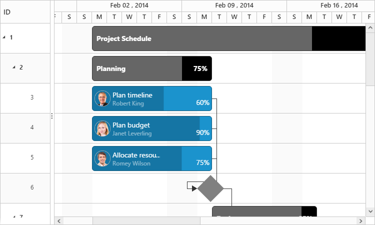
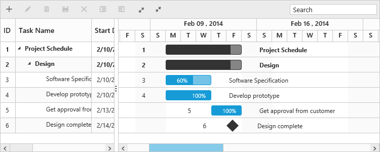
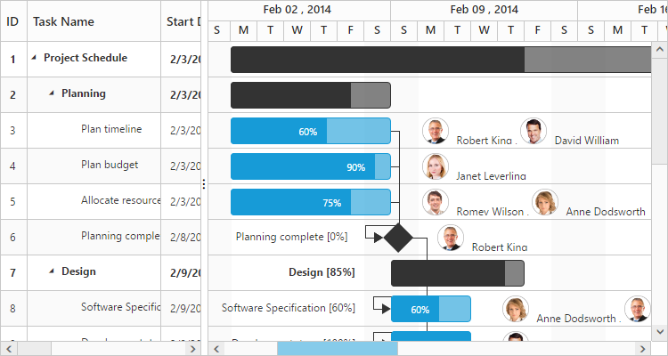
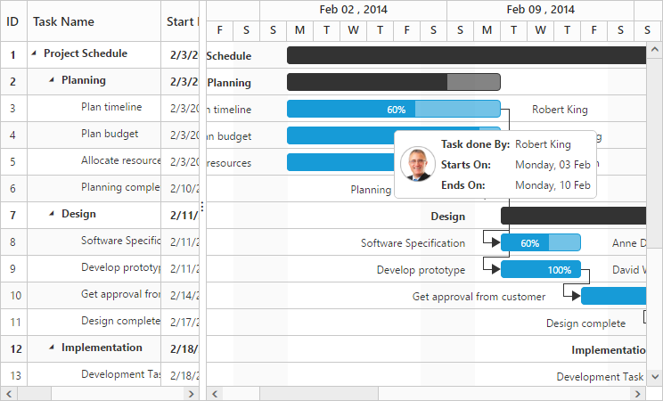
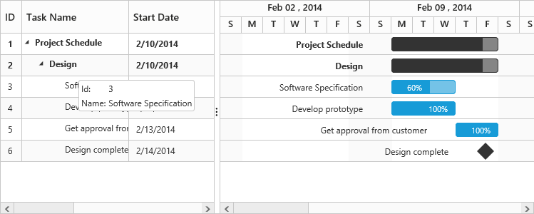

# Customizations 

The Gantt provides support for the following UI customizations:

* Taskbar template
* Task label template
* Tooltip template

## Taskbar template

You can design your own taskbars to view the tasks in Gantt by using the [e-taskbartemplate](https://help.syncfusion.com/api/js/ejgantt#members:taskbartemplate "taskbarTemplate") property. You can map the JsRender script or script element’s ID to this property, and you can also customize the parent taskbars and milestones with custom templates by using the [e-parenttaskbartemplate](https://help.syncfusion.com/api/js/ejgantt#members:parenttaskbartemplate "parentTaskbarTemplate") and [e-milestonetemplate](https://help.syncfusion.com/api/js/ejgantt#members:milestonetemplate "milestoneTemplate") properties.

The following code example shows how to define template for taskbars in the Gantt:



<body ng-controller="GanttCtrl">
   <!--Add  Gantt control here-->    
   

   



The DOM structure and class names mentioned in the above code snippet is mandatory for providing the editing support in custom templates.

The following screenshot shows the template for taskbars in the Gantt:

## Task label template

By default, the task name will be displayed to the left and resource names will be displayed to the right of the taskbars as task labels. But these task labels are customizable.

### Mapping data source fields as task labels

You can set any data source fields as task labels by using [e-righttasklabelmapping](https://help.syncfusion.com/api/js/ejgantt#members:righttasklabelmapping "rightTaskLabelMapping") and [e-lefttasklabelmapping](https://help.syncfusion.com/api/js/ejgantt#members:lefttasklabelmapping "leftTaskLabelMapping") properties.

The following code example explains how to set task name field as right label and task ID field as left label:



<body ng-controller="GanttCtrl">
   <!--Add  Gantt control here-->    
   

   

</body>



The following screenshot shows Gantt with task labels mapped with different data source fields:

### Task label templates

You can customize the task labels with templates by using [e-righttasklabeltemplate](https://help.syncfusion.com/api/js/ejgantt#members:righttasklabeltemplate "rightTaskLabelTemplate") and [e-lefttasklabeltemplate](https://help.syncfusion.com/api/js/ejgantt#members:lefttasklabeltemplate "leftTaskLabelTemplate") properties.

The following code example explains how to map custom templates to task labels:



<body ng-controller="GanttCtrl">
   <!--Add  Gantt control here-->    
   

   



The following screenshot shows Gantt with task label templates:

## Tooltip template

The default tooltip in the Gantt can be customized by using the [e-taskbartooltiptemplateid](https://help.syncfusion.com/api/js/ejgantt#members:taskbartooltiptemplate "taskbarTooltipTemplateId") property. You should map the JsRender script element’s ID value to this property.

The following code example shows how to customize the tooltip:



<body ng-controller="GanttCtrl">
   <!--Add  Gantt control here-->    
   

   

</body>



The following screenshot shows the Gantt with task tooltip customization:

### Cell tooltip 

The tooltip of the tree grid part can also be customized by using the[e-celltooltiptemplate](https://help.syncfusion.com/api/js/ejgantt#members:celltooltiptemplate) property. You should map the script element or element id to this property. The following code explains how to customize the cell tooltip in Gantt:



<body ng-controller="GanttCtrl">
   <!--Add  Gantt control here-->    
   

   

</body>


