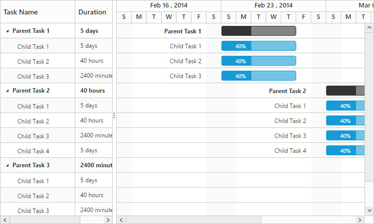

# Duration units

In Gantt, the duration value of task can be measured by the following duration units: 

* Day
* Hour
* Minute

Each task in the project can be defined with different duration units, and the duration unit of the task can be defined by the following ways:

1. To map the data source field of the duration unit, use the **e-durationunitmapping** property.
2. Define the duration unit value along with the duration field in the data source.

## Mapping the duration unit field

The following code snippet explains the mapping of duration unit data source field to the Gantt control by using the **e-durationunitmapping** property:



<body ng-controller="GanttCtrl">
   <!--Add  Gantt control here-->    
   

   

</body>



N> The default value of the **e-durationunit** property is “day”.

## Defining duration unit along with duration field

Duration units for tasks can also be defined along with the duration values. The following code snippet explains the duration unit for the task along with duration value:



<body ng-controller="GanttCtrl">
   <!--Add  Gantt control here-->    
   

   

</body>



The following sample explains the duration unit of tasks in the Gantt control:

[Duration Unit](http://js.syncfusion.com/demos/web/#!/bootstrap/gantt/schedulingconcepts/durationunits)

The following screenshot shows different duration unit support in the Gantt control:

N> The edit type of the duration column in Gantt is a string which supports editing the duration field along with duration units.

## Localizing the duration unit

You can localize the duration unit texts as shown in the following codes:





N> The **durationUnitTexts** property is used to display the unit of duration in columns and taskbar tooltips.
N> The **durationUnitEditText** property is used to save the edited duration unit value on editing action.
