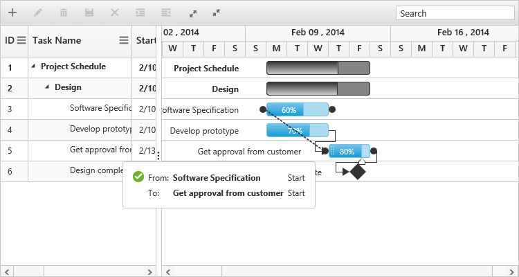

# Editing

The Gantt control provides built-in support to add, insert, and update the tasks. The following are the types of editing available in the Gantt:

* Cell editing
* Normal editing
* Taskbar editing
* Predecessor editing

## Cell editing

Update the task details through the grid cell editing by setting the editMode to `cellEditing`.

The following code example shows how to enable the `cellEditing` in the Gantt control:



<body ng-controller="GanttCtrl">
   <!--Add  Gantt control here-->    
   

   

   
</body>



The output of the Gantt with cellEditing is as follows:

## Normal editing

Update the task details through the edit dialog by setting the `editMode` to `normal`.

The following code example shows how to enable normal editing in the Gantt control:



<body ng-controller="GanttCtrl">
   <!--Add  Gantt control here-->    
   

   

  
</body>



The following screenshot shows the output of `normal` editing:

## Taskbar editing

Update the task details by interactions such as resizing and dragging the taskbar. The following code example shows how to enable taskbar resizing in the Gantt control:



<body ng-controller="GanttCtrl">
   <!--Add  Gantt control here-->    
   

   

</body>



You can also enable or disable the progressbar resizing by setting 'e-enableprogressbarresizing'. Refer to the following code example, to disable this property:



<body ng-controller="GanttCtrl">
   <!--Add  Gantt control here-->    
   

   

</body>



## Predecessor editing

Update the predecessor details of the task using mouse interactions. The following code example shows how to enable predecessor editing:



<body ng-controller="GanttCtrl">
   <!--Add  Gantt control here-->    
   

   

</body>


The following screenshot shows the predecessor editing in the Gantt control:

