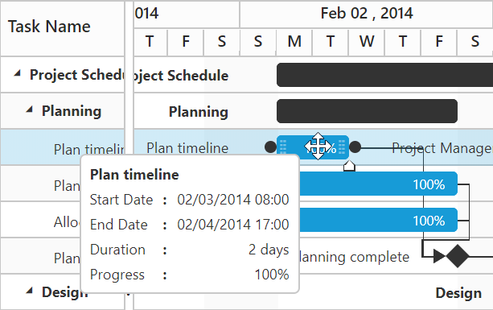

## Round-off start date, end date and duration value on taskbar editing
In Gantt start date, end date and duration values can be round-off as per current `scheduleHeaderSettings.scheduleHeaderType` value on taskbar resizing and dragging actions. This can be achieved by setting `roundOffDuration` argument value as `true` in `taskbarEditing` event.

The below code example explains how to achieve this requirement. 



<body ng-controller="GanttCtrl">
   <!--Add  Gantt control here-->    
   

   

   
</body>



Before resizing

{:.caption}

After resizing

{:.caption} 