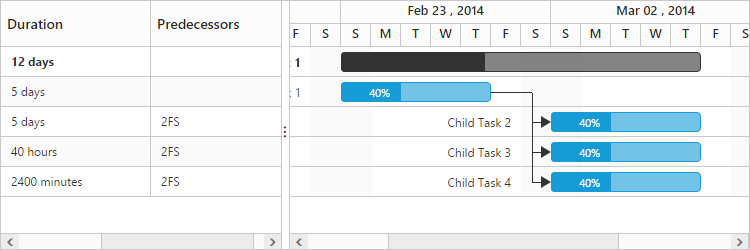

# Predecessor

## Predecessor offset with duration units

In Gantt, the predecessor offset can be defined with the following duration units: 

* Day
* Hour
* Minute

You can define the offset with various offset duration units for predecessors by using the following code example:



<body ng-controller="GanttCtrl">
   <!--Add  Gantt control here-->    
   

   

   
</body>



The following screenshot depicts the duration unit support in the predecessor offset:

