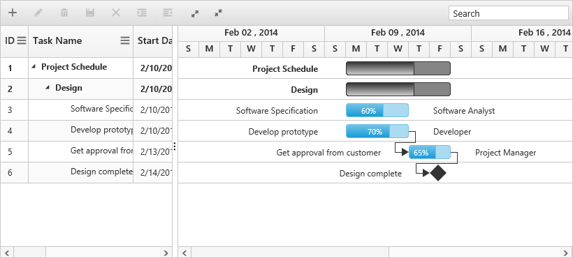

# Resources

Resources are represented by staff, equipment, and materials etc. In Gantt control, you can show/allocate the resources (human resources) for each task. The following steps explain how to configure the Gantt with resources:

**Step 1**: Create a collection of `JSON` object that contains id and name of the resource, and assign it to the `e-resources` property.

**Step 2**: Specify the field name for id and name of the resource in the resource collection to `e-resourceidmapping` and `e-resourcenamemapping` properties. 

**Step 3**: The name of the field that contains the actual resources assigned for a particular task in the data source is specified using the `e-resourceinfomapping` property.



<body ng-controller="GanttCtrl">
   <!--Add  Gantt control here-->    
   

   

   
</body>



The following screenshot shows the Gantt control with resources:

