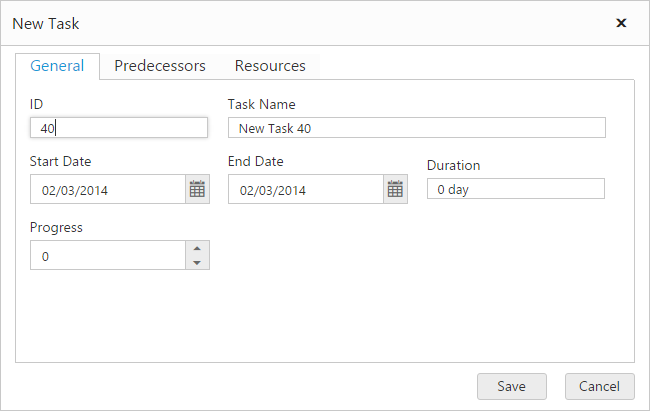
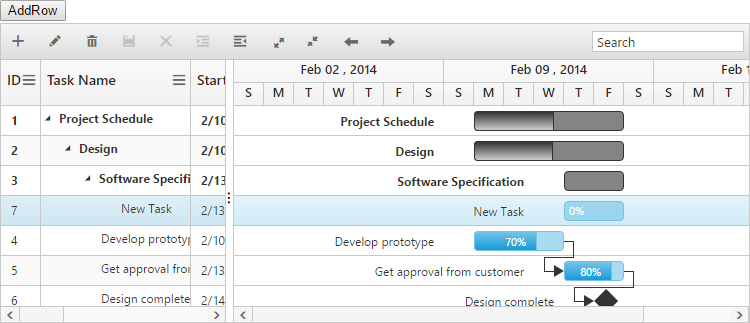
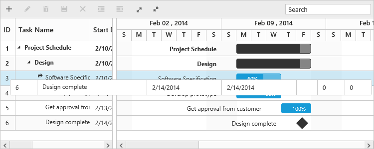
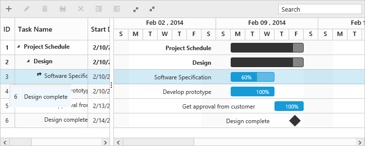
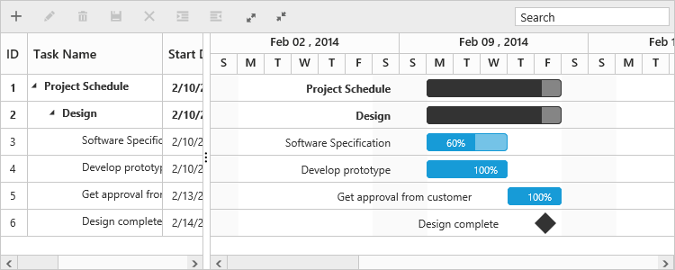
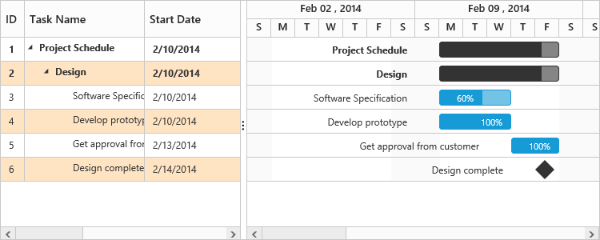
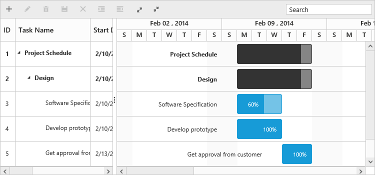

# Rows

The row represents a task information from the data source. You can perform the following actions in Gantt rows.

## Adding a row

A row can be added to the Gantt in the following ways:

* Toolbar
* Context menu 
* Adding a row programmatically 

### Adding toolbar

The row can be added in the Gantt from toolbar when the [e-editsettings.allowAdding](https://help.syncfusion.com/api/js/ejgantt#members:editsettings-allowadding) property is set to true. When clicking the toolbar add icon, you should provide the task information in the add dialog. If a row is previously selected, then the new row will be added below and in the same hierarchical level as that of the selected row. If there are no rows selected in the Gantt, by default the new row will be added as the top most row in Gantt.



<body ng-controller="GanttCtrl">
   <!--Add  Gantt control here-->    
   

   

  
</body>



### Context menu adding

You can add new rows either above or below the selected rows by using the default context menu, when the [e-enablecontextmenu](https://help.syncfusion.com/api/js/ejgantt#members:enablecontextmenu) is set to true. The new row added will have the same task information similar to the selected row.



<body ng-controller="GanttCtrl">
   <!--Add  Gantt control here-->    
   

   

  
</body>



### Adding a row programmatically

You can add rows in the below positions dynamically by using the [addRecord](https://help.syncfusion.com/api/js/ejgantt#methods:addrecord) public method.

* Top of all the rows.
* Bottom to all the existing rows.
* Above the selected row.
* Below the selected row.
* As child to the selected row.

The following code example explains adding a row using the custom button:


<button id="addRow" style="top:27px;left:50px;position:absolute">AddRow</button>





$("#addRow").click(function(args) {

    //Create Gantt object

    var GanttObj = $("#gantt").data("ejGantt");

    // data to be added

    var data = {

        taskID: 5,

        taskName: "New Task",

        startDate: "02/13/2014",

        endDate: "02/14/2014",

        duration: 2

    };

    GanttObj.addRecord(data, ej.Gantt.AddRowPosition.Child);

})


The following screenshot shows adding a new row as child:

## Drag and drop of row

You can dynamically re-arrange the rows in the Gantt control by using the [e-allowdraganddrop](https://help.syncfusion.com/api/js/ejgantt#members:allowdraganddrop "allowDragAndDrop") property. With this property, the drag and drop of the row can be enabled or disabled. Rows can be inserted above or below as a sibling or as a child to the existing row with the help of this feature. A default tooltip is rendered while dragging the Gantt row and this tooltip can be customized by the [e-dragtooltip](https://help.syncfusion.com/api/js/ejgantt#members:dragtooltip "dragTooltip") property. This property has inner properties such as [showTooltip](https://help.syncfusion.com/api/js/ejgantt#members:dragtooltip-showtooltip "e-dragtooltip.showTooltip"), [tooltipItems](https://help.syncfusion.com/api/js/ejgantt#members:dragtooltip-tooltipitems "e-dragtooltip.tooltipItems"), and [tooltipTemplate](https://help.syncfusion.com/api/js/ejgantt#members:dragtooltip-tooltiptemplate "dragTooltip.tooltipTemplate").

The `showTooltip` property is used to enable or disable the tooltip. By default, this property value is `false`.

The following code explains about enabling the drag and drop of row with default tooltip in the Gantt:



<body ng-controller="GanttCtrl">
   <!--Add  Gantt control here-->    
   

   

  
</body>



The following screenshot depicts the drag and drop of row in the Gantt widget:

### Customizing drag tooltip

The [tooltipItems](https://help.syncfusion.com/api/js/ejgantt#members:dragtooltip-tooltipitems) property is used to customize the tooltip items. By using this property, specific fields can be rendered in the tooltip. By default this property value is `null`, and all the defined field items are rendered in the tooltip.

The following code shows how to render the row drag tooltip with the desired field items:



<body ng-controller="GanttCtrl">
   <!--Add  Gantt control here-->    
   

   

  
</body>



The [tooltipTemplate](https://help.syncfusion.com/api/js/ejgantt#members:dragtooltip-tooltiptemplate) property renders the template tooltip for dragging and dropping of row in the Gantt control by using the JsRender template. You can provide either the id value of the script element or the script element to the property.

The following code shows how to render the row drag tooltip with tooltip template:



<body ng-controller="GanttCtrl">
   <!--Add  Gantt control here-->    
   

   

  
</body>



## Alternate row background

In Gantt, you can enable or disable the alternate row background by using the [e-enablealtrow](https://help.syncfusion.com/api/js/ejgantt#members:enablealtrow) property. The following code example shows you to disable the alternate row color in the Gantt:


<body ng-controller="GanttCtrl">
   <!--Add  Gantt control here-->    
   

   

</body>


### Change altRow background

The altRow background can be changed by setting the background color for the altRow using CSS. The following code example shows how to change the altRow color:


<head>

    

</head>





<body ng-controller="GanttCtrl">
   <!--Add  Gantt control here-->    
   

   

</body>



# Row height

You can change the height of row in Gantt by setting the row height in pixels to the [e-rowheight](https://help.syncfusion.com/api/js/ejgantt#members:rowheight) property. The following code example explains how to change the row height in Gantt at load time.



<body ng-controller="GanttCtrl">
   <!--Add  Gantt control here-->    
   

   

</body>



