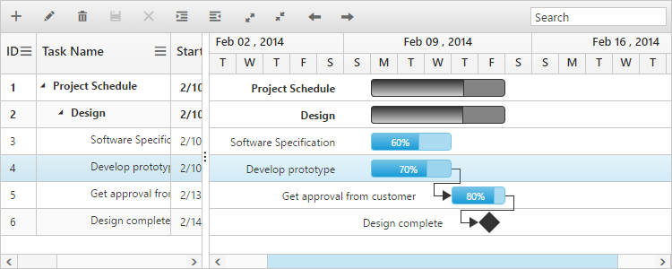
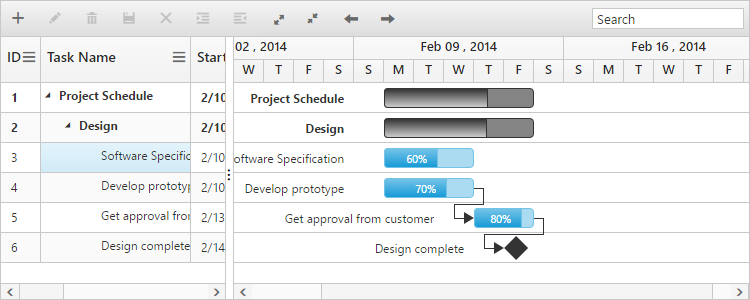

# Selection

## Row selection

You can enable or disable the row selection in the Gantt by using the [e-allowselection](https://help.syncfusion.com/api/js/ejgantt#members:allowselection) property. You can get the selected row object using the selectedItem property from the Gantt model. The following code example shows how to disable the row selection in Gantt:



<body ng-controller="GanttCtrl">
   <!--Add  Gantt control here-->    
   

   

</body>


### Selecting a row on initial load

You can select a row on load time by setting the index of row to the [e-selectedrowindex](https://help.syncfusion.com/api/js/ejgantt#members:selectedrowindex) property. Find the following code example for details:



<body ng-controller="GanttCtrl">
   <!--Add  Gantt control here-->    
   

   

</body>



### Selecting a row programmatically

You can also select a row programmatically by setting the index of row value to the [e-selectedrowindex](https://help.syncfusion.com/api/js/ejgantt#members:selectedrowindex) property. The following code shows how to select a row programmatically with custom button click action:


<body>

    <button id="selectRow">SelectRow</button> 
    

   

</body>



### Multiple row selection

You can select multiple rows by setting the [e-selectiontype](https://help.syncfusion.com/api/js/ejgantt#members:selectiontype) as `multiple`. You can select more than one row by holding down the `CTRL` key while selecting multiple rows.
The following code example explains how to enable multiple selection in the Gantt:


<body ng-controller="GanttCtrl">
   <!--Add  Gantt control here-->    
   

   

</body>


The output of the Gantt with multiple row selection is as follows:

To enable multiple selection, you can set the [e-selectiontype](https://help.syncfusion.com/api/js/ejgantt#members:selectiontype) property either as `multiple` or enumeration value `ej.Gantt.SelectionType.Multiple`.

### Selecting multiple rows programmatically 

You can also select multiple rows programmatically by using the `selectMultipleRows` public method. The following code example explains how to enable multiple selection in the Gantt:


<body>
<button id="selectMultipleRow">SelectMultipleRows</button> //…

   





$("#selectMultipleRow").click(function(args) {

     //create Gantt object

    var ganttObj = $("#GanttContainer").data("ejGantt"),

    multipleRowIndex = [1,0,5,7];     

    ganttObj.selectMultipleRows(multipleRowIndex);

})
</body>


## Cell selection

You can select a cell in the Gantt by setting the [e-selectionmode](https://help.syncfusion.com/api/js/ejgantt#members:selectionmode) property as ‘cell’. You can get the selected cell information by using the selectedCellIndexes property from the Gantt object. selectedCellIndexes is an object collection, which has the cell index and row index information of the selected cells.

Find the code example below to enable the cell selection in Gantt: 



<body ng-controller="GanttCtrl">
   <!--Add  Gantt control here-->    
   

   

</body>



The following screenshot shows the cell selection:

### Selecting multiple cells

You can also select multiple cells by setting the [e-selectiontype](https://help.syncfusion.com/api/js/ejgantt#members:selectiontype) property as ‘multiple’ when the [e-selectionmode](https://help.syncfusion.com/api/js/ejgantt#members:selectionmode) property is set to “cell”. Multiple cells can be selected by holding the ctrl key and clicking the cells. The following code example shows you to select multiple cells:



<body ng-controller="GanttCtrl">
   <!--Add  Gantt control here-->    
   

   

</body>



### Select cells programmatically 

You can select the cells programmatically using the [selectCells](https://help.syncfusion.com/api/js/ejgantt#methods:selectcells) public method. Find the code example below for details:


<body>

    <button id="select">SelectCells</button> //…

   





$("#select").click(function(args) {

    //create Gantt object

    var ganttObj = $("#GanttContainer").data("ejGantt");

    cellIndex = [{
        rowIndex: 2,
        cellIndex: 1
    }, {
        rowIndex: 3,
        cellIndex: 1
    }];

    ganttObj.selectCells(cellIndex);

})
</body>


## MultiSelection – Touch option

You can select rows using touch action in the Gantt. The Gantt provides support for both single selection and multiple row selection using touch action. For multiple row selection, when you tap on a cell, a helper icon will be displayed using which you can select multiple rows.

The following code example describes how to enable multiple selection in the Gantt:


<body ng-controller="GanttCtrl">
   <!--Add  Gantt control here-->    
   

   

</body>


The following output displays the result of multiple selection in the touch device environment:

