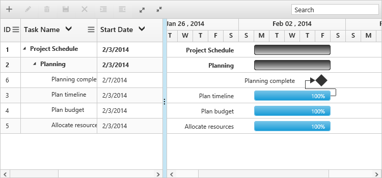

# Sorting

The Gantt control for JavaScript has built-in support for sorting one or more columns.

### Sorting columns

Gantt allows the tasks to be sorted in ascending or descending order based on the selected column by enabling the `e-allowsorting` option in the Gantt control. The following code example shows how to enable sorting in the Gantt control.



<body ng-controller="GanttCtrl">
   <!--Add  Gantt control here-->    
   

   

</body>



### Multicolumn sorting

Gantt allows you to sort multiple columns by clicking the desired column headers while holding the `CTRL` key. The following code example shows how to enable multicolumn sorting in the Gantt control:



<body ng-controller="GanttCtrl">
   <!--Add  Gantt control here-->    
   

   

</body>



The following screenshot shows the output of multicolumn sorting in the Gantt control:

