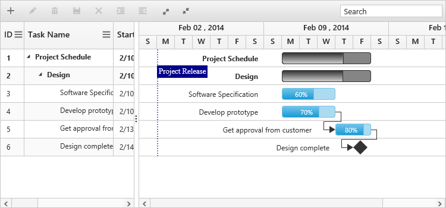

# Stripline

The stripline in the Gantt control is used to highlight the important event in Gantt chart part. By using this feature, you can add the striplines to highlight important days in your project. The following code example shows how to add the stripline in Gantt control:



<body ng-controller="GanttCtrl">
   <!--Add  Gantt control here-->    
   

   

  
</body>



The following screenshot shows the stripline in Gantt control:

