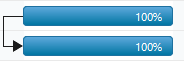
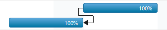
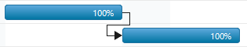
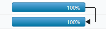

# Task relationship

You can show the relationship between two tasks in the Gantt control. These relationships are categorized into four types based on the start and finish date of the task.

## Start to start(SS)

You cannot start a task until the other task also starts.

## Start to finish(SF)

You cannot finish a task until the other task is started.

## Finish to start(FS)

You cannot start a task until the other task is completed.

## Finish to finish(FF)

You cannot finish a task until the other task is completed.

The following code example shows how to show the predecessor in the Gantt control:



<body ng-controller="GanttCtrl">
   <!--Add  Gantt control here-->    
   

   

</body>
    


The following screenshot displays the output of the above code:

